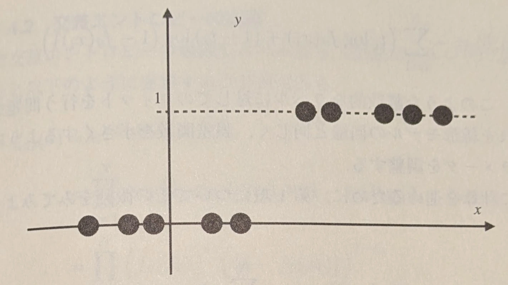
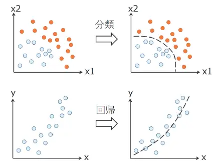

# 学習物理学入門 A1 1.4-1.7

多田 瑛貴
公立はこだて未来大学 システム情報科学部
複雑系知能学科 複雑系コース 3年

*写真: 京都府京都市左京区 比叡山登山道*

---
# 前回学んだこと

**語彙**
- **最小二乗法** (=**最小二乗誤差**(MSE) の最小化)
- **線形モデル**・**線形変換** (**アフィン変換**は近い概念)
- **凸関数**の定義・**イェンセンの不等式**による一般化
- **KLダイバージェンス** (相対エントロピー)
- **最尤法**・**尤度関数**・**対数尤度関数**

---

**要点**

- 最小二乗法
- 誤差がガウス分布に従う仮定での最尤法

これらは、同じ結果となる！

*最尤法は**KLダイバージェンスの最小化**としても捉えられる*
*(=真の分布とモデル分布の"離れ具合"の最小化)*

*この仮定の下では**最小二乗誤差の最小化**に帰着された*

---

# 一般線形化モデル
*一般には「誤差が任意の分布に従うと仮定したモデル」だが
本書ではロジスティック回帰のみ言及*

---

## 2値分類

データセット$D=\{(x_i, t_i)\}^N_{i=1}$ ($t_i=0,1$) 

つまり**0**か**1**でラベル付けされた
データセットを分類する問題

線形モデルでの回帰ではフィットできない

*(このような離散的なラベルに対しての
フィットは「**分類問題**」と呼ばれる)*

---

### ロジスティック関数 (シグモイド関数)

次の関数を用いる (**ロジスティック関数**):
*図のような曲線をとる*

$$
\sigma_{sig}(x) = \frac{1}{1+e^{-x}}
$$

### ロジスティック回帰

$g(x) = ax+b$とパラメータ $\theta = \{a, b\}$ を用いた

$$
f_\theta(x) = \sigma_{sig}(g(x)) = \sigma_{sig}(ax+b)
$$

この関数をデータにフィットさせる

---

最小化する誤差関数は**交差エントロピー**として次のように定義される:

$$
\varepsilon_D(a, b) = -\sum^N_{i=1} \{t_i \log f_\theta(x_i) + (1-t_i) \log (1-f_\theta(x_i))\}
$$

これは**誤差がベルヌーイ分布に従う仮定での負の対数尤度関数** *(起源は後述)*

ただし、線形モデルの回帰のように解析的に解くことはできない *教科書を参照*
実際に解くには数値計算を用いることとなる

---

<!-- _class: smartblockquote -->

> (交差エントロピーは) 誤差がベルヌーイ分布に従う仮定での負の対数尤度関数

**ベルヌーイ分布** ($t=0,1$ とし、$t=1$が出る確率を$p$とした分布)

$$
p^t(1-p)^{1-t}
$$
この分布を誤差関数とした尤度関数は以下のようになる
$$
\begin{aligned}
L_D(\theta) &= \prod^N_{i=1} (f_\theta(x_i))^{t_i} ((1-f_\theta(x_i)))^{1-t_i} \\
&= \prod^N_{i=1}\exp(t_i \log f_\theta(x_i) + (1-t_i) \log (1-f_\theta(x_i))) = e^{-\varepsilon_D(a, b)}
\end{aligned}
$$

---

# 機械学習の様々な用語
*機械学習の分類・汎化/過学習/未学習・乱数*

---

## 機械学習の種類

- 教師あり学習
  $\mathbf{x}$に対する$\mathbf{y}$が既に定まっており
  その応答を近似する関数を作ることが目的
  回帰問題・分類問題 など

- 教師なし学習
  $\mathbf{x}$のみが与えられ、その特徴を調べることが目的
  クラスタリングなど

*画像: 上杉徳照. 機械学習の概要と材料工学への応用例 (前編). 軽金属, 2023, 73.3: 104-111.*

---

- 強化学習
  環境・エージェントという自由度が存在
  *ゲームをプレイするAIであれば、ゲームが環境・プレイヤーがエージェント*
  エージェントの得られる報酬を最大化する行動を経験から導く

この3種類は、目的の違いであり、手法によっての区別ではないことに注意
*例えばニューラルネットワークは、教師あり学習でも強化学習でも使われる*

---

## 汎化・過学習と未学習

**汎化**: 学習データに含まれないデータに対しても正確に予測できること

**過学習**: 学習データに過度に適合し、未知のデータで正確な予測ができないこと
*パラメータ数がデータ数に対して**多すぎる**場合に発生しやすい*

**未学習**とは、学習データに対しても正確な予測ができないこと
*例えば、二次関数のように分布するデータを一次関数で近似しようとしている*
*関数として表現力が足りていない*
*パラメータ数が**少なすぎる**場合に発生しやすい*

---

汎化性能を高めるには、過学習の検出が必要

そこで、データセットを以下の3つに分割し用いる
- **訓練データ**: パラメータの調整
- **検証データ**: ハイパーパラメータ *=学習の中で決定されないパラメータ* の調整
  *パラメータの調整 $\leftrightarrow$ ハイパーパラメータの調整 を繰り返し実行*
- **テストデータ**: モデルの汎化性能用のデータ
  *訓練・検証データで過学習が発生している場合、テストデータにはうまく適合しない*

*データセットの分割法としては「ホールドアウト法」「交差検証法」が存在*
*参考: 上杉徳照. 機械学習の概要と材料工学への応用例 (前編). 軽金属, 2023, 73.3: 104-111.*

---

## 疑似乱数

(イメージ)
$$\{r_0, r_1, r_2, \ldots\} = \{0.3946\ldots, 0.21255\ldots, 0.74674\ldots, \ldots\}$$

**乱数**とは、規則性のない数列

コンピュータは決定論的に動作するため、真の乱数は生成できない
*真の乱数を追求する場合、物理現象等を利用する特別な装置が必要*
*(topic: バナナ乱数生成器 https://hackaday.com/2022/06/12/yes-we-have-random-bananas/)*

代わりに、数学的アルゴリズムによって
それらしい数列を生成する**疑似乱数**が利用される

---

### 一様乱数

確率密度関数

$$
p(x) = \begin{cases}
1 & (0 \leq x < 1) \\
0 & (\text{otherwise})
\end{cases}
$$

で生成される乱数。つまり、$x \in [0,1)$ の範囲で一様に分布する

例: **線形合同法**

$$r_{n+1} = (ar_n + b) \mod M$$

*得られる値は$0$から$M-1$の整数であり、$M$で割ることで $[0,1)$ の範囲に収める*

---

### ガウス乱数

確率密度関数がガウス分布となる乱数
一様乱数を変換することで生成可能

例: **Box-Muller変換**

$$
\begin{aligned}
z_0 &= \sqrt{-2\log u_1} \cos(2\pi u_2) \\
z_1 &= \sqrt{-2\log u_1} \sin(2\pi u_2)
\end{aligned}
$$

その他、より動作の早いZiggurat法などもある
*Box-Muller変換は三角関数や根号が使われ、計算機上では動作が遅い*

---

### 疑似乱数の種類

前述した線形合同法は
多次元で規則性が現れる・周期が短いなどの問題がある

実際には、より高品質で実用的なアルゴリズムが利用される
- メルセンヌ・ツイスタ
- xorshift (とその亜種xoroshiro128++)

 *「周期性の長さ」「高速さ」等をトレードオフとして様々な手法が使われている*

---

# まとめ

- ロジスティック回帰 
  - 一般線形化モデルの一例
  - 2値分類問題に対する線形モデル
  - 誤差関数として用いる交差エントロピーは
誤差がベルヌーイ分布に従う仮定での
負の対数尤度関数
- 機械学習の種類
  - 教師あり学習・教師なし学習・強化学習
- 汎化・過学習・未学習
  - データセットの分割により検出
- 疑似乱数
  - 一様乱数・ガウス乱数

