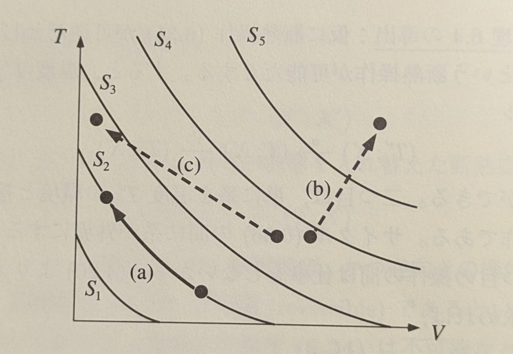

**熱力学 現代的な視点から**
# 第6章 エントロピー

多田 瑛貴
公立はこだて未来大学 システム情報科学部
複雑系知能学科 複雑系コース 3年

*写真: 北海道旭川市*

---

# 前回学んだこと

断熱操作から、エントロピーの本質を捉える

- Planckの原理
$(T, X) \overset{\text{a}}{\longrightarrow} (T', X)$ が可能なら
$T' \geq T$ であり、この操作は不可逆
- **エントロピー原理**
エントロピーは**断熱操作の不可逆性**の定量的な尺度
*図のように、複数の系を合わせた場合でも
「不可逆性」を「可逆性」で打ち消すことによって
特定の平衡状態への到達可能性をエントロピーから判断可能*

---

# エントロピーと熱

---

### Clausius流のエントロピーの定義

等温準静操作 $(T;X) \overset{\text{iq}}{\longrightarrow} (T;X')$ において

操作前後でのエントロピーと最大吸熱量の関係は、次のように表せた

$$S(T;X')-S(T;X)=\frac{Q_{max}(T;X_1 \rightarrow X_2)}{T}$$

これを、次のように表現する
$$\Delta S = \frac{\Delta Q}{T}$$

 *$\Delta S$ $\Delta Q$は微小量である必要はない*

---

等温準静操作と断熱準静操作を繰り返し
$(T_1;X_1)$から$(T_n;X_n)$に移ることを考える

つまり *イメージは図のようになる*

$$
\begin{aligned}
&(T_1;X_1)\overset{\text{iq}}{\longrightarrow} (T_1;X'_1)\overset{\text{aq}}{\longrightarrow} (T_1;X_2)\overset{\text{iq}}{\longrightarrow} \ldots \\
&\ldots \overset{\text{aq}}{\longrightarrow}(T_{n-1};X_{n-1})\overset{\text{iq}}{\longrightarrow} (T_{n-1};X'_{n-1})\overset{\text{aq}}{\longrightarrow} (T_n;X_n)
\end{aligned}
$$

---

<!-- _class: smartblockquote -->

> エントロピーと最大吸熱量の関係 $\Delta S = \frac{\Delta Q}{T}$

ここで、断熱準静操作 $(T;X) \overset{\text{aq}}{\longrightarrow} (T';X')$ では
最大吸熱量 *=環境から受け取る熱の最大値* $\Delta Q=0$のため
エントロピーは変わらない($\Delta S=0$)

すると、エントロピーの変化について次式が得られる
*各等温準静操作でのエントロピーの変化を足し合わせる*

$$S(T_n;X_n)-S(T_1;X_1)=\sum_{i=1}^{n}\frac{\Delta Q_i}{T_i}$$

---

### エントロピーの積分表示

さらに、各操作の$T$および$X$の変化を小さくすると
「連続の道」$(T(\tau);X(\tau))_{0\leq\tau\leq1}$を構成できる

よって、先程のエントロピーの定義に対して
形式的な極限を取れば

$$S(T(1);X(1))-S(T(0);X(0))=\int_{0}^{1}\frac{dQ(\tau)}{T(\tau)}$$

---

<!-- _class: smartblockquote -->

> エントロピーの積分表示 $S(T(1);X(1))-S(T(0);X(0))=\int_{0}^{1}\frac{dQ(\tau)}{T(\tau)}$

ただし、この積分表示は、等温準静操作と断熱準静操作の組み合わせとして
実現したときを前提としている

「連続の道」を再現する具体的な操作は一通りでないため
一般には、この積分表示は成り立たない
*ただし、他に成り立つ操作も存在する。その判別に関する考察は演習問題にて*

---

# エントロピー増大則

---

**エントロピー増大則**
一般の熱力学的な系で断熱操作を行い、状態$(T;X)$から$(T';X')$が得られるなら
$$S(T;X) < S(T';X')$$

が成り立つ
つまり、**断熱された系に様々な操作を行うと、エントロピーは増大し続ける**

*不等式自体はエントロピー原理の時点で$S(T;X) \leq S(T';X')$と定まっており
$S(T;X)=S(T';X')$を現実的に不可能として省いたもの*

*言及できることはここまでだが、教科書の内容が興味深いため読むとよい*

---

# 複合状態のエントロピーとエントロピー原理

---

### 複合状態

断熱壁で仕切られた複数の平衡状態も、一種の平衡状態とみなせる
このように表す

$$\{(T_1, X_1)|(T_2, X_2)|\ldots|(T_n, X_n)\}$$

この複合状態のエントロピーは、相加性がそのまま成り相加性立つことから

$$
S(\{(T_1, X_1)|(T_2, X_2)|\ldots|(T_n, X_n)\})=\sum_{i=1}^{n}S(T_i, X_i)
$$

*思い出し: エントロピーの相加性 $S(T; X, Y)=S(T; X)+S(T; Y)$*

---

### 複合状態でのエントロピー原理

ある2つの複合状態$\{(T_1, X_1)|\ldots|(T_n, X_n)\}$ と $\{(T'_1, X'_1)|\ldots|(T'_\ell, X'_\ell)\}$があるとき

$$
S(\{(T_1, X_1)|\ldots|(T_n, X_n)\}) \leq S(\{(T'_1, X'_1)|\ldots|(T'_\ell, X'_\ell)\})
$$
が成り立つことが断熱操作

$$
\{(T_1, X_1)|\ldots|(T_n, X_n)\} \overset{\text{a}}{\longrightarrow} \{(T'_1, X'_1)|\ldots|(T'_\ell, X'_\ell)\}
$$

が可能なための必要十分条件である *導出は省略*

---

### 熱的接触

示量変数の組が一定値$X_0$に固定された
熱容量一定の系が2つあり
それぞれ$(T_1, X_0)$, $(T_2, X_0)$の平衡状態にあるとする

これらを断熱壁で仕切って並べた後
透熱壁に置き換えると

$$
\{(T_1, X_0)|(T_2, X_0)\} \overset{\text{a}}{\longrightarrow} \{(T_f, X_0)|(T_f, X_0)\}
$$

ができ、$T_f=(T_1+T_2)/2$となる

---

この操作の前後でのエントロピーの変化を評価すると

$$
\begin{aligned}
&2S(T_f, X_0)-\{S(T_1, X_0)+S(T_2, X_0)\} \\
&=2C_0\log\frac{T_1+T_2}{2}-C_0logT_1-C_0\log T_2 \\
&=2C_0\log\frac{(T_1+T_2)^2}{4T_1T_2}>0
\end{aligned}
$$

*この$C_0$は補足として後述。$C_0>0$*

となり、この操作は不可逆であることがわかる

---

#### 補足

ここで4章3節より、定積熱容量は
温度$T$に対するエネルギー$U(T;X)$の増加量として
$$
C_v(T; X)=\frac{\partial}{\partial T}U(T;X)
$$

$U(T;X)$は$T$の増加関数であるから、$C_v(T;X)>0$

*該当資料: https://slides2.peruki.dev/slides/2024/%E8%BC%AA%E8%AA%AD%E8%B3%87%E6%96%99/%E7%86%B1%E5%8A%9B%E5%AD%A64/slide*

---

また、6章1節にて、エントロピーの定義

$$
S(T;X)=S(T_0;X)+\int_{T_0}^{T}dT'\frac{C_v(T';X)}{T'}
$$

示量変数が$X_0$に固定され、かつその熱容量が温度に依存しない場合
$C_v(T;X)=C_0$として

$$
S(T;X)=S_0+C_0\log{T}
$$

*このような捉え方は、固体の最も大雑把な取り扱いとして説明された*

*以上は、エントロピーの温度依存性($S$は$T$の増加関数)を示す関係式であった*

---

# まとめ

- エントロピーと熱(最大吸熱量)の関係から
エントロピーを定式化・積分表示を導出
- エントロピー増大則
- 複合状態のエントロピーから、熱的接触でのエントロピーの変化を評価
