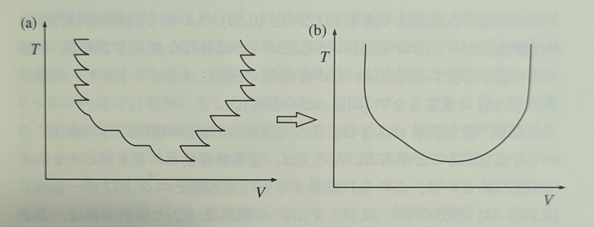

**熱力学 現代的な視点から**
# 第6章 エントロピー

多田 瑛貴
公立はこだて未来大学 システム情報科学部
複雑系知能学科 複雑系コース 3年

*写真: 北海道旭川市*

---

# 前回学んだこと

断熱操作から、エントロピーの本質を捉える

- Planckの原理
$(T, X) \overset{\text{a}}{\longrightarrow} (T', X)$ が可能なら
$T' \geq T$ であり、この操作は不可逆
- **エントロピー原理**
エントロピーは**断熱操作の不可逆性**の定量的な尺度
*図のように、複数の系を合わせた場合でも
特定の平衡状態への到達可能性をエントロピーから判断可能*
- 断熱操作によってエントロピーは増大

---

# エントロピーと熱

---

### Clausius流のエントロピーの定義

等温準静操作 $(T;X) \overset{\text{iq}}{\longrightarrow} (T;X')$ において

操作前後でのエントロピーと最大吸熱量の関係は、次のように表せた

$$S(T;X')-S(T;X)=\frac{Q_{max}(T;X_1 \rightarrow X_2)}{T}$$

これを、次のように表現する
$$\Delta S = \frac{\Delta Q}{T}$$

 *$\Delta S$ $\Delta Q$は微小量である必要はない*

---

等温準静操作と断熱準静操作を繰り返し
$(T_1;X_1)$から$(T_n;X_n)$に移ることを考える

つまり *イメージは図のようになる*

$$
\begin{aligned}
&(T_1;X_1)\overset{\text{iq}}{\longrightarrow} (T_1;X'_1)\overset{\text{aq}}{\longrightarrow} (T_1;X_2)\overset{\text{iq}}{\longrightarrow} \ldots \\
&\ldots \overset{\text{aq}}{\longrightarrow}(T_{n-1};X_{n-1})\overset{\text{iq}}{\longrightarrow} (T_{n-1};X'_{n-1})\overset{\text{aq}}{\longrightarrow} (T_n;X_n)
\end{aligned}
$$

---

<!-- _class: smartblockquote -->

> エントロピーと最大吸熱量の関係 $\Delta S = \frac{\Delta Q}{T}$

ここで、断熱準静操作 $(T;X) \overset{\text{aq}}{\longrightarrow} (T';X')$ では
最大吸熱量 *=環境から受け取る熱の最大値* $\Delta Q=0$のため
エントロピーは変わらない($\Delta S=0$)

すると、エントロピーの変化について次式が得られる
*各等温準静操作でのエントロピーの変化を足し合わせる*

$$S(T_n;X_n)-S(T_1;X_1)=\sum_{i=1}^{n}\frac{\Delta Q_i}{T_i}$$

---

### エントロピーの積分表示

さらに、各操作の$T$および$X$の変化を小さくすると
「連続の道」$(T(\tau);X(\tau))_{0\leq\tau\leq1}$を構成できる

よって、先程のエントロピーの定義に対して
形式的な極限を取れば

$$S(T(1);X(1))-S(T(0);X(0))=\int_{0}^{1}\frac{dQ(\tau)}{T(\tau)}$$

---

<!-- _class: smartblockquote -->

> エントロピーの積分表示 $S(T(1);X(1))-S(T(0);X(0))=\int_{0}^{1}\frac{dQ(\tau)}{T(\tau)}$

ただし、この積分表示は、等温準静操作と断熱準静操作の組み合わせとして
実現したときを前提としている

「連続の道」を再現する具体的な操作は一通りでないため
一般には、この積分表示は成り立たない
*ただし、他に成り立つ操作も存在する。その考察は演習問題にて*

---

# エントロピー増大則

---

---

# 複合状態のエントロピーとエントロピー原理

---

---

# まとめ

---