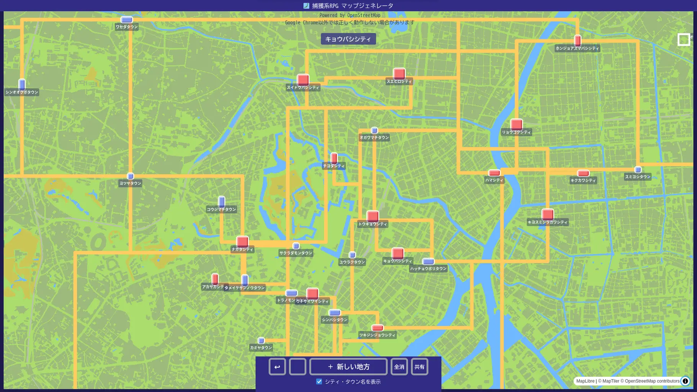
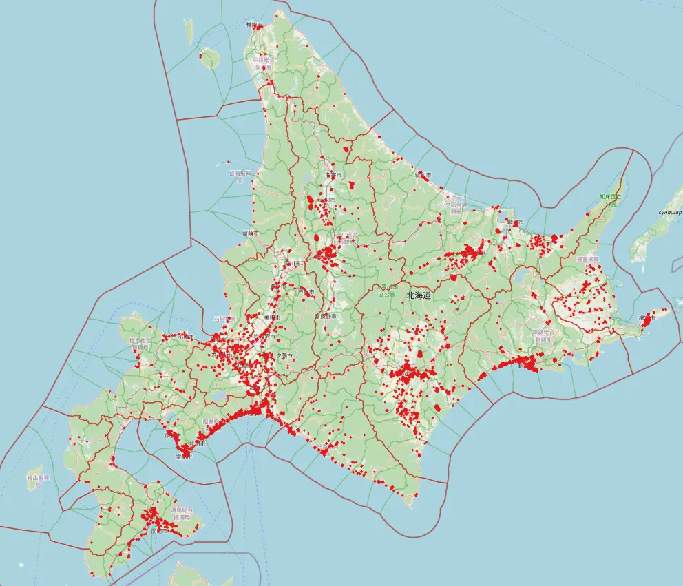
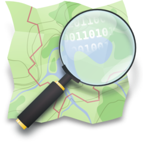
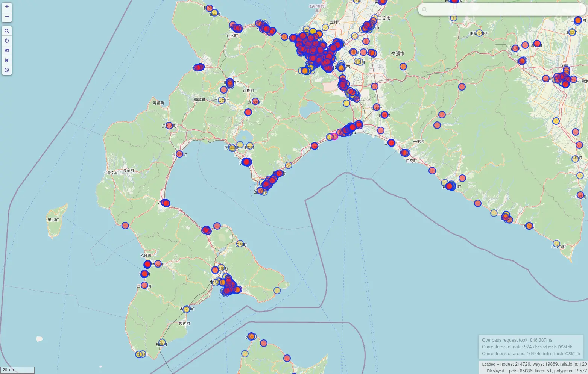
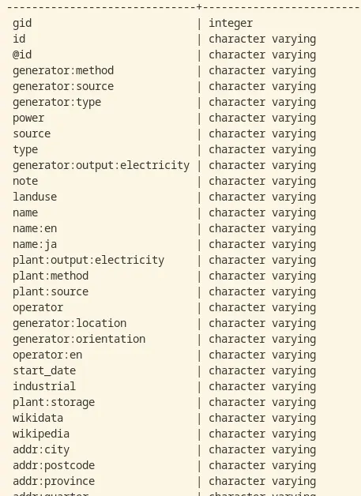
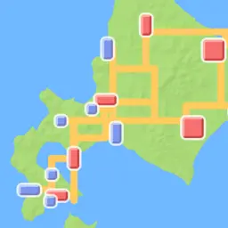
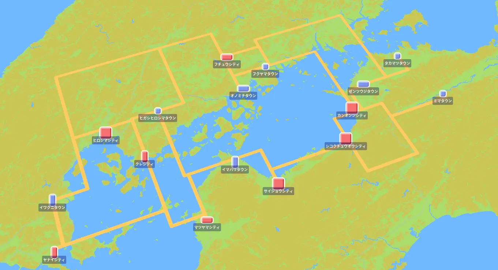
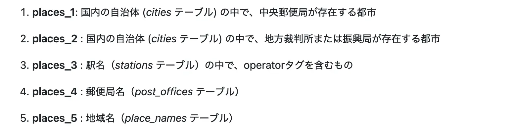
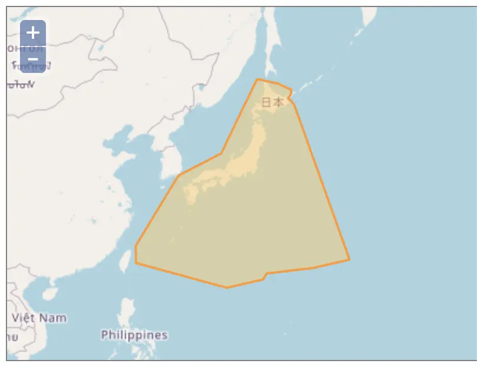
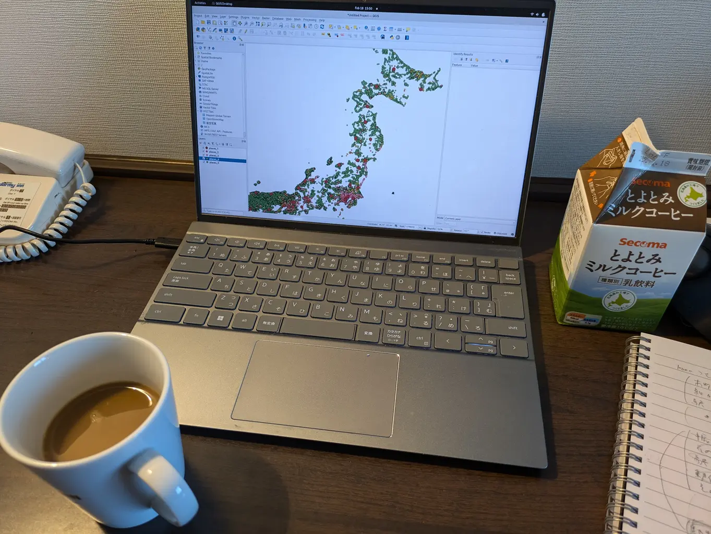

&emsp;&emsp;&emsp;&emsp;**で 遊 ぶ ピ ヨ**

2025年5月3日 HACK
多田 瑛貴 (@PerukiFUN)

---

## 自己紹介

多田 瑛貴 (ただ てるき)

GitHub: TadaTeruki / X: @PerukiFUN / HP: peruki.dev

- 福山 *広島県* → 京都 → 函館
- 複雑系知能学科 複雑系コース 学部4年 
- Mariners' Conference 設立/元部長
  - 今も学内/学外イベントの運営をこまごまやっています
- 技術は地理空間情報を軸に色々やってます
*GIS、GUI (Webフロントエンド含む)、グラフィックス
データ分析、機械学習 etc...*

---

## このLTについて

マリカン春LT (4/27) にて

&nbsp;**で 遊 ぶ ゾ ヴ** を発表
**https://slide.peruki.dev/slides/2025/LT/SpringLT/slide**

こちらもぜひご覧ください 

---

## 🦆はじめに🦆

長い🦆生、**地図から何らかの情報をいい感じに引き出したい** 時がある 

例えば、次のことが知りたいとき...

 - 国道5号の長さを測る
 - 家から最も近い面積🦆🦆🦆以上のイオンモールを検索する
 - 半径🦆🦆km以内の松屋と西松屋の店舗を探す

---

## よくある方法: Google Maps

手軽に情報を得る分には十分だが...
データ分析はできない
*APIを使っても、大量のデータをコピーして使うのは*
*技術的に困難かつライセンス違反*

---

そこで、オープンデータ **OpenStreetMap (OSM)** を利用
*Open Database License(ODbL)に準拠*

データとして扱うことで色々な分析が可能になる
*国土数値情報等のオープンデータと比較し
様々な種類の情報をマルチモーダルに扱えるのも嬉しい点*

*参考: https://www.openstreetmap.org/*

---

## 解決策A: Overpass API

OpenStreetMapベース
特定の属性を持つ地理情報など
柔軟な地図データの検索ができる
*参考: こちらで遊んだ例は、**マリカン同人誌 Submarine vol.1にて***
*『Overpass APIで全国のロードサイド店舗の位置情報を集めよう』*

**欠点**

- 独自クエリ言語Overpass QLを扱う必要がある
- 空間計算などはできない
- 環境構築が非常に面倒

***Overpass Turbo**などの公開インスタンスも存在*
*手軽に使うにはこれで十分*
*参考: https://overpass-turbo.eu/*

---

## 解決策B: データベース管理システム

**DBMS: データベース管理システム** 
大量のデータを効率的に管理し扱うシステム
*システム開発やデータサイエンスなど普遍的に使われている*

OSMのデータをDBMSに取り込み
(主に) SQLを使って情報を検索する

**欠点**

- クエリ言語SQLを覚える必要がある
*ただし可搬性の高い知識で、むしろありがたい点でもある*

---

## どのDBMSを使う？

地理空間情報のデータに対応していてほしい
- **測地系や地理情報の種類**など、地理空間情報特有の概念やデータ形式に対応したい
*地理情報の種類... 道路(線)や建物(ポリゴン)など*
- **距離・面積の計算や重なり判定、クラスタリング**など
空間計算もDBMSで完結すると嬉しい

---

## 実は、選択肢は色々ある

- サーバー型
  - **PostgreSQL + PostGIS**
  *前回の発表。機能が豊富、定番感が強い*
  - MySQL
  - etc...*他の主要DBMSは
  調査不足のためここでは割愛*
- 組み込み型
  - **SQLite**
  *地理空間情報の取り扱いの基盤として何かとよく使われる*
  - **DuckDB**

---

## DuckDBとは 🦆🦆🦆

**組み込み型**
一般には、アプリケーションに組み込んで使うDBMS
*PostgreSQLのpsqlのようにCLIツールも提供され
対話的に使うこともできる*
常駐プロセスを持たないためメンテが不要

**OLAP系**
巨大なデータの集計クエリなど
列単位でまとめて扱うタスクに向く

**地理空間情報用の拡張機能が存在**

---

## やること

**某捕獲系RPGのマップを作りたい**

長い🦆生、地元がゲームに登場してほしい時もある

函館にあたる町は
出てきていない気がする...

---

## デモ

**https://pocket-rpg-map.pages.dev/**

---

## 基本的な流れ

1. OSMのデータを取得
2. **DuckDBを使って**
「拠点性の高い都市」のデータを
都市データとして分析・抽出
3. 選択範囲内の都市データを
ランダムに抽出
4. 抽出した都市をつなぐ道を生成

---

## 拠点性の高い都市をどう選ぶ？

例えば北海道なら、札幌、函館、旭川、帯広、釧路など
*江別や千歳も都市としては大きいが、上記に比べ強い拠点性があるとは言えない*

---

基準は色々ある
最終的には以下のようにスケールごとに定義:

---

様々な属性情報を複合的に分析するため
多様な情報がほしい ➡️ できればOSMの全データを参照したい

---

## OSMのデータってとても重い
地図データはGeofabricからダウンロードできる
ダウンロードサイズは日本だけでも2.1GB

*分析にDuckDBを使うモチベーションでもある*

---

## Parquet形式を使う

**Apache Parquet**
列指向データファイル形式
DuckDBで直接読み出すことができる

同じ形式のデータが並び圧縮がしやすく
サイズが劇的に軽くなる場合が多い
*研究活動で津波のシミュレーションデータを
Parquetに変換したところ
元データの10分の1くらいになった*

OSMのデータはParquet形式に変換して扱うことに

---

## 注意: OSMデータの課題について

OSMの生データを使う場合
情報量の少なさや地域差が存在する場合がある
*コミュニティベース特有の課題*

今回の結果は正確でない可能性もあるので注意
*本当のデータ分析用途であれば、用途に応じて
信頼できる提供元からデータをもらう必要がある*

*話題: 信頼性のあるオープンな地図データの提供を目標とする
企業団体による**Overture Maps**プロジェクトも存在*

---

## おわりに

- 長い🦆生、地図から何らかの情報を
いい感じに引き出す方法を紹介
- 今回はDuckDBを使用
DBMSそれぞれに特有の利点があるので
色々試してみてみてください

*右写真: 実際の開発の様子*

