&nbsp;**で 遊 ぶ ゾ ヴ**

2025年4月27日 春LT

多田 瑛貴 (@PerukiFUN)


---

## 自己紹介

多田 瑛貴 (ただ てるき)

GitHub: TadaTeruki / X: @PerukiFUN / HP: peruki.dev

- 福山 *広島県* → 京都 → 函館
- 複雑系知能学科 複雑系コース 学部4年 
 *Mariners' Conferenceも今年度で4年目らしい*
- Mariners' Conference 設立/元部長
  - 今も学内/学外イベントの運営をこまごまやっています
  *物事の立ち上げにかかる根気を身につけた気がする*


---

## 🐘はじめに🐘

長い🐘生、**地図から何らかの情報をいい感じに引き出したい** 時がある 

例えば

 - 国道5号の長さを測る
 - 近くにある面積の大きい産業施設を調べる
 - 家から最も近い面積🐘🐘🐘以上のイオンモールを検索する
 - 半径🐘🐘km以内の松屋と西松屋の店舗を探す


---

## よくある方法: Google Maps

手軽に情報を得る分には十分だが...
データ分析はできない
*APIを使っても、大量のデータをコピーして使うのは*
*技術的に困難かつライセンス違反*

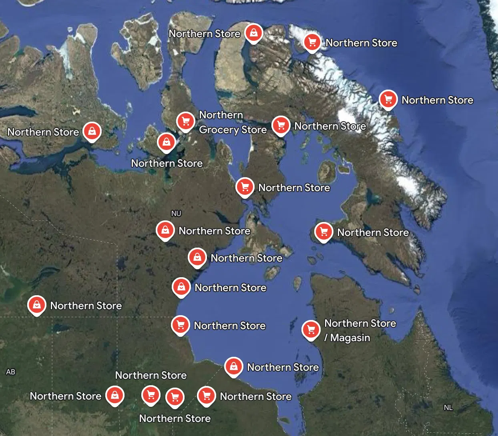


---


そこで、オープンデータ **OpenStreetMap (OSM)** を利用
*Open Database License(ODbL)に準拠*
*地図データはGeofabricからダウンロードできる*

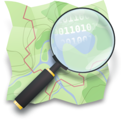

*参考: https://www.openstreetmap.org/*

---

## 解決策A: Overpass API

OpenStreetMapベース
地図データの検索ができる
*参考: こちらで遊んだ例は、**Submarine vol.1にて***
*『Overpass APIで全国のロードサイド店舗の位置情報を集めよう』*

**欠点**

- 独自クエリ言語Overpass QLを扱う必要がある
- 環境構築が非常に面倒

***Overpass Turbo**などの公開インスタンスも存在*
*手軽に使うにはこれで十分*
*参考: https://overpass-turbo.eu/*


---

## 解決策B: データベース管理システム

**DBMS: データベース管理システム** 
大量のデータを効率的に管理し扱うシステム
*システム開発やデータサイエンスなど普遍的に使われている*

OSMのデータをDBとして取り込んで読み込んで
検索や計算を行う


**欠点**

- クエリ言語SQLを覚える必要がある
*ただし可搬性の高い知識で、むしろありがたい点でもある*

---

## ということで今回はPostGISを導入🐘🐘🐘🐘🐘🐘🐘🐘🐘🐘🐘🐘🐘


地理空間データを扱うための
PostgreSQL (DBMS) の拡張機能

データの検索だけでなく、長さや面積の計算
重なりの判定といった様々なタスクを扱える

*参考: https://postgis.net/docs/manual-1.5/ch08.html*


---

## やること

長い🐘生、**北海道で一番🐘い
産業施設が気になることもある**

- 製鉄所が圧倒的？
- 製紙産業関連施設
- 太陽光発電施設

産業施設を面積順に並べ
最も大きい施設を調べよう

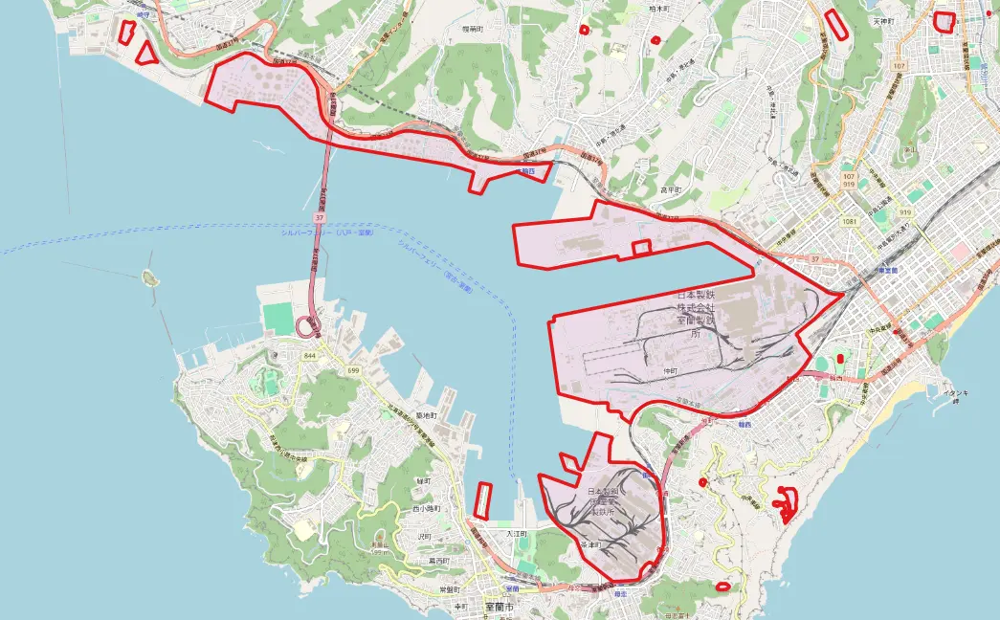

---

## 基本的な流れ


1. 対象のデータを取得: **Overpass API**
2. DBを立てる: Docker
3. OSMデータをDBへ取り込む: GDAL/OGR
4. データを検索: **PostGIS**
5. 可視化: QGIS

*(1)については*
*OSMの生データは嵩張りすぎたので*
*公開インスタンス**Overpass Turbo**を使用*

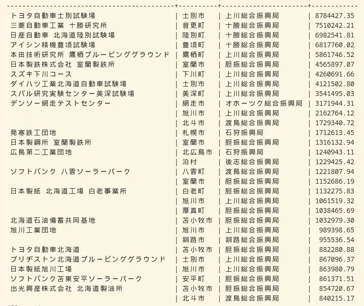


---

## 結果

---

<!-- _color: gray -->

**結果: 北海道全土**


---
<!-- _color: gray -->

**結果: 室蘭市**


---

<!-- _color: gray -->

**結果: 上川地方周辺**

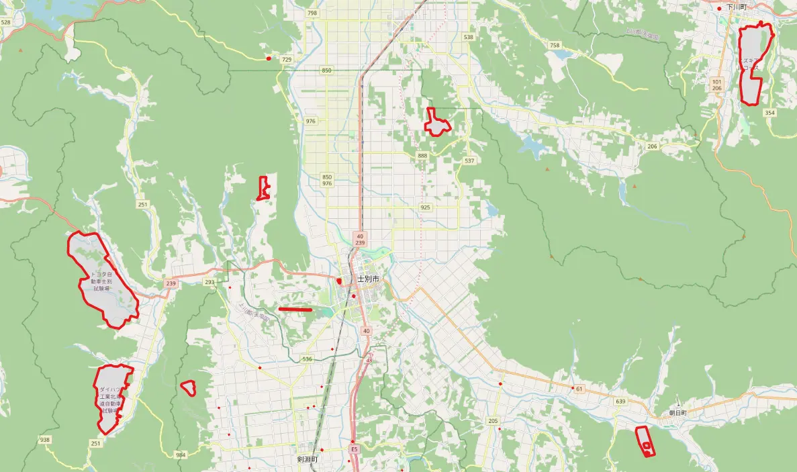


---

## 何となく

**胆振地方が強そう**

- 室蘭も苫小牧もある...
- 製鉄も製紙もある...
- ウポポイもクマ牧場もある...

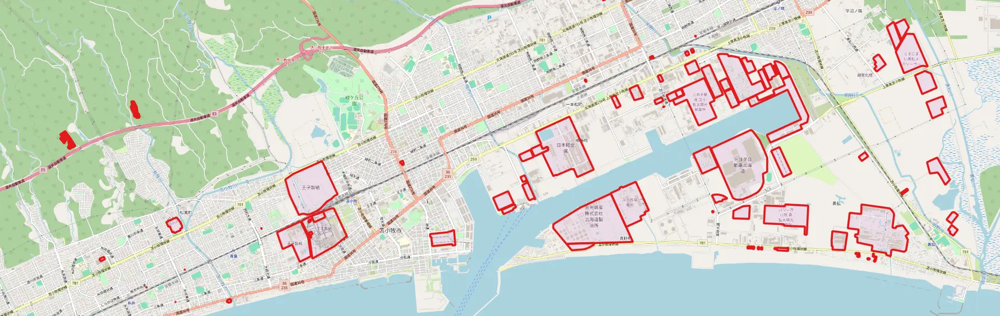

---

## 産業施設ごとの面積ランキング (大きい順)

```sql
SELECT ind.name, ct.name, sb.name, ROUND(CAST(ind.area AS NUMERIC),2)
FROM industries AS ind
JOIN cities AS ct ON ind.city_id=ct.id
JOIN subprefectures AS sb ON ct.subprefecture_id=sb.id
ORDER BY ind.area DESC
LIMIT 30;
```

---


**自動車試験場！？**


---

## 市町村ごとの産業施設の面積の合計 (大きい順)

```sql
WITH rank_ind AS (
  SELECT ind.id, ind.name, ROW_NUMBER() OVER (PARTITION BY ct.id ORDER BY ind.area DESC) AS rn
  FROM industries AS ind, cities AS ct
  WHERE ind.city_id=ct.id
)
SELECT ct.name, sb.name, ROUND(CAST(SUM(ind.area) AS NUMERIC),2) AS indsum, rank_ind.name
FROM cities AS ct
JOIN industries AS ind ON ind.city_id=ct.id
JOIN subprefectures AS sb ON ct.subprefecture_id=sb.id
JOIN rank_ind ON rank_ind.id=ind.id
WHERE rank_ind.rn=1
GROUP BY ct.id, sb.name, rank_ind.name
ORDER BY indsum DESC
LIMIT 20;
```

---

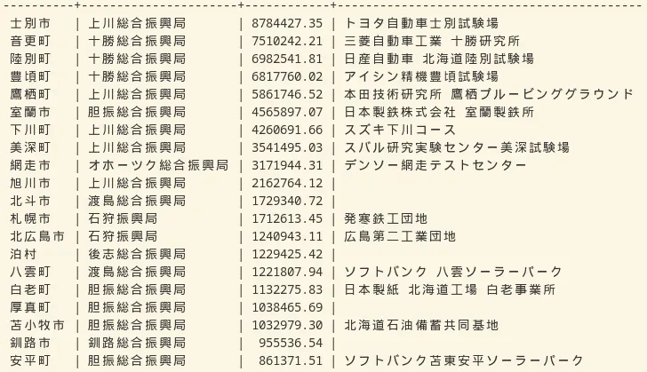

**士別市！？**

---

**自動車試験場が最強らしい...**

上位の産業施設は
自動車関連の試験場が
多くを占めている

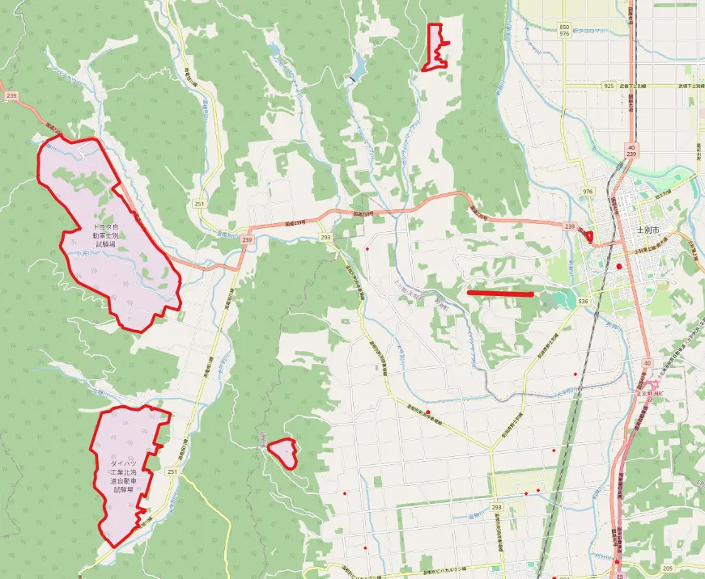

---

<!-- _class: smartblockquote -->

## 士別市の自動車試験場

士別市は「自動車等試験研究のまち・士別市」として街をPRしているらしい
> これら5か所の試験場の総面積は、行政区域面積の約2.8％を占める1,670haに及び、全国に類のない規模の試験場の集積地となりました。...(中略)...士別市はかつての冬期間の耐寒試験だけのまちから、自動車等試験研究のまちへと変貌を遂げました。

---

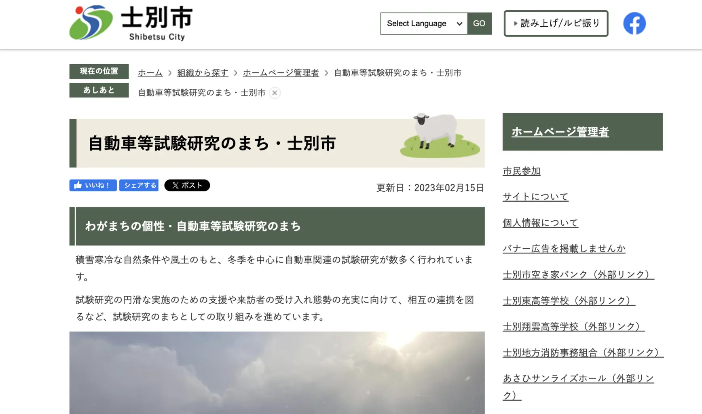

---

## 道南は道南ですか (怒)

```sql
SELECT ind.name, ct.name, sb.name, ROUND(CAST(ind.area AS NUMERIC),2)
FROM industries AS ind
JOIN cities AS ct on ind.city_id=ct.id
JOIN subprefectures AS sb on ct.subprefecture_id=sb.id 
WHERE ST_Y(ST_Centroid(ind.geom)) < 42.25
AND sb.name IN ('渡島総合振興局', '檜山振興局')
ORDER BY ind.area
DESC LIMIT 10;
```

---

### 結果

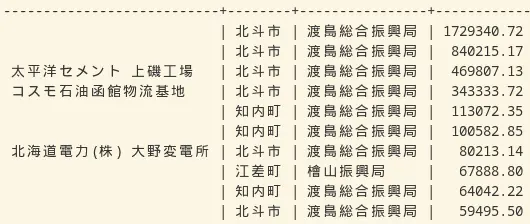

施設名が空になっている...
可視化して見比べてみると

---

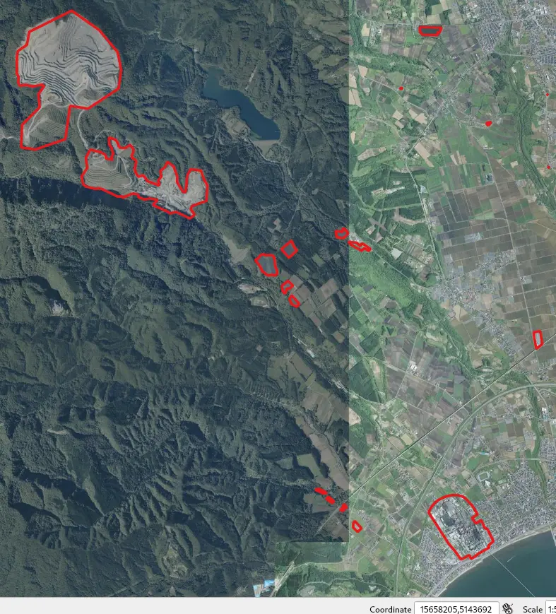

**峩朗鉱山だった！**

石灰石の鉱山

北斗市のセメント工場は現役最古
昔は専用の電気鉄道も
通っていたらしい

---

## 注意: OSMデータの課題について

OSMの生データを使う場合
情報量の少なさや地域差が存在する場合がある
*コミュニティベース特有の課題*

今回の結果は正確でない可能性もあるので注意
*本当のデータ分析用途であれば、用途に応じて
信頼できる提供元からデータをもらう必要がある*

*話題: 信頼性のあるオープンな地図データの提供を目標とする
企業団体による**Overture Maps**プロジェクトも存在*

---

## おわりに

- 長い🐘生、地図から何らかの情報を
いい感じに引き出す方法を紹介
- 今回はPostGISを使用
用途によってはMySQLやSQLite
DuckDBも視野に入るので
色々試してみてみてください

*原作: https://peruki.dev/blogs/articles/postgis*


