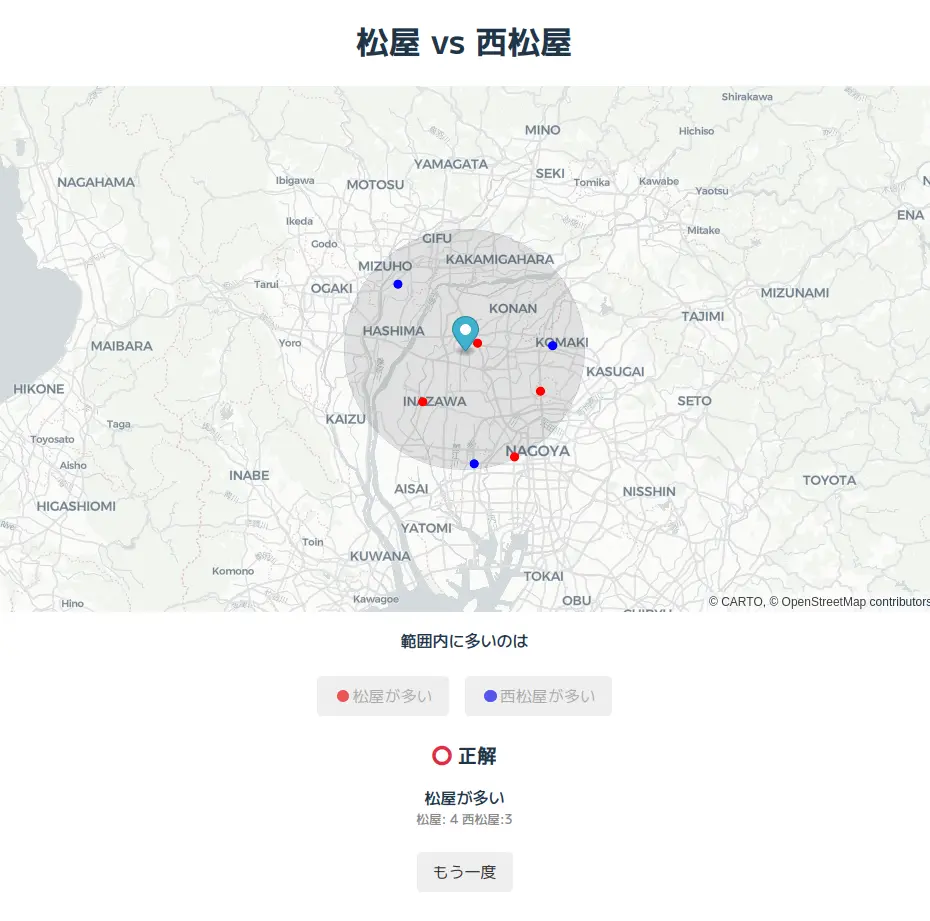
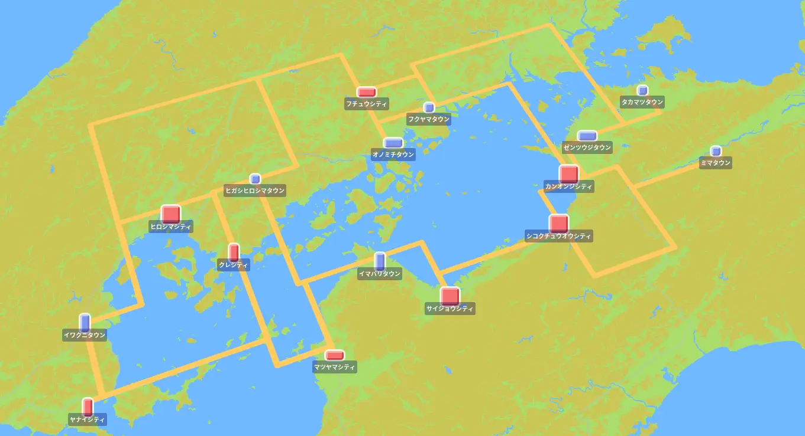

# オープンな地図データで遊ぼう

**OpenStreetMap x PostGIS/DuckDB**

2025年5月16日 大LT
多田 瑛貴 (@PerukiFUN)

---

## 自己紹介

多田 瑛貴 (ただ てるき)

GitHub: TadaTeruki / X: @PerukiFUN / HP: peruki.dev

- 福山 *広島県* → 京都 → 函館
- 複雑系知能学科 複雑系コース 学部4年 
- Mariners' Conference 設立/元部長
- 技術は地理空間情報を軸に色々やってます
*GIS、GUI (Webフロントエンド含む)、グラフィックス
データ分析、機械学習 etc...*

---

## はじめに

長い人生、**地図から何らかの情報をいい感じに引き出したい** 時がある 

---

次のことが知りたいとき...

 - 国道5号の長さを測る
 *ちなみに、長さはだいたい280km (wikipedia情報)*

---

次のことが知りたいとき...

 - 半径数km以内の**特定の店舗**を探す

 

---

## よくある方法: Google Maps

手軽に情報を得る分には十分だが...
データ分析はできない
*APIを使っても、大量のデータをコピーして使うのは*
*技術的に困難かつライセンス違反*

---

## OpenStreetMap (OSM)

オープンデータ **OpenStreetMap (OSM)** を利用
*Open Database License(ODbL)に準拠*

データとして扱うことで色々な分析が可能になる
*国土数値情報等のオープンデータと比較し
様々な種類の情報をマルチモーダルに扱えるのも嬉しい点*

---

## データベース管理システム

**DBMS: データベース管理システム** 
大量のデータを効率的に管理し扱うシステム
*システム開発やデータサイエンスなど普遍的に使われている*

OSMのデータをDBMSに取り込み
(主に) SQLを使って情報を検索する

*道や建物の属性がそのままカラムになる！*

---

地理空間情報を扱う機能や拡張を利用すれば
DBMSだけで、**意外と色々なタスクがこなせる**

- **測地系や地理情報の種類**など、地理空間情報特有の概念やデータ形式への
- **距離・面積の計算や重なり判定、クラスタリング**など

---

## 主な選択肢

- サーバー型
  - **PostgreSQL + PostGIS**
  *機能が豊富、定番感が強い*
  - MySQL など
- 組み込み型
  - **SQLite**
  *地理空間情報の取り扱いの基盤として
  何かとよく使われる*
  - **DuckDB**
  *巨大なデータの集計クエリなど
  列単位でまとめて扱うタスクに向く*

---

## 今回はDuckDBを使用 🦆

端的に言えばOLAP版のSQLite

**組み込み型**
一般には、アプリケーションに組み込んで使う
*PostgreSQLのpsqlのようにCLIツールも提供され
対話的に使うこともできる*

**OLAP系**
巨大なデータの集計クエリなど
列単位でまとめて扱うタスクに向く

---

## やること

**某捕獲系RPGのマップを作りたい**

長い人生、地元がゲームに登場してほしい時もある

函館にあたる町は
出てきていない気がする...

---

## デモ

**pocket-rpg-map.pages.dev**

---

## 基本的な流れ

1. OSMのデータを取得
2. **DuckDBを使って**
「拠点性の高い都市」のデータを
都市データとして分析・抽出
3. 選択範囲内の都市データを
ランダムに抽出
4. 抽出した都市をつなぐ道を生成

---

## 拠点性の高い都市をどう選ぶ？

例えば北海道なら、札幌、函館、旭川、帯広、釧路など
*江別や千歳も都市としては大きいが、上記に比べ強い拠点性があるとは言えない*

---

基準は色々ある
最終的には以下のようにスケールごとに定義:

---

様々な属性情報を複合的に分析するため
多様な情報がほしい ➡️ できればOSMの全データを参照したい

---

## まとめ

- 長い人生、地図から何らかの情報を
いい感じに引き出す方法を紹介
- DBMSによるデータ分析は面白い
- それぞれのDBMSに特有の利点があるので
用途に応じて選択するとよい
- OpenStreetMapは面白いので
是非やってみてください

