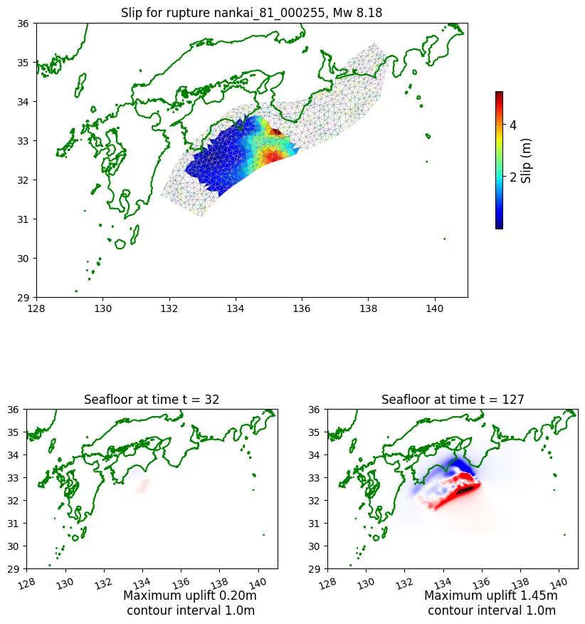
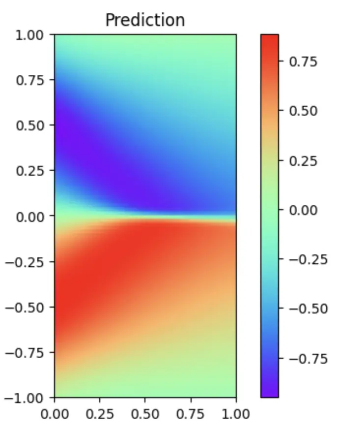

## コースオリエンテーション: 複雑系コース

島内研究室所属
複雑系知能学科 複雑系コース 4年
多田 瑛貴

---

## 研究内容

**物理的な意味を付与した深層学習モデルによる
津波シミュレーションの高速化**

津波シミュレーションは
空間を区切るメッシュ上で
流体現象の支配方程式を解く方法が一般的

高精度な出力には細かなメッシュが必要
→ 計算コストが増大

*図: 南海トラフを震源とするシミュレーションの例
出典は p.6 に記載*

---

深層学習モデルを用いた
支配方程式の数値計算手法や
生成モデルを用いて
従来手法によるシミュレーションデータの
再現を目指す

GPUの利用により、小規模な計算資源でも
高精度な結果を得られる可能性がある

*図: 南海トラフを震源とするシミュレーションの例
出典は p.6 に記載*

---

## 過去の活動とコース選択の経緯

- シミュレーションへの興味
    - 地形の侵食・堆積の数理モデルを用いた
    景観進化モデル (Landscape Evolution Model) の実装
  *2023年度 北海道ITクリエータ発掘・育成事業 採択*
  *右図: 実装した景観進化モデルによる地形生成*
  - プロジェクト学習での数理モデル構築経験
- 地理空間情報への興味
  - Project PLATEAU (国土交通省) 関連OSSの開発貢献

もとの得意分野はソフトウェア開発 (GUI, CG等) だったが
数理方面にも渡る幅広い視野を持ちたいと考え
複雑系コースを選択

---

## 研究室で学んでいること

- 機械学習
  - 多層パーセプトロン, CNN, GANs (生成モデル) など
- 数値計算
  - 有限要素法(メッシュベース),
  PINNs (深層学習モデルベース) など
  *右図: PINNsによるBurgers方程式の数値解*

**関連する講義**
- B1:「データサイエンス入門」
- B2:「力学基礎」「確率論」「システムと微分方程式」
- B3:「複雑系と情報処理」
&emsp; 「応用データ解析」「システム情報科学実習」

---

## 画像出典

LeVeque, R., Nomura, R., & Fujita, S. (2024). Synthetic dataset of 2342 earthquake/tsunami scenarios targeting the Nankai trough subduction zone (0.0.1) [Data set]. Zenodo. https://doi.org/10.5281/zenodo.12696848

ディレクトリ: nankai_data/quakes/png/nankai_81_000255_slip_dtopo.png

Licensed under CC BY 4.0.