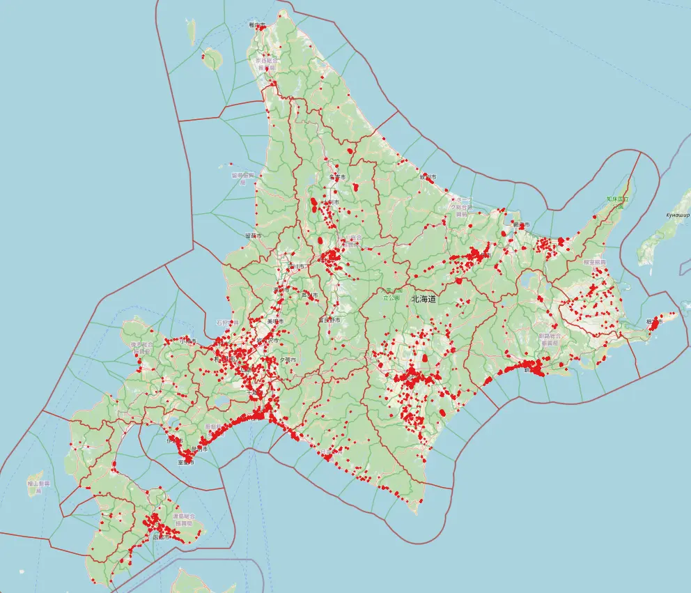

## コースオリエンテーション: 複雑系コース

島内研究室所属
複雑系知能学科 複雑系コース 4年
多田 瑛貴

---

## コース選択の経緯

もとの得意分野はソフトウェア開発
地理情報システム / GUI / CG が中心

物理現象のシミュレーションへの興味から
数理科学を含めた幅広い視野を持ちたいと考え
複雑系コースを選択

---

## 過去の活動

- 土壌の侵食作用の数理モデルを用いた
    地形形成のシミュレーションの実装
  *右図: 実装したLEMによる地形生成*

  2023年度 北海道ITクリエータ発掘・育成事業 採択

---

## 過去の活動

- P2HACKS
  - 未来大の学内ハッカソン
  - 複雑系コースの3人でチーム構成
  - Post-PBL部門 **最優秀賞**

---

## 過去の活動

コミュニティ活動を促進し、他コース生と交流

- 学内サークルMariners' Conferenceを設立
  - 未来大の総合技術コミュニティとして様々な大学と交流
  - 技術同人誌の頒布
- YAPC::Hakodate 2024 コアスタッフとして未来大に誘致

---

## 研究室での活動

**研究内容: 深層学習モデルによる
津波シミュレーションの高速化**

学んでいること
- 深層学習モデル *多層パーセプトロン、GANsなど*
- 数値計算 *有限要素法など*

*右図: 南海トラフを震源とする
メッシュベース手法でのシミュレーションの例
出典は p.6 に記載*

---

## 画像出典

LeVeque, R., Nomura, R., & Fujita, S. (2024). Synthetic dataset of 2342 earthquake/tsunami scenarios targeting the Nankai trough subduction zone (0.0.1) [Data set]. Zenodo. https://doi.org/10.5281/zenodo.12696848

ディレクトリ: nankai_data/quakes/png/nankai_81_000255_slip_dtopo.png

Licensed under CC BY 4.0.