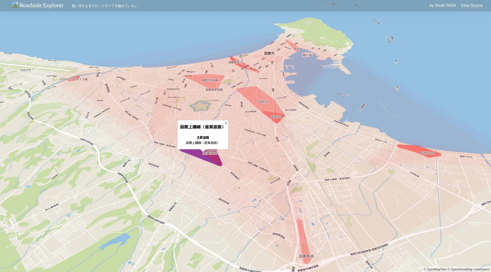

# Mariners' Conference 自己紹介LT

2025年4月18日

公立はこだて未来大学
複雑系知能学科 複雑系コース

多田 瑛貴 (@PerukiFUN)

*写真: 北海道札幌市*

---

## 自己紹介

多田 瑛貴 (ただ てるき)

GitHub: TadaTeruki / X: @PerukiFUN / HP: peruki.dev

- 福山 *広島県* → 京都 → 函館
- 複雑系知能学科 複雑系コース 学部4年 
 *Mariners' Conferenceも今年度で4年目らしい*
- Mariners' Conference 設立/元部長
  - 今も学内/学外イベントの運営をこまごまやっています
  *物事の立ち上げにかかる根気を身につけた気がする*

---

## 技術の守備範囲
(GitHubを見たら大体わかる話)

地理空間情報を軸に、空間的なものの周りを色々やっています

- 言語: Rust, JS/TS, Go, Python, C/C++, etc...
- GUI開発 / Web開発
  - Svelte, React / SvelteKit, Next.js / Tailwind CSS
  *バックエンドもGoやPythonで書いたりしますが*
  *最近はWebAssemblyの埋め込みやサーバレスなど軽量に済ませることが多いです*
- CG *モデリングとかはできないけど...*
- GIS (Web/デスクトップ) *利用者というよりも中身の話だけど...*

---

## 趣味開発

- 架空地図生成したい
  - 地形・地名・交通網生成
  - Hokkaido Generator (2024)
    *今年はアップデートしてNT函館に出展します。間に合うか...？*
- その他、地図系の趣味開発が多め
  - 松屋 vs 西松屋 (2023)
  - 捕獲系RPGマップジェネレータ (2025)

---

## その他

- 機械学習
  - 2024年後期あたりから
  研究で使うためちゃんと学び始めています
  - GANs *生成モデル*
  PINNs *微分方程式を解くモデル* など...
  - 津波のシミュレーションをする予定です
- ソフトウェア設計・開発手法
  - 共同開発でよく指針に使います
*昨年のP2HACKSでは最優秀賞を受賞しました🥇*
*www.fun.ac.jp/activity/26603*

皆さんと知識を共有できる機会があると嬉しいです🌲

---

## LTで行った場所の思い出

 - 千歳市 (千歳科学技術大学)
 - 会津若松市 (会津大学)
 - 釧路市 (釧路高専)

LTサークルは全国の技術系大学各所にある
いろんな文化があって面白かったりする
*全国のオタクと繋がろう*

---

**釧路**

- 釧路高専
- ルーレットで発表順決める文化
休憩時間も決める
*休憩時間のあとに休憩時間が入る*
- 高専前の大楽毛海岸は
石炭拾いが可能
- サブウェイある
- イオンある
- イオンモールある
- 豚丼

---

**千歳**

- 千歳科学技術大学
- Cist IT COMMUNITY
 *マリカンとの関わりで*
 *今後動きがあるそうなないそうな...* 
- 学園祭でLTをしていたりする
- 札幌と距離が近い
セガ札幌スタジオから
大量のぷよぷよグミが
提供されたりする
- カツカレー
- イオンがある
- レラがある！！！！！！

---

**会津**

- 会津大学
*他にも郡山には日大工学部があったり*
- Zli *LTサークル* あり
団体運営や資金の集め方など
色々とモデルになる
- 打ち上げで
大量のマクドとピザ
どう片付けたんだろう
- 豚丼
- 馬刺
- イオンない...........................................
*昔はサティがあったらしい*
*イオンタウンが喜多方にあるらしい*

---

## 今まで行った感動できるイオンランキング

**1.** イオン静内
**2.** イオンモール名寄
**3.** イオン厚岸
**3.** イオン根室
**3.** イオンモール発寒

君はどのイオンが好きか...？

---

## 宣伝: 未来大×企業エンジニア 大LT2025

**5/17 (土曜日) 13:30〜** 
- 3年目、2年ぶりの開催
- 今回は協賛7社 *公表は近々。お楽しみに...*
- 企業の方のLTが聴けます。お話しも伺えるかも

春LTの発表内容ベースでも問題ないです
1・2年の方にもぜひ登壇or聴講を...

*反省: Mariners' Conferenceの後の割とすぐに入れてしまった*
