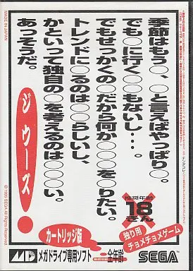

# 大LT宣伝

多田 瑛貴 (@PerukiFUN)

---

イベント名：未来大×企業エンジニア 大LT2025
日時：2025年5月17日 13:30 ~ 17:00 (自由交流 17:00~17:30) (懇親会 18:30~)
募集期間: 2025年5月10日 23:59まで
場所：公立はこだて未来大学 講堂
参加費：無料

※ 未来大生限定

---

<!-- _class: smartblockquote -->

# 来て 

聴講もいいよ

> 今年は懇親会以外の交流の機会として、イベント終了直後、聴講者の皆様にも自由に企業エンジニア・学生登壇者の方々と直接お話できる時間を設ける予定です。

---

## 10秒間待ちます

---

# 大LTを振り返って

多田 瑛貴 (@PerukiFUN)

---

<!-- _class: smartblockquote -->

### ある日...

> あー、確かに運営の権利の範囲とか料金の扱いは、別途書類に定めて公開したほうが良いかもしれない。意思決定の円滑化も考えて
> …といって今から整備するのは時期的にも体力的にも間に合わないので
> もし過去にそういう書類があればそれを引き継ぎ
> なければ今回は反省点ということで、来年度か再来年度の運営の人たちに託そう

---

---

## その1: 「協賛規定」や「CoC」を作ろう

---

### 直近のイベント

- 4月27日: Mariconf Spring LT
- 5月某日: HACK
- 5月5日: NT函館
- 5月17日: 当日

=== 空白の期間 ===

---

## その2: 時期は6月や7月でもいいかもしれない

5月に行ったのは
多くの企業のインターン応募時期に合わせるため

割り切って1年・2年をターゲットとして
来年のインターン応募の参考にするようにすれば効果は十分

---

# その3: 予算カツカツは、やめよう

協賛N社と決めて実際にN社集まるわけではない
マージンは取っておこう

*今回実は本当に危なかった*

---

# その4: 協賛金には税金 (消費税) がかかる

あなたが課税事業者なら尚更考えよう

受取寄附金 (非課税) として処理できるかは税務署に聞きます

---

# その5

---

# 反省は、思い立ったら書こう

今回、ある意味すごい貴重な知見を得られるかもしれない

---

## 10秒間待ちます

