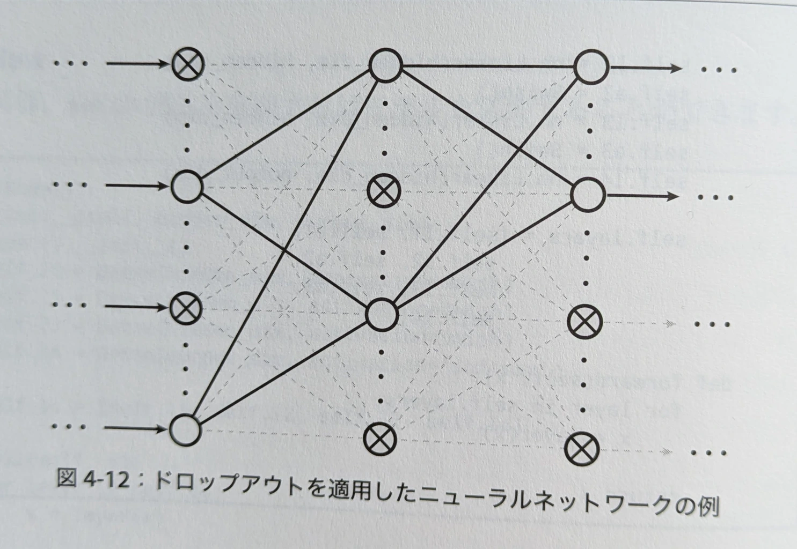
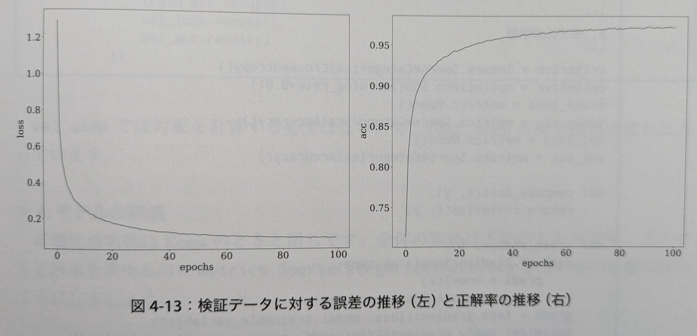
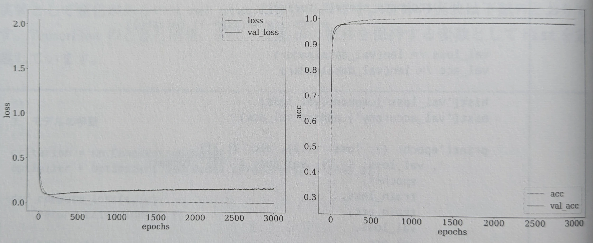

**詳解ディープラーニング**
# 4.4-4.6 ディープニューラルネットワーク

島内研究室 2025年4月7日 輪読会

発表者: 多田 瑛貴
(公立はこだて未来大学 複雑系知能学科 複雑系コース)

---

## 前回の内容

- 誤差逆伝播法
  - 自動微分に基づき、パラメータに対する微分を高速に計算 
  - 連鎖率 (合成関数の微分公式) によって説明可能
- 勾配消失問題
  - 深いネットワークにて勾配が小さくなり、学習が進まない現象
- 活性化関数
  - ニューロンの出力に非線形性を与える
  - Sigmoid: 最大値が0.25であり勾配消失問題が課題
  - tanh: 最大値が1.0であり勾配消失が起こりにくくなる
  - ReLU: 勾配消失が起こりにくく、かつ高速な計算が可能
  - Leaky ReLU: 負の値に対しても小さな勾配を持つ

---

## 前回内容の補足

- 他の活性化関数
  - Swish
  - Parameteic ReLU (PReLU)
  - ELU

様々な手法が存在し、ReLU等よりも優れた性能を示すことがある
ただし、どの手法が最適かはケースバイケース

計算コストの低さにおいてReLUが優れているため
実験のサイクルを早めるためReLUを使用することが多い

---

## 4.4 ドロップアウトの導入

学習の際にランダムにニューロンを除外(=ドロップアウト)させる手法
汎化性能の向上に寄与する
*汎化性能: 未知のデータに対しても高い性能を発揮する能力*

*図の✖️は、ドロップアウトされたニューロン*

---

### なぜ汎化性能の向上に有効か？

一つのモデルで学習を行うと、過学習のリスクがある

複数のモデルを生成・学習し結果を組み合わせることで
集合知的に汎化性能を向上できる
→ **アンサンブル学習**: 複数のモデルを生成し学習を行う手法

ドロップアウトにより、一つのモデルから実質的に複数のモデルを生成
→ 擬似的なアンサンブル学習

---

### 数式での表現

マスク項を導入し表現

$$\mathbf{m} = (m_1, \dots, m_j, \dots, m_J)^T$$
$m_j$は確率$1-p$で$1$、$p$で$0$を取る値とする

ドロップアウトを適用した場合の出力は

$$h_1 = f(Wx + b) \odot m$$

*$\odot$はアダマール積 (要素ごとの積)*

---

次の層は
$$h_2 = g(Vh_1 + c)$$
ここで
$$
\begin{align*}
p := Wx + b \\
q := Vh_1 + c
\end{align*}
$$

に対して、誤差項は

$$
\begin{align*}
e_{h_1} := \frac{\partial E_n}{\partial p} \\
e_{h_2} := \frac{\partial E_n}{\partial q}
\end{align*}
$$

---

$$q = V f(p) \odot m + c$$
であるから
$$
\begin{align*}
e_{h_1} &= \frac{\partial E_n}{\partial q} \frac{\partial q}{\partial p} \\
&= f'(p) \odot m \odot V^T e_{h_2}
\end{align*}
$$

誤差逆伝播においてもマスク項を考慮する必要がある

---

### 注意点

- ドロップアウトは学習時のみ使用
- ニューロンの出力は$1/(1-p)$倍にスケーリング *pはドロップアウト率*

---

## 4.5 学習の効率化に向けて

- 訓練データ・テストデータに加え検証データを用意
    - 訓練データ: 学習に使用
    - テストデータ: 学習後の性能評価に使用
    - 検証データ: 学習中の性能評価に使用 

**検証データの役割**

- 学習の可視化
- 早期終了の導入
- (学習率など、ハイパーパラメータの調整)

---

### 学習の可視化

- matplotlibなどを使用し学習の進捗を可視化 (誤差の推移・正解率の推移)

---

### 早期終了の導入

過度なエポック数での学習は、訓練データへの過学習をもたらす
*図左では、学習の途中で検証データに対する誤差が増えている*

**早期終了 (Early Stopping):**
学習を早期に打ち切るアプローチ
エポックごとの誤差を監視し、それまでの最小値を
一定期間上回らなくなったタイミングで学習を終了
*検証データに対する誤差が増加したタイミングを過学習の兆候とみなすことができるため*

---

直前のエポックの誤差のみを考慮するのではないことに注意
- 誤差の値はエポックによって上下する
  *ドロップアウトの適用時など、たまたま学習が行われていないニューロンが存在し得るため*

---

## 4.6 学習率の設定 (4.6.2まで)

学習率: 勾配に合わせてパラメータを更新する際のスケール
これまで、決め打ちで設定していた (例: 0.01)

$$\theta_{t+1} = \theta_t - \eta g_t$$

学習率の大きさにはトレードオフが存在
- 大きいと最適解を飛び越えてしまう
- 小さいと局所最適解に陥る・学習が進まない

学習率の設定手法は**最適化手法**として研究が進められている

---

### モメンタム

局所最適解に陥らず効率的に解を探索するには
はじめは大きく、徐々に小さくするのが理想的

**モメンタム (Momentum)**: 調整項を導入しこれを擬似的に実現

$\Delta \theta_t := \theta_{t+1} - \theta_t$として
$$\Delta \theta_t = -\eta g_t + \gamma \Delta \theta_{t-1}
$$

$\gamma$は$0.5$や$0.9$などが一般的

*この式は変形することで空気抵抗の式となる*

---

$\nabla_\theta f(\theta_t) := g_t$とすると、この式は

$$
\begin{aligned}
v_t &= \eta \nabla_\theta f(\theta_t) - \gamma \Delta \theta_{t-1} \\
\theta_{t+1} &= \theta_t - v_t
\end{aligned}
$$

と表現できる

---

### Nesterovモメンタム

$$
\begin{aligned}
v_t &= \eta \nabla_\theta f(\theta_t + \gamma \Delta \theta_{t-1}) - \gamma \Delta \theta_{t-1} \\
\theta_{t+1} &= \theta_t - v_t
\end{aligned}
$$

*$v_t = ($モメンタムの調整項を加えたパラメータの勾配$)- ($モメンタムの調整項$)$*

次のステップにおけるパラメータの近似値が求められるため
効率的に解の探索ができるようになる

---

## まとめ

- 活性化関数はケースバイケース
- ドロップアウトの導入により擬似的なアンサンブル学習が可能 → 汎化性能の向上
- 検証データの導入により学習の可視化・早期終了が可能

