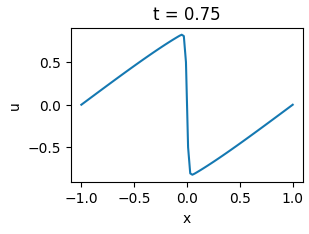
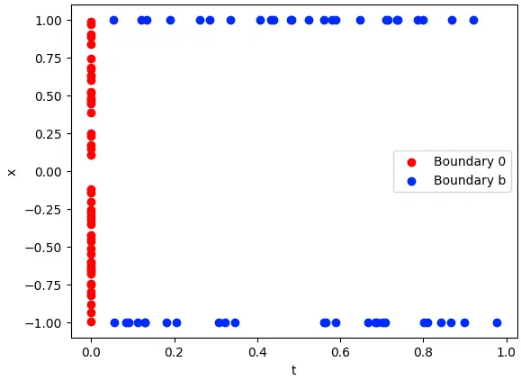
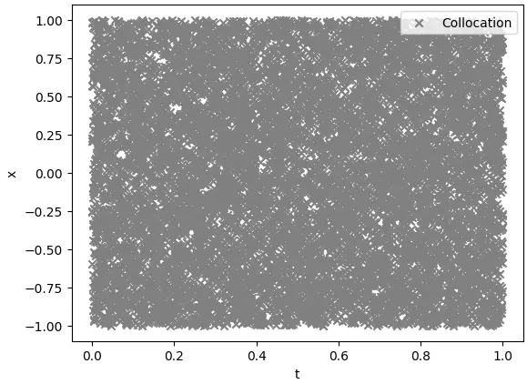
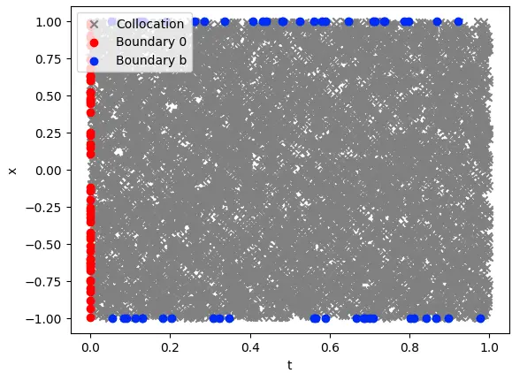
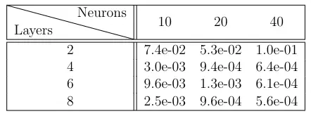
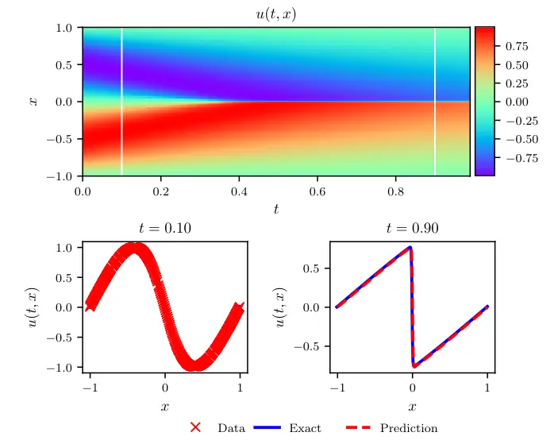

# "Physics Informed Deep Learning (Part I): Data-driven Solutions of Nonlinear Partial Differential Equations"

島内研究室 2025年1月14日 輪読会

発表者: 多田 瑛貴 (公立はこだて未来大学 学部3年)


---

## 書誌情報

**Physics Informed Deep Learning (Part I): 
Data-driven Solutions of Nonlinear Partial Differential Equations**

著者: Maziar Raissi, Paris Perdikaris, George Em Karniadakis
arXiv:1711.10561 (https://arxiv.org/abs/1711.10561)

2017年発表の論文、Part IとPart IIの2部構成

- Part I: data-driven solution (深層学習による非線形偏微分方程式の数値解法)
- Part II: data-driven discovery (PINNsのパラメータ不定の方程式に対する適用)


---

## 本研究の概要

"physics-informed neural networks" (PINNs) の提案
- 非線形偏微分方程式を解くデータ駆動のアプローチ
- ある物理現象の支配方程式を考慮した深層学習を導入
- 既知の物理法則に対して、**少量の教師データから有用な近似解を提供**
- パラメータ不定の偏微分方程式に対しても適用可能 (Part IIの範囲)

---

# 背景

- データ駆動での数値解法のアプローチとして、深層学習を用いたい
*物理法則を深層学習を用いて解こうとする意義は、研究結果を踏まえ後述する*

- 物理法則を深層学習を用いて解くとき
現実の多くの場面では、教師データを十分な量取得できない
*データが少ない場合、結果のロバスト性や、学習を通したモデルの収束を保証できなくなる*

- 既知の支配方程式を使えないだろうか？

---

# 提案手法

- 教師データだけでなく、支配方程式を損失関数に取り入れる
*具体的には、時空間領域上に選点(collocation point)をとり、
その点での支配方程式の残差を損失とする*
*教師データは、ディレクレ境界条件から与える*

- 非線形偏微分方程式をそのまま (線形化等をせず) 適用

---

## 導入対象: Burgers方程式

一般に、動的粘性率$\nu$から

$$ u_t + uu_x - \nu u_{xx} = 0 $$

ナビエ-ストークス方程式から、圧力項を無視したもの
*ナビエ-ストークス方程式: 流体の運動を記述する偏微分方程式
(非圧縮性粘性流体の運動方程式)*

ここでは、パラメータおよび初期・境界条件を
次のように定め扱うこととする

$$
\begin{cases}
u_t + uu_x - (0.01/\pi)u_{xx} = 0 \\
u(0, x) = -\sin(\pi x) \\
u(t, -1) = u(t, 1) = 0
\end{cases}
$$





---

## 学習の目標

支配方程式を次のように表現 ($u(t, x)$: 未知関数, $\lambda$: パラメータ)

$$ u_t + \mathcal{N}[u; \lambda] = 0 $$


現実の物理法則の支配方程式の多くは、この形式で表現可能

*Burgers方程式においては... $u_t+\lambda_1uu_x-\lambda_2u_{xx}=0$ より $\mathcal{N}[u; \lambda] = \lambda_1uu_x-\lambda_2u_{xx}$*

---


本論文 Part I ではパラメータ$\lambda$の不定性を考慮せず、次のように表現

$$ u_t + \mathcal{N}[u] = 0 $$

**目標: 未知関数 $u(t,x)$ を近似するニューラルネットワークを作る**
*ただし、$x \in \Omega, t \in [0, T]$ とし、$\Omega$は$\mathbb{R}$の部分集合*

```
def u(t, x):
  u = neural_net(tf.concat([t,x],1), weights, biases)
  return u
```

---

## 学習のおおまかな方針

- 教師データに対する誤差の損失関数 $MSE_u$
- 支配方程式に対する誤差の損失関数 $MSE_f$

この和である

$$ MSE = MSE_u + MSE_f $$

を全体の損失関数として最小化する

---

### 教師データの設定

ディレクレ境界条件から
$$
\begin{cases}
u(0, x) = -\sin(\pi x) \\
u(t, -1) = u(t, 1) = 0
\end{cases}
$$

この条件を満たす時空間領域上の点を設け
教師データ$(t_u^i, x_u^i, u^i)$とする
*$(t_u^i, x_u^i)$: 時空間上の点、$u^i$: その点における$u$の値*

損失関数は、この平均二乗誤差$MSE_u$
*$N_u$: 教師データの数*

$$ MSE_u = \frac{1}{N_u} \sum_{i=1}^{N_u} |u(t_u^i, x_u^i) - u^i|^2 $$



---

### 支配方程式の損失関数

支配方程式
$$ u_t + uu_x - (0.01/\pi)u_{xx} = 0 $$



時空間領域からランダムにおいた選点
$(t_f^i, x_f^i)$ をおき、残差を計算

$$ f(t_f^i, x_f^i) = u_t + uu_x - (0.01/\pi)u_{xx} $$

$f$を0に近づける *=方程式を満たす* よう学習
*具体的な$u$の値は求めない*
損失関数は、平均二乗誤差$MSE_f$

$$ MSE_f = \frac{1}{N_f} \sum_{i=1}^{N_f} |f(t_f^i, x_f^i)|^2 $$

---

### 補足: $MSE_f$の計算

$$ f(t_f^i, x_f^i) = u_t + uu_x - (0.01/\pi)u_{xx} $$

ニューラルネットワークに対する自動微分から得る

```
def f(t, x):
  u = u(t, x)
  u_t = tf.gradients(u, t)[0]
  u_x = tf.gradients(u, x)[0]
  u_xx = tf.gradients(u_x, x)[0]
  f = u_t + u*u_x - (0.01/tf.pi)*u_xx
  return f
```

---

## 損失関数の設定

全体の損失関数は

$$ MSE = MSE_u + MSE_f $$



右図は、$N_u=100, N_f=10000$

*参考: $N_f=0$であれば単に教師データのみに基づく*
*深層学習本来のアプローチと同じとなる*

---

## 実験

- $N_u=100, N_f=10000$
- 9層(中間7層)のニューラルネットワーク
- 中間層ニューロン数20
- 活性化関数: tanh
- 最適化手法: L-BFGS
- 選点の生成手法: Latin hypercube sampling

---

### 支配方程式・境界条件へのあてはまり


相対二乗誤差(RSE): $6.7 \times 10^{-4}$
*上図: $tx$ 平面上の予測値$u$の値, 下図: $t=0.25, 0.50, 0.75$における$x$に対する$u$の値*

---

### $N_u$・$N_f$の値と性能の関係

相対二乗誤差による比較、9層(中間7層)、中間層ニューロン数20


選点$N_f$を与えることによって精度が向上していることがわかる

---

### レイヤ数・中間層ニューロン数と性能の関係

相対二乗誤差による比較、$N_u=100, N_f=10000$



概ね、レイヤ・ニューロン数が多いほど精度が高まる

---

## 複素関数への適用

Burgers方程式を近似するPINNでは、2入力1出力の実数関数をNNで表現していた
-> 複素関数の場合、実部と虚部を分けた2出力を用いる

---

## 導入例: Schrödinger方程式

$$
\begin{cases}
ih_t + 0.5h_{xx} + |h|^2h = 0 \\
h(0, x) = 2\mathrm{sech}(x) \\
h(t, -5) = h(t, 5) = 0 \\
h_x(t, -5) = h_x(t, 5) = 0
\end{cases}
$$
$h = u + iv$とすると、出力は$h(t,x) = [u(t,x), v(t,x)]$となる
この場合のPINNの損失関数は

$$ MSE = MSE_0 + MSE_b + MSE_f $$

$$
\begin{cases}
MSE_0 = \frac{1}{N_0} \sum_{i=1}^{N_0} |h(t_0^i, x_0^i) - h^i|^2 \\
MSE_b = \frac{1}{N_b} \sum_{i=1}^{N_b} (|h^i(t_b^i, -5) - h^i(t_b^i, 5)|^2 + |h_x^i(t_b^i, -5) - h_x^i(t_b^i, 5)|^2) \\
MSE_f = \frac{1}{N_f} \sum_{i=1}^{N_f} |h(t_f^i, x_f^i)|^2 
\end{cases}
$$


---

# 離散化した支配方程式への適用

特定の時間での値を教師データとして与え (例えば初期条件 $u(t=0)$)
支配方程式を離散化した上で、時間発展を計算し解を得ることを考えたい

- 本来は、ルンゲ=クッタ法などを用いて数値的に解く
- PINNsでは、ルンゲ=クッタ法に基づき
その計算過程の値を含めて損失を計算し最小化する

---

## 前提: ルンゲ=クッタ法の一般形

段数$q$のルンゲ=クッタ法は、$u^n$から$u^{n+1}$の時間刻みを$\Delta t$とし、次のように表される

$$u^{n+c_j(x)} = u(t_n + c_j\Delta t, x)$$

$$
\begin{cases}
u^{n+c_i} = u^n - \Delta t \sum_{j=1}^{s} a_{ij} \mathcal{N}[u^{n+c_j}] \\
u^{n+1} = u^n - \Delta t \sum_{j=1}^{s} b_{j} \mathcal{N}[u^{n+c_j}] 
\end{cases}
$$

*$a_{ij}, b_i, c_i$はルンゲ=クッタ法の係数であり、精度が高くなるように選ばれる*
古典的なルンゲ=クッタ法は、$q=4$ であり、係数は次の通り

$$
a = \begin{bmatrix}
0 & 0 & 0 & 0 \\
0.5 & 0 & 0 & 0 \\
0 & 0.5 & 0 & 0 \\
0 & 0 & 1 & 0
\end{bmatrix}, \quad
b = \begin{bmatrix}
1/6 & 1/3 & 1/3 & 1/6
\end{bmatrix}, \quad
c = \begin{bmatrix}
0 & 0.5 & 0.5 & 1
\end{bmatrix}
$$

---

これは、つぎのように変形する

$$
\begin{aligned}
& u^n = u^n_i, \quad i=1\dots q \\
& u^n = u^n_{q+1}
\end{aligned}
$$

つまり、$u^n_1, u^n_2, \dots, u^n_q$をルンゲ=クッタ法の計算過程の値、$u^n_{q+1}$を解の値として
$[u^n_1, u^n_2, \dots, u^n_q, u^n_{q+1}]$が存在
これらを$u^n_i$および$u^n_{q+1}$を右辺においた式として表すと

$$
\begin{cases}
u^n_i = u^{n+{c_i}} - \Delta t \sum_{j=1}^{s} a_{ij} \mathcal{N}[u^{n+c_j}] \\
u^n_{q+1} = u^{n+1} - \Delta t \sum_{j=1}^{s} b_{j} \mathcal{N}[u^{n+c_j}] 
\end{cases}
$$

**この $[u^n_1, \dots, u^n_{q+1}]$ をニューラルネットワークの出力とし、損失を計算する**

---

## 離散化した支配方程式での学習の方針

損失関数は残差二乗和 (SSE) を用いる

- ルンゲ=クッタ法の計算結果に対する誤差関数 $SSE_n$
- 境界条件への当てはまりに対する損失関数 $SSE_b$

この和である

$$ SSE = SSE_n + SSE_b $$

を全体の損失関数として最小化する

---

## Burgers方程式への適用

<!-- _class: smartblockquote -->

> ルンゲ=クッタ法の一般形 $\cdots
\begin{cases}
u^n_i = u^{n+{c_i}} - \Delta t \sum_{j=1}^{s} a_{ij} \mathcal{N}[u^{n+c_j}] \\
u^n_{q+1} = u^{n+1} - \Delta t \sum_{j=1}^{s} b_{j} \mathcal{N}[u^{n+c_j}] 
\end{cases}
$

Burgers方程式は次のように表現される

$$
\mathcal{N}[u^{n+{c_i}}] = u^{n+{c_i}}_t + uu^{n+{c_i}}_x - (0.01/\pi)u^{n+{c_i}}_{xx}
$$

---

ルンゲ=クッタ法の計算結果に対する誤差関数 $SSE_n$は
$$
SSE_n = \sum_{j=1}^{q+1}\sum_{i=1}^{N_n} |u^n_j(x^{n,i}) - u^{n, i}|^2
$$

*ここで、初期条件に対するデータの数は$N_n$*

境界条件への当てはまりに対する損失関数 $SSE_b$は

$$
SSE_b = \sum_{i=1}^{q} \left( |u^{n+c_i}(-1)|^2 + |u^{n+c_i}(1)|^2 \right) + |u^{n+1}(-1)|^2 + |u^{n+1}(1)|^2
$$

*境界条件の具体的な値は与えておらず、$N_b$にあたる値がないことに注意*

---

## 実験

- $t=0.1$における$u$の値から、$t=0.9$での解を計算
- $N_n = 250$
- ルンゲ=クッタ法の段数$q=500$

---



---

---

# まとめ


