# "Physics Informed Deep Learning (Part II): Data-driven Solutions of Nonlinear Partial Differential Equations"

島内研究室 2025年2月6日 輪読会

発表者: 多田 瑛貴
(公立はこだて未来大学 複雑系知能学科 複雑系コース)


---

# 書誌情報

**Physics Informed Deep Learning (Part II): 
Data-driven Solutions of Nonlinear Partial Differential Equations**

著者: Maziar Raissi, Paris Perdikaris, George Em Karniadakis
arXiv:1711.10566 (https://arxiv.org/abs/1711.10566)

2017年発表の論文、Part IとPart IIの2部構成

- Part I: data-driven solution (深層学習による非線形偏微分方程式の数値解法)
- Part II: data-driven discovery (パラメータ不定の方程式に対するPINNsの適用)

---

# 本研究の概要

"physics-informed neural networks" (PINNs) の提案
- 非線形偏微分方程式を解くデータ駆動のアプローチ
- ある物理現象の支配方程式を考慮した深層学習を導入
- 既知の物理法則に対して、少量の教師データから有用な近似解を提供
- パラメータ不定の偏微分方程式に対しても適用可能

PartIIでは、パラメータ不定の偏微分方程式にフォーカス

---

# 提案手法

物理法則の支配方程式を損失関数に取り入れたニューラルネットワークを構築
パラメータを学習対象とすることで推定を行う

以下の2つの適用方法を示す

- **Continuous Time Models**: 時間領域上の教師データから未知のパラメータを推定
- **Discrete Time Models**: 二つの時間の教師データから未知のパラメータを推定

---

# Continuous Time Models

時間領域上の教師データから未知のパラメータを推定

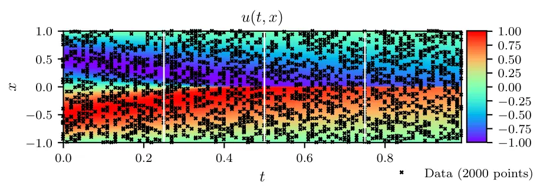

---

## 学習の目標

支配方程式を次のように表現 ($u(t, x)$: 関数, $\lambda$: パラメータ)

$$ u_t + \mathcal{N}[u; \lambda] = 0 $$

現実の物理法則の支配方程式の多くは、この形式で表現可能

**目標: 未知のパラメータ $\lambda$ を学習対象として加えた
関数 $u(t,x)$ のニューラルネットワークを教師データに適合させる**
*ただし、$x \in \Omega, t \in [0, T]$ とし、$\Omega$は$\mathbb{R}$の部分集合*

*個別のパラメータの学習は、PyTorchのtorch.nn.Parameter等を用いて実現可能*

---

## 導入対象: Burgers方程式

一般に、動的粘性率$\nu$から

$$ u_t + \lambda_1 uu_x - \lambda_2 u_{xx} = 0 $$

ナビエ-ストークス方程式から、圧力項を無視したもの
*ナビエ-ストークス方程式: 流体の運動を記述する偏微分方程式*

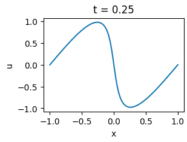
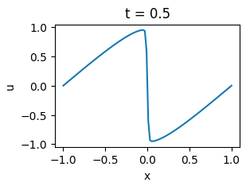
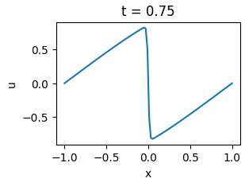


---

### 教師データの設定

時空間領域上の点および
それに対応する$u$の値から
教師データ$(t_u^i, x_u^i, u^i)$を作成
*教師データの$u$は何らかの方法で得られているとする*

損失関数は、この平均二乗誤差$MSE_u$
*$N_u$: 教師データの数*

$$ MSE_u = \frac{1}{N} \sum_{i=1}^{N} |u(t_u^i, x_u^i) - u^i|^2 $$


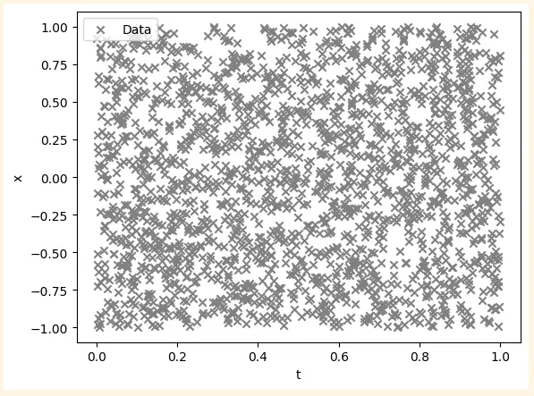

---

### 支配方程式の残差計算

支配方程式
$$ u_t + uu_x - \lambda u_{xx} = 0 $$

時空間領域からランダムにおいた選点
$(t_f^i, x_f^i)$ をおき、残差を計算
$f$を0に近づける *=方程式を満たす* よう学習
損失関数は、平均二乗誤差$MSE_f$

$$ MSE_f = \frac{1}{N} \sum_{i=1}^{N} |f(t_u^i, x_u^i)|^2 $$

*論文では、教師データと支配方程式の選点の数と時空間領域上の座標が同じとなっており、それぞれの点を別々に定義する必要は無いととれる*


---

## 損失関数の概要

- 教師データに対する損失関数 $MSE_u$
- 支配方程式に対する損失関数 $MSE_f$

この和である

$$ MSE = MSE_u + MSE_f $$

を全体の損失関数として最小化する

---

## 実験

$\lambda_1=1.0, \lambda_2=0.01/\pi$ つまり 
$$ u_t + uu_x - (0.01/\pi) u_{xx} = 0 $$

このBurgers方程式の解を教師データとして用いる
ロバスト性の検証のため、ノイズありの場合も同時に検証する

- $N=2000$
- 9層(中間7層)のニューラルネットワーク
- 中間層ニューロン数20
- 活性化関数: tanh
- 最適化手法: L-BFGS
- 選点の生成手法: Latin hypercube sampling

---

### 支配方程式・教師データへのあてはまり


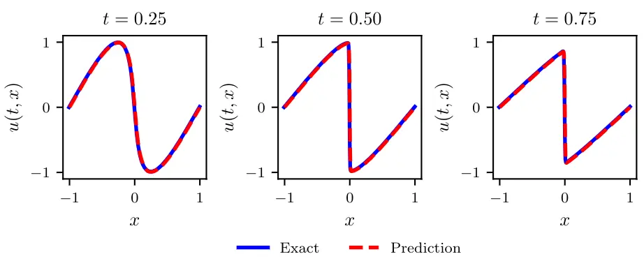

*左図: $tx$ 平面上の予測値$u$の値, 右図: $t=0.25, 0.50, 0.75$における$x$に対する$u$の値*

---

### 支配方程式・教師データへのあてはまり

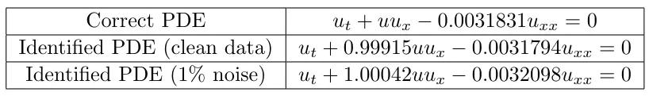

*上から、学習対象のパラメータ、ノイズなしの場合の予測値、ノイズありの場合の予測値*

---

### $N$およびノイズの値と性能の関係

相対二乗誤差による比較

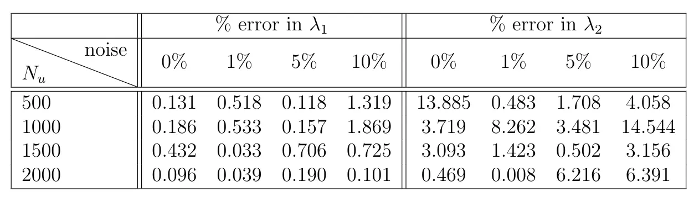

*0%,1%,5%,10%は、ガウスノイズの大きさ*

```python
    noise = 0.01 # 1%
    u0 = u0 + noise*np.std(u0)*np.random.randn(u0.shape[0], u0.shape[1])
    u1 = u1 + noise*np.std(u1)*np.random.randn(u1.shape[0], u1.shape[1])
```

---

### ノイズおよびレイヤ数の比較

相対二乗誤差による比較、$N_u=2000$

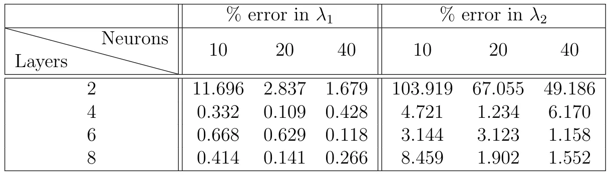

---

## Part Iとの違い

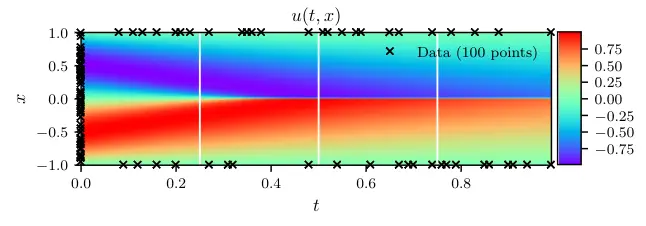
*左図: Part I, 右図: Part II*

偏微分方程式と境界条件を学習元とすることは共通

- Part Iでは解を求めることが目的
*解が不定、パラメータは固定されていた*
- Part IIではパラメータ推定が目的
*パラメータは不定、解は教師データによって十分に表現されている*

---

### Part Iとの違い (考察)


現実には、パラメータだけでなく
与える支配方程式が現象を十分に捉えているか否かも
ある意味の不定性と言える？

その上で、よりフラットにPINNsの目的を捉えると
与えられた支配方程式と境界条件を、それらが正しいか否かは関係なく
とりあえず近似する連続な関数を作ることが目的となるように見える
*上記2つの方針は、その関数から何を見出すかによる違い？*
*そうであれば、解とパラメータの両方を目的とすることもできる*

---

# Discrete Time Models

二つの時間の教師データから未知のパラメータを推定

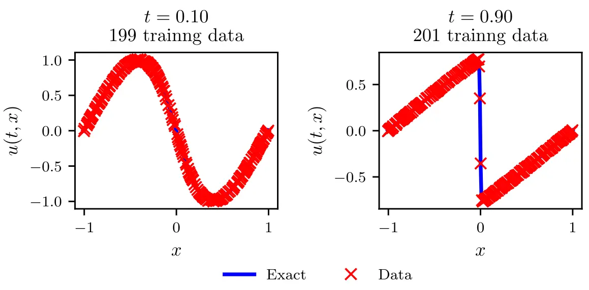

---

## 学習の目標


特定の時間での値$u^n$および他の時間での値$u^{n+1}$から
未知のパラメータ$\lambda$を推定

*例えば、$t=0.1$での値と$t=0.9$での値から$\lambda_1$と$\lambda_2$を推定*

PINNsでは、ルンゲ=クッタ法に基づき
その計算過程の値を含めて損失を計算し最小化する

---

## 前提: ルンゲ=クッタ法の一般形

段数$q$のルンゲ=クッタ法は、$u^n$から$u^{n+1}$の時間刻みを$\Delta t$とし、次のように表される

$$u^{n+c_j(x)} = u(t_n + c_j\Delta t, x)$$

$$
\begin{cases}
u^{n+c_i} = u^n - \Delta t \sum_{j=1}^{s} a_{ij} \mathcal{N}[u^{n+c_j}] \\
u^{n+1} = u^n - \Delta t \sum_{j=1}^{s} b_{j} \mathcal{N}[u^{n+c_j}] 
\end{cases}
$$

*$a_{ij}, b_i, c_i$はルンゲ=クッタ法の係数であり、精度が高くなるように選ばれる*
段数$q=4$のルンゲ=クッタ法の係数は次の通り

$$
a = \begin{bmatrix}
0 & 0 & 0 & 0 \\
0.5 & 0 & 0 & 0 \\
0 & 0.5 & 0 & 0 \\
0 & 0 & 1 & 0
\end{bmatrix}, \quad
b = \begin{bmatrix}
1/6 & 1/3 & 1/3 & 1/6
\end{bmatrix}, \quad
c = \begin{bmatrix}
0 & 0.5 & 0.5 & 1
\end{bmatrix}
$$

---

## 学習の方針

移項して次の式を得る
$$
\begin{aligned}
& u^n = u^n_i, \quad i=1\dots q \\
& u^n = u^n_{q+1} \\
& u^{n+1} = u^{n+1}_j, \quad j=1\dots q \\
& u^{n+1} = u^{n+1}_{q+1}
\end{aligned}
$$

ここで

$$
\begin{cases}
u_i^n 
\;:=\; 
u^{n + c_i} 
\;+\; \Delta t 
\sum_{j=1}^q a_{ij}\,\mathcal{N}\bigl[u^{n + c_j}; \lambda\bigr],
\quad i = 1,\ldots,q,
\\
u_k^{n+1}
\;:=\;
u^{n + c_i}
\;+\;\Delta t \sum_{j=1}^q (a_{ij} - b_j)\,\mathcal{N}\bigl[u^{n + c_j}; \lambda\bigr],
\quad i = 1,\ldots,q.
\end{cases}
$$

---

$[u^{n+c_1}, \dots, u^{n+c_q}, u^{n+c_1}]$ をNNで予測
ここから$[u^n_1, \dots, u^n_{q+1}]$ および  $[u^{n+1}_1, \dots, u^{n+1}_{q+1}]$ を導出することで
ルンゲクッタ法の計算過程に沿う形で$u^n$および$u^{n+1}$を計算

教師データ(観測値)と$u^n$および$u^{n+1}$の差を損失関数として最小化
パラメータを調整しながら適合させていく

*この理解は怪しい可能性があります*

---

## 損失関数の概要

損失関数は残差二乗和 (SSE) を用いる

二つの時間に対する誤差関数 $SSE_n$ と $SSE_{n+1}$ を定義し
この和となる

$$ SSE = SSE_n + SSE_{n+1} $$

を全体の損失関数として最小化する

---

## 実験

- $N_n=199$, $N_{n+1}=201$
- 中間4層のニューラルネットワーク
- 中間層ニューロン数50
- 活性化関数: tanh
- 最適化手法: L-BFGS
- 選点の生成手法: Latin hypercube sampling

---

### 支配方程式・教師データへのあてはまり

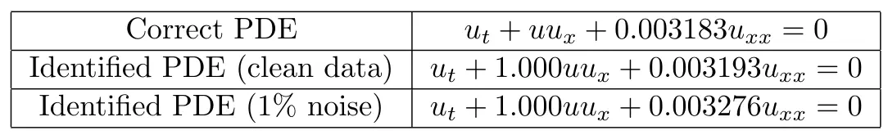

*上から、学習対象のパラメータ、ノイズなしの場合の予測値、ノイズありの場合の予測値*

---

### ノイズおよびレイヤ数の比較

相対二乗誤差による比較

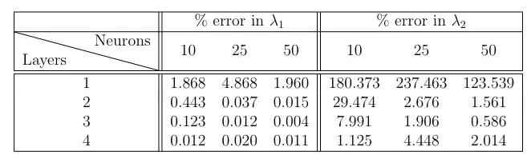

---

# まとめ

PINNs: 物理法則を考慮した深層学習のアプローチ

2つの適用方法を示す
- **Continuous Time Models**: 時間領域上の教師データから未知のパラメータを推定
- **Discrete Time Models**: 二つの時間の教師データから未知のパラメータを推定

限られたデータ (時空間領域上の値、あるいは二つの時間の値) を用いて
支配方程式のパラメータ推定が可能であることを示した

ある程度のノイズにも対応可能であることも示した

---

**ご清聴ありがとうございました**

参考: PyTorchを用いた実装例 (Burgers, Continuous Time Models) 

https://colab.research.google.com/drive/1CKyyknp25kk5RfFixK-XWLx550qe9JUk?usp=sharing


