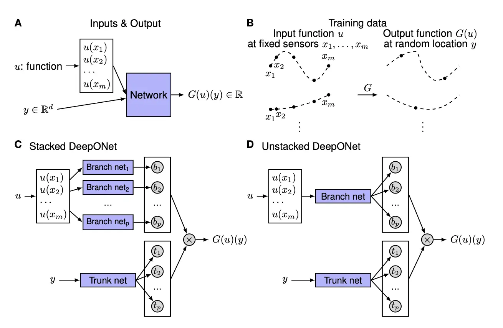

# 論文紹介: Physics Informed Newral Networks for tsunami inundation modeling

島内研究室 2025年6月2日 輪読会

発表者: 多田 瑛貴
(公立はこだて未来大学 複雑系知能学科 複雑系コース)

---

# 書誌情報

**Physics Informed Newral Networks for tsunami inundation modeling**
著者: Rüdiger Brecht, Elsa Cardoso-Bihlo, Alex Bihlo
arXiv:2406.16236v1 (https://arxiv.org/abs/2406.16236v1)

2024年7月23日発表

---

- 津波のモデリングと数値解析における現在の手法の概観と課題
- 有効なデータ駆動アプローチとして
**Physics-informed neural networks**と**Physics-informed DeepONets**の説明
- 浅水方程式にデータ駆動アプローチを取り入れるための形式の検討
- 性能評価 

---

# Introduction

第2章 関連研究の内容とあわせて言及します

---

## 津波のモデリング

津波のモデリングにおける課題
- データの収集
- (?) 固体と流体の相互作用に関する十分な理解の不足
- 長期にわたる断層滑りの過程の不確実性

津波の様々な要因
- **物理的パラメータ** (海底地形、断層滑り量...) の考慮が必要
- (?) 海底地震における、地盤の変位・水柱へのエネルギー伝達の問題との関連性
- 火山噴火や隕石衝突といったより空間スケールの小さい場合のモデリング

---

## 津波の数値解析

様々な波動力学の支配方程式と離散化手法が用いられた

- 差分法
- 有限要素法・不連続ガラーキン法
- メッシュレスなアプローチ

これらを用いて以下の支配方程式を解く

- **Shallow-water equations** (浅水方程式)
- Boussinesq equations
- Serre–Green–Naghdi equations
- Navier–Stokes equations 

検討されているアプローチのほとんどは上記に基づく

---

## データ駆動型アプローチ

近年は、機械学習などデータ駆動型アプローチへの移行がみられている

- 関心のある関係性をモデル化
  - 外洋の水位変位と特定の地点における遡上との関係
  - 低解像度・高解像度シミュレーションの関係 (→ 超解像？)
- (一度学習すれば) 即時の計算が可能

--- 

## 科学技術機械学習 (Scientific machine learning)

微分方程式や物理的な性質(対称性・保存則)といったで与えられる帰納バイアスを
機械学習ベースのアルゴリズムに組み込む

**Physics-informed neural networks (PINNs)** は特に注目を集める
他の数値計算同様に微分方程式を直接解く・メッシュレス・逆問題に応用可能

---

PINNsには課題も存在:
- 長い時間間隔での解を得るのが難しい
- 学習時間が長く、即時予測では適用が困難になる場合がある

幾つかの軽減策も見られている
- Multi-model approaches
- Improved training and optimization strategies
- Preservation of geometric properties
- **Operator learning techniques** (Physics-informed DeepONetsなど)

---

# A primer on physics-informed neural networks

---

## PINNsの一般的な形式

時空間領域 $\Omega = [0, t_f] \times \Omega_s$, where $\Omega_s \subset \mathbb{R}^d$ において
以下を満たすことを目標にする:

$$
\begin{aligned}
\Delta_l(t, \mathbf{x}, \mathbf{u}_{(n)}) &= 0, \quad l = 1, \dots, L, \quad t \in [0, t_f], \mathbf{x} \in \Omega,\\
\mathcal{I}_{l_i}(\mathbf{x}, \mathbf{u}_{(n_i)}\vert_{t=0}) &= 0, \quad l_i = 1, \dots, L_i, \quad \mathbf{x} \in \Omega,\\
\mathcal{B}_{l_b}(t, \mathbf{x}, \mathbf{u}_{(n_b)}) &= 0, \quad l_b = 1, \dots, L_b, \quad t \in [0, t_f], \mathbf{x} \in \partial \Omega,
\end{aligned}
$$

- $t$: 時間変数
- $\mathbf{x} = (x_1, \dots, x_d)$: 空間独立変数
- $\mathbf{u} = (u_1, \dots, u_q)$: 従属変数
- $\mathbf{u}_{(n)}$: $n$次までの従属変数の全ての導関数

---

浅水方程式の場合、初期条件・境界条件の関係式を
ディリクレ境界条件を用いて次のように表す:

$$
\mathcal{I} = \mathbf{u}\vert_{t=0} - \mathbf{u}_0, \quad \mathcal{B} = \mathbf{u} - \mathbf{g}(t, \mathbf{x}),
$$

- $\mathbf{u}_0(\mathbf{x})$: 与えられた初期条件
- $\mathbf{g}(t, \mathbf{x})$: 与えられた境界条件

---

## ニューラルネットワークによる解の近似

PINNsは、パラメータ $\boldsymbol{\theta}$ を持つニューラルネットワーク $\mathcal{N}_{\boldsymbol{\theta}}$ を用いて
以下のように解を近似する:

$$
\mathbf{u}_{\boldsymbol{\theta}}(t, \mathbf{x}) = \mathcal{N}_{\boldsymbol{\theta}}(t, \mathbf{x}), \quad \mathbf{u}_{\boldsymbol{\theta}}(t, \mathbf{x}) \approx \mathbf{u}(t, \mathbf{x})
$$

以下の損失関数を最小化してネットワークを学習
*有限個の選点よりサンプリングし実際の値を求める*

$$
\mathcal{L}(\boldsymbol{\theta}) = \mathcal{L}_\Delta(\boldsymbol{\theta}) + \gamma_i \mathcal{L}_i(\boldsymbol{\theta}) + \gamma_b \mathcal{L}_b(\boldsymbol{\theta})
$$

---

## 損失関数の詳細

各損失項は以下のように定義される：

$$
\begin{aligned}
\mathcal{L}_\Delta(\boldsymbol{\theta}) &= \frac{1}{N_\Delta}\sum_{i=1}^{N_\Delta}\sum_{l=1}^{L}|\Delta_l(t^\Delta_i, \mathbf{x}^\Delta_i, \mathbf{u}^{(n)}_{\boldsymbol{\theta}}(t^\Delta_i, \mathbf{x}^\Delta_i))|^2, \\
\mathcal{L}_i(\boldsymbol{\theta}) &= \frac{1}{N_i}\sum_{i=1}^{N_i}\sum_{l_i=1}^{L_i}|\mathcal{I}_{l_i}(t^i_i, \mathbf{x}^i_i, \mathbf{u}^{(n_i)}_{\boldsymbol{\theta}}(t^i_i, \mathbf{x}^i_i))|^2, \\
\mathcal{L}_b(\boldsymbol{\theta}) &= \frac{1}{N_b}\sum_{i=1}^{N_b}\sum_{l_b=1}^{L_b}|\mathcal{B}_{l_b}(t^b_i, \mathbf{x}^b_i, \mathbf{u}^{(n_b)}_{\boldsymbol{\theta}}(t^b_i, \mathbf{x}^b_i))|^2,
\end{aligned}
$$

- $\gamma_i, \gamma_b > 0$: 損失重みパラメータ
- 自動微分により必要な導関数を計算

---

## ハード制約による境界条件の強制

初期・境界条件を厳密に満たす「ハード制約」の導入

$
\mathbf{u}_{\boldsymbol{\theta}}(t, \mathbf{x}) = F_i(t, \mathbf{x})\mathbf{u}_0(\mathbf{x}) + F_b(t, \mathbf{x}) + F_{nn}(t, \mathbf{x})\mathcal{N}_{\boldsymbol{\theta}}(t, \mathbf{x})
$

$F_i$, $F_b$, $F_{nn}$は、$
\mathbf{u}^{\theta}(t_0, \mathbf{x}) = \mathbf{u}_0, \quad \mathbf{u}^{\theta}(t, \mathbf{x}) = \mathbf{g}(t, \mathbf{x})$を満たすように選択される

- 支配方程式に対する損失項のみを考慮すれば良い
- 初期・境界条件を厳密に満たすことができる
- 学習が遅くなる
*微分不可能な初期条件を相殺するように学習しなければならない(?)*
*浅水方程式では、初期条件がwet-dryの界面で微分不可能 (?)*
---

## PINNsの課題と解決策

2つの主要な課題が存在する：

1. **長い学習時間が必要**
2. **長時間の予測では効果的でない**
微小な解に収束するため (?)

解を直接学習するのではなく、solution operatorを学習することで
これらの課題を軽減することができる

---

## Solution operatorの学習

解を次のように表現する:

$$
\mathbf{u}(t, \mathbf{x}) = \mathcal{G}(\mathbf{u}_0(\mathbf{x}))
$$

ここで $\mathbf{u}_0$ は初期条件

---

## DeepONetsのアーキテクチャ

典型的なアーキテクチャは2つのサブネットワークで構成される：

- **Branch Nets**: サンプリングされた初期条件入力を処理
- **Trunk Nets**: 独立変数 $(t, \mathbf{x})$ を処理

各ネットワークは $k$ 次元ベクトルを出力：

$$
\begin{aligned}
\mathbf{b}(\mathbf{u}_0(\mathbf{x}_1), \dots, \mathbf{u}_0(\mathbf{x}_{N_s})) &= (b_1, \dots, b_k), \\
\mathbf{t}(t, \mathbf{x}) &= (t_1, \dots, t_k)
\end{aligned}
$$

---

## オペレータ近似

オペレータ表現はスカラー積により近似される：

$$
\mathcal{G}(\mathbf{u}_0(\mathbf{x}))(t, \mathbf{x}) \approx \mathbf{b}(\mathbf{u}_0(\mathbf{x}_1), \dots, \mathbf{u}_0(\mathbf{x}_{N_s})) \cdot \mathbf{t}(t, \mathbf{x})
$$

この定式化は理論的結果に基づく：
- 2つのバナッハ空間間の任意の連続非線形オペレータは同様に表現可能 (?)
- 単一隠れ層ニューラルネットワークに対するCybenkoの汎用近似定理と類似 (?)

