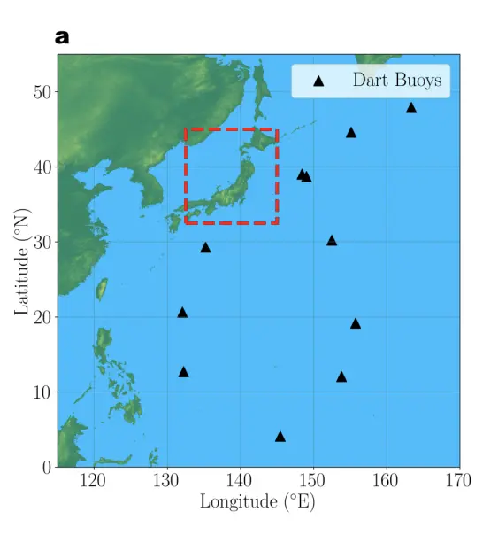
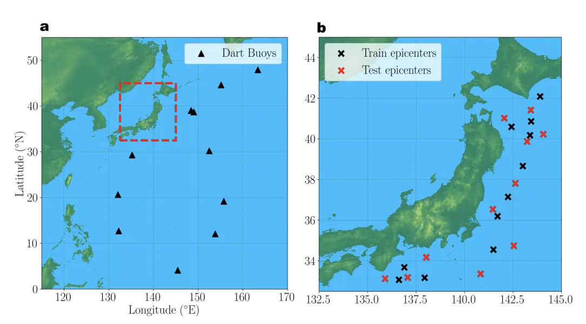
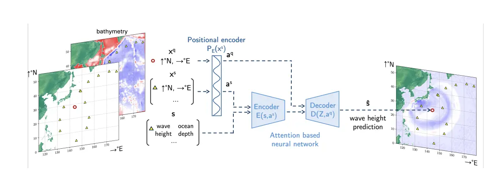
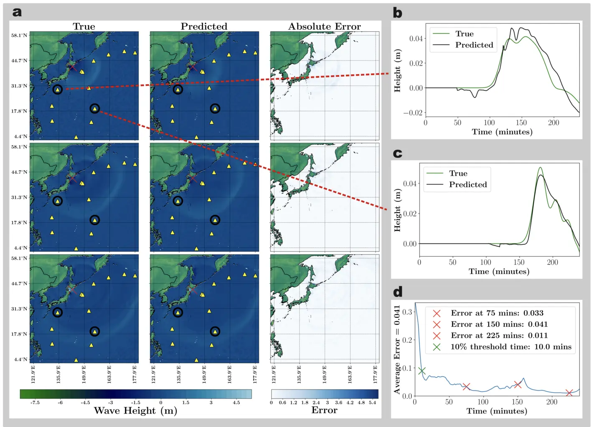
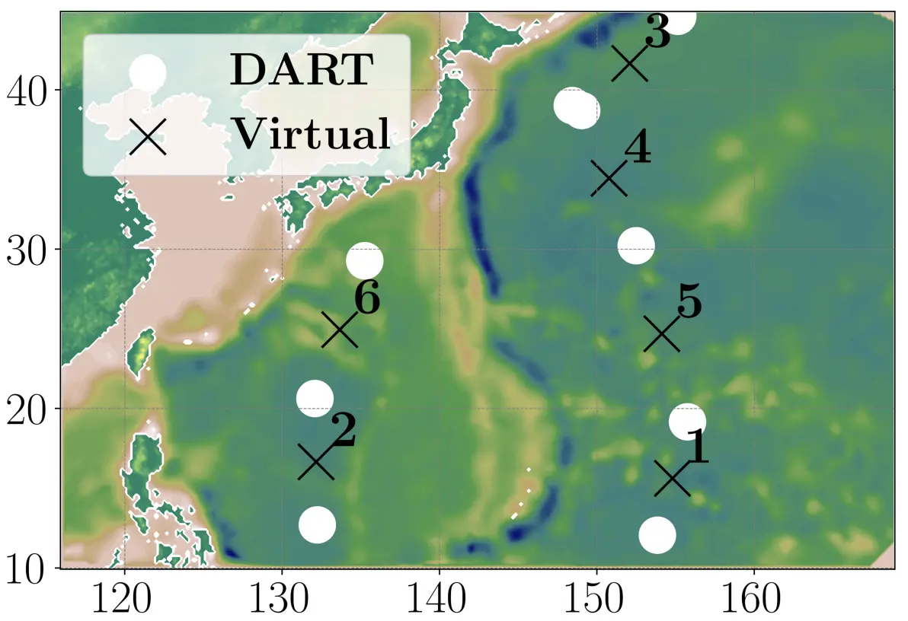
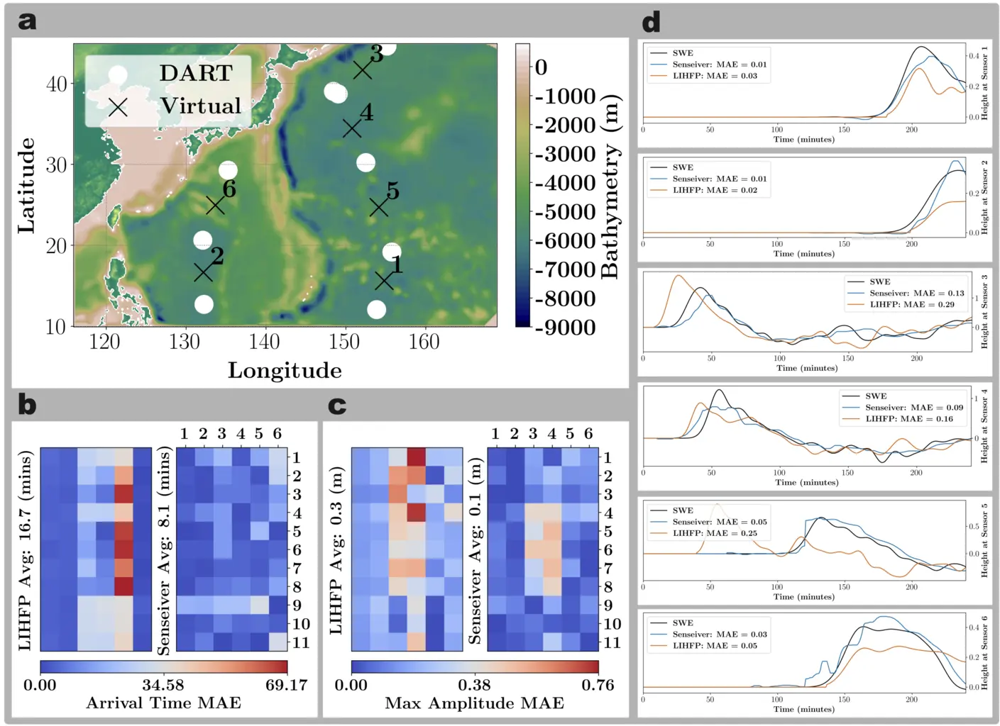

# 論文紹介: Attention-Based Reconstruction of Full-Field Tsunami Waves from Sparse Tsunameter Networks

発表者: 多田 瑛貴
(公立はこだて未来大学 複雑系知能学科 複雑系コース)

2025年6月16日 島内研究室

---

## 書誌情報

**Attention-Based Reconstruction of Full-Field Tsunami Waves from Sparse Tsunameter Networks** *McDugald et al., 2025*

- DOI: https://arxiv.org/abs/2411.12948
- 著者: Edward McDugald et al.
  - 所属は University of Arizona, Los Alamos National Laboratory 等
- 掲載予定誌: Geophysical Research Letters
  - アメリカ地球物理学連合 (AGU) が発行する査読つき学術雑誌

---

# Introduction

---

## 背景と課題

津波早期警報システムにおける課題

現状は**PDE-based solver**が主流
- 地震のダイナミクスに基づく初期の海面変位の計算
- 流体の物理法則を用いた数値計算
*津波予測では、特にMOST (NOAA), GeoCLAW等による浅水方程式の数値計算が主流と述べている*

以下の問題が未解決
- 地震パラメータ推定の不確実性
- 高い計算コスト
- リアルタイム適応性の限界

---

機械学習を用いた即時予測手法が注目されている。現状においては
- 固定点での津波波形予測は Liu et al. (2021) や Rim et al. (2022) による研究が存在
- **疎な観測値 or 予測値からの全体波形の再構成は未達成**としている

---

## 本研究の目的

疎なtsunameter観測網から高解像度の
津波全体波形を即座に再構成する
Attentionベースの手法を提案

実験では、観測装置として**DART**ブイを想定

- 訓練データにない震源での評価
- 地震発生時のDARTの観測値を浅水方程式による数値計算で再現
- **LIHFP**と性能比較
*Liner Interpolation with Huygens-Fresnel Principle (Wang et al., 2019)*

---

# Generating Full-Field Training Data

---

## 支配方程式: 浅水方程式

$$\frac{\partial \mathbf{u}}{\partial t} + (\mathbf{u} \cdot \nabla)\mathbf{u} + f\mathbf{u}^{\perp} = -(1-\beta)g\nabla(h + z_b) + c_d\frac{|\mathbf{u}|}{h}\mathbf{u} + \nu_4^u\nabla^4\mathbf{u}$$

$$\frac{\partial h}{\partial t} + \nabla \cdot (\mathbf{u}h) = 0$$

**変数の説明**

- $z_b$: 海底地形の高さ (bathymetric height)
- $f = 2\Omega\sin\phi$: コリオリ力
- $\mathbf{u}$: 深度平均された水平方向の速度
- $\beta = 0.015$: 重力補正係数 (self-attraction and loading effects)
- $h$: fluid thickness (=(自由表面高)-(底面高)) *以降は「波高」と表現します*

*語彙の確認にはこちらのページを参照: https://doc.comsol.com/5.6/doc/com.comsol.help.models.mph.shallow_water_equations/shallow_water_equations.html#669342*

---

**データ規模** *SWEの数値計算で作成しモデルの学習に使用*
- 訓練用震源: 11個（日本周辺のM7.5以上の地震）
- テスト用震源: 11個（訓練震源から20-100マイル離れた位置）
- 時間解像度: 50秒間隔、4時間（289ステップ）
- 空間解像度: 81,921ピクセル

---

**初期波高**: 震源位置をもとに以下の式で生成
$$h_0(\mathbf{x}; \mathbf{x}_0) = -z_b + 5\exp(-(250\|\mathbf{x} - \mathbf{x}_0\|^2)^4)$$

- 最大初期波高は**5m**に固定
波形の長さや振幅の様々なパターンへの対応はfuture workとしている

---

# Methods

---

## Senseiverの導入

Santos et al., 2023

- "designed for sparse-to-dense reconstruction task"
- Attentionベース

重要な利点として

1. 位置情報を扱うことができる
2. グリッドに依存せず、任意のメッシュ構造に対応
3. 遠い地点からの影響の考慮 (CNNでは層を深くしないと考慮できない)

Attentionでは計算が多項式時間で膨れ上がるため、途中でコンパクトな潜在行列に変換することで計算コストを小さく抑える

---

## Senseiver アーキテクチャ

**疎な観測から密な再構成への問題設定**

**入力**: 
- 観測点位置 $\mathbf{x}^s = \{\mathbf{x}_1^s, \mathbf{x}_2^s, ..., \mathbf{x}_N^s\}$ (N個)
- 観測値 $s = \{s_1, s_2, ..., s_N\}$ (波高データ)

**出力**:
- 任意位置 $\mathbf{x}^q = \{\mathbf{x}_1^q, \mathbf{x}_2^q, ..., \mathbf{x}_M^q\}$ (M個)
- 予測値 $\hat{s} = \{\hat{s}_1, \hat{s}_2, ..., \hat{s}_M\}$ (予測波高)

**典型的には** $M \gg N$ (数十の観測点 → 数十万の予測点)

---

- Positional Encoding $P_E$
- エンコーダー $E$: (ブイ観測値, $P_E$(ブイ位置)) → 潜在行列 Z
- デコーダー $D$: (Z, $P_E$(任意位置)) → 予測波高

---

- $\mathbf{a}^s$: Positional Encodingを適用したブイ位置
- $s$: ブイ観測値
- $\mathbf{a}^q$: Positional Encodingを適用した任意位置
- $\hat{s}$: 任意位置での予測波高

$$\mathbf{a}^s = P_E(\mathbf{x}^s)$$
$$\mathbf{Z} = E(s, \mathbf{a}^s)$$
$$\mathbf{a}^q = P_E(\mathbf{x}^q)$$
$$\hat{s}(\mathbf{x}^q) = D(\mathbf{Z}, \mathbf{a}^q)$$

- 緯度・経度に海底地形情報をエンコード *これはどういうこと？*
- 陸域はマスク処理

---

## 学習・最適化

**損失関数**: 平均二乗誤差 (MSE)
$$\mathcal{L} = \sum (s(\mathbf{x}^q) - \hat{s}(\mathbf{x}^q))^2$$

ここで
$$\hat{s}(\mathbf{x}^q) = D(E(s(\mathbf{x}^s), P_E(\mathbf{x}^s)), P_E(\mathbf{x}^q))$$

**最適化**: Adam optimizer使用
**過学習防止**: 利用可能な訓練フレームの80%のみを使用 *これはどういうこと？*

**ハイパーパラメータ**: 
- クエリ点の数・順序
- 使用する訓練データフレーム

---

## 実験設定

- 評価指標には主に**MAE**を使用
- 誤差は次のように最大値で正規化し計算:
$$\text{Error}(x,y,t) = \frac{|h(x,y,t) - \hat{h}(x,y,t)|}{\max(|h(x,y,t)|)}$$

---

# Results

---

## 全体での評価

全テスト用のデータ(289時間ステップ・11初期状態)における
波高の平均再構成誤差: $5.00 \times 10^{-2}$
- 多くの誤差は初期 (津波発生直後) に生じている
津波が観測点にまだ届いていないため *他のデータ同化手法でも同様*
- 十分な精度 (誤差 < $1 \times 10^{-1}$) に到達するまで
平均**32.9分**、中央値**38.3分**を要する

---

## 物理的整合性
- 残差: $4.10 \times 10^{-2}$
*これは無次元値となっている。どうとればいいのか不明。アクセス不可能なSupporting Informationに重要な情報が載っている可能性あり*
- 物理法則との整合性を維持
*Physics-Informedでないことを踏まえると興味深い。一方で、訓練しているシナリオの数が少ないことにも注意したい*

---

## 実験結果の可視化

最近傍の訓練用震源からの距離が
- **平均的な** (38.4 miles) テスト用震源 
- **最も遠い** (90.6 miles) テスト用震源

の2つでの実験結果を可視化

---

*再構成結果。最近傍の訓練用震源からの距離が**平均的な**テスト用震源に基づく。*
*図a: 上から75, 150, 225分での再構成結果, 図b-c: 2地点での波の推移, 図d:全体でのMAEの変化*

---

*再構成結果。最近傍の訓練用震源からの距離が**最も遠い**テスト用震源に基づく。*
*図a: 上から75, 150, 225分での再構成結果, 図b-c: 2地点での波の推移, 図d:全体でのMAEの変化*

---

わかること

- 最初の50分ほどで再構成誤差が急激に下がる

十分な精度 (誤差 < $1 \times 10^{-1}$) に到達するまで
- "平均的な距離での震源"では丁度**10分**
- "最も遠い距離での震源"では**40.8分**

---

## 仮想観測点を用いたLIHFPとの比較

*「仮想観測点」の導入はLIHFPと実験設定を合わせるため*

いくつかのDARTブイの間に
仮想的な観測点を6つ設け評価

---

*図a: 仮想観測点, 図b: 到達時間のMAE, 図c: 最大振幅のMAE, 図d: 中央値距離のテスト震源での各仮想観測点の波高計算結果*

---

## 全体での比較結果

| 指標 | Senseiver | LIHFP |
|------|-----------|-------|
| 波高MAE | 7.02×10⁻²m | 18.2×10⁻²m |
| 到達時間MAE | 8.12分 | 16.68分 |
| 最大振幅MAE | 13.1×10⁻²m | 25.9×10⁻²m |

- Senseiverによる到達時間予測では
外れ値として18.611分を記録したシナリオが存在した

---

## 特定のテスト震源(中央値距離)での比較結果

| 指標 | Senseiver | LIHFP |
|------|-----------|-------|
| 波高MAE | 5.5×10⁻²m | 13.3×10⁻²m |
| 到達時間MAE | 7.22分 | 16.39分 |
| 最大振幅MAE | 14.9×10⁻²m | 23.8×10⁻²m |

---

## 技術的課題と対策

**出力の時間的なスムーズさの欠如**
- Median filteringを適用
- 到達時間精度が9.05分→5.35分に改善
- 最大振幅に影響が出ている可能性あり

今後の改善の方針
- 時間エンコーディングの導入
- 前状態への条件付け
- 損失関数への正則化項追加

---

# まとめ

**Attention-Based Reconstruction of Full-Field Tsunami Waves from Sparse Tsunameter Networks** *McDugald et al., 2025*

**現在の課題**
- 限定的な海域
- 理想化された初期条件
- 早期段階での再構成精度
- 時間的なスムーズさの問題

今後の改善の方針
- より広域・多様な初期条件
- GNSS、HFレーダーなど別の観測との統合
