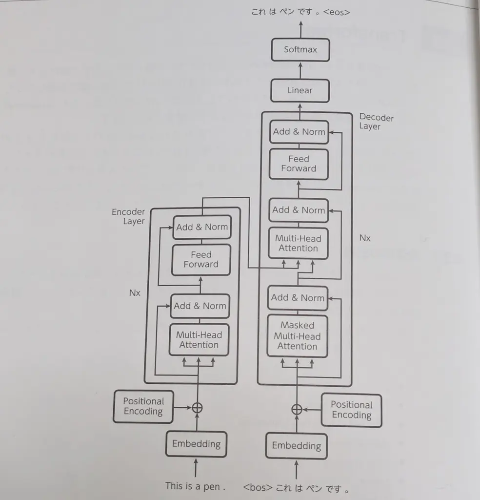
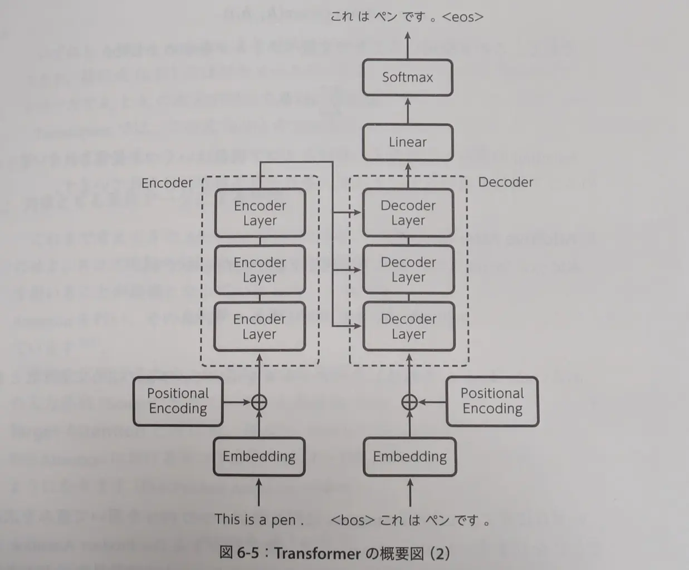
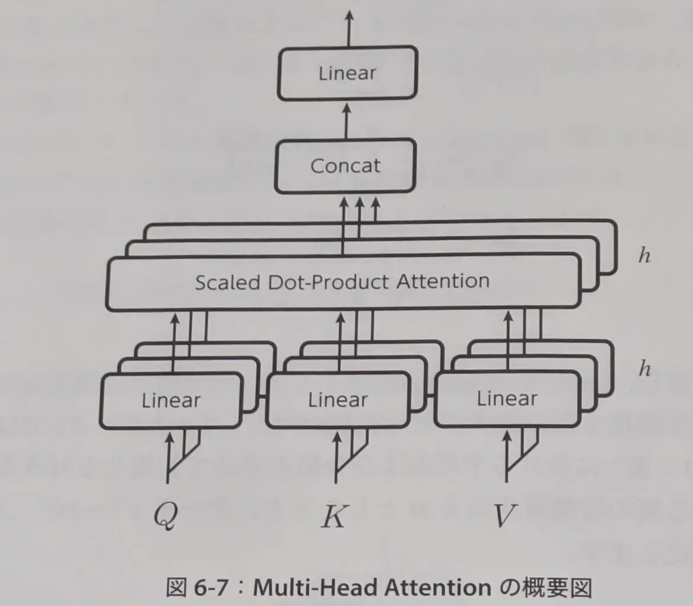
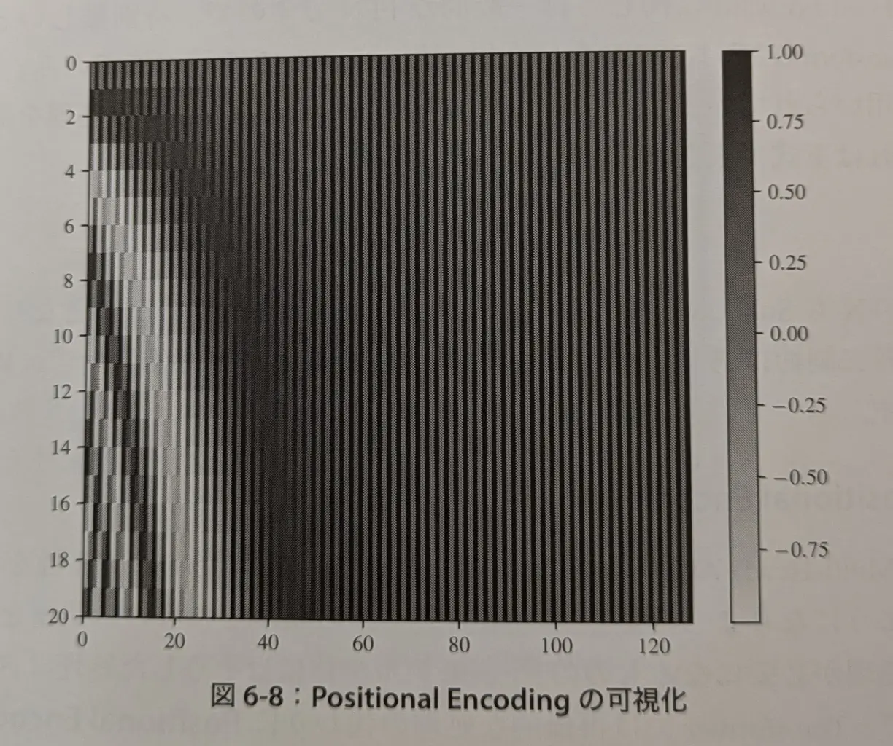

## 概要

- 初出: "Attention Is All You Need" (DOI: 10.48550/arXiv.1706.03762)
  - 2017年末 (NIPS 2017) にてGoogleの研究者によって提案される
  - 翻訳タスクにおいて既存手法のスコアを大幅に更新
- エンコーダ・デコーダで構成されるSeq2Seqの1つ
- LSTMやGRUのような再帰計算のある層が用いられず  
Attentionのみが活かされていることが特徴

---

## 全体像の把握

**太字**は初出の概念

- Embbeding: 埋め込み層
- **Positional Encoding**
- **(Masked) Multi-Head Attention**  
"Masked"は、翻訳タスクにおけるマスク処理
- **Add & Norm**
- Feed Forward: 一般的なFFN
- Linear: 線形変換
- Softmax: ソフトマックス関数

---

備考: 線形変換について... 学習可能なパラメータ$W$および$b$を用いて
$$
\mathrm{Linear}(x) = Wx + b
$$

---

今の時点では、(Masked) Multi-Head AttentionかFeed Forwardの各処理の後ろに  
Add & Normがついていることを把握すれば大丈夫

"Nx"は、同じ処理をN回繰り返すことを示している。  
実際のTransformerは、Encoder LayerとDecoder Layerがそれぞれ  
複数並んで一つのエンコーダーおよびデコーダーとなる

---

## Attentionの整理: スコア関数による分類

---

### 復習: スコア関数

エンコーダ・デコーダの出力をそれぞれ$h_s$, $h_t$とする。  
Attentionの重み$q$は、(時刻に関する引数を省略して) 以下のように表せる:

$$
a = \mathrm{softmax}(\mathrm{score}(h_s, h_t))
$$

ただし、スコア関数は次のようなものがある:

$$
\mathrm{score}(h_s, h_t) :=
\begin{cases}
\nu^\top \tanh\bigl(W_t h_t + W_s h_s\bigr)\\
h_t^\top W_a h_s\\
h_t^\top h_s
\end{cases}
$$

この$a$により、文脈ベクトル$c$を求めた:

$$
c = \sum a \cdot h_s
$$

---

### Addictive Attention (加法注意)

$$
\mathrm{score}(h_s, h_t) = v^\top \tanh (W_t h_t + W_s h_s)
$$

あるいは、$h_s$, $h_t$を連結したベクトル$h$を用いて

$$
\mathrm{score}(h_s, h_t) = v^\top \tanh (W_a h)
$$

- 隠れ層が1つのFFNを用いて重みを求めることに相当
- パラメータが多いため比較的計算コストがかかるが  
特徴量次元が多い場合は、Dot-Product Attentionより良い精度を得られることもある

---

### Dot-Product Attention (内積注意, Multiplicative Attention)

$$
\mathrm{score}(h_s, h_t) = h_t^\top W_a h_s
$$

または

$$
\mathrm{score}(h_s, h_t) = h_t^\top h_s \tag{6.31}
$$

- Addictive Attentionよりパラメータが少なく、計算コストが抑えられる  
特に 6.31 はパラメータが一切ないので高速に計算可能
- $h_s$と$h_t$の次元数が同じである必要がある
- Transformerでは、 6.31 に基づくDot-Product Attentionを用いている

---

## Attentionの整理: 対象とする系列データによる分類

---

これまでは、$h_s$, $h_t$の2つの系列データを用いることが前提となっていた

- **Source-Target Attention**  
2つの系列データに対してAttentionを行う
- **Self-Attention**  
1つの系列データに対してのみAttentionを行い、その系列データ内での時間依存性を学習する

例えば、Dot-Product Attentionを用いる場合:
$$
\mathrm{score}(h_s, h_s) = h_s^\top h_s
$$

---

Transformerでは
- エンコーダ・デコーダ内でSelf-Attention
- それらの繋ぎ目でSource-Target Attention  
を用いている

従来のEncoder-DecoderのモデルではLSTMなどを用いて時系列情報を読み取るが  
TransformerではSelf-Attentionがその役割を担う  

---

Attentionの式は全てテンソル演算で表現される  
例えば、Source-Target Attentionはエンコーダとデコーダの値を  
それぞれ全て並べた行列 $H_s$,$H_t$ により、次のように表現される:

$$
\mathrm{score}(H_s, H_t) = H_t H_s^\top
$$

これにより、GPUを活用したより高速な計算が可能

---

## 式の解釈: クエリ・キー・値

---

<!-- _class: smartblockquote -->

Attentionは  
「キーに対してクエリを投げ、該当するキーに対応する値を抽出する関数である」  
と解釈することができる  

> An attention function can be described as mapping a query and a set of key-value pairs to an output, where the query, keys, values, and output are all vectors.

---

ここで、文脈ベクトルを求める部分を$\mathrm{Attention}$という関数で表す:  
(Source-Target Attention/Dot-Product Attentionの組み合わせの場合)  

$$
\mathrm{Attention}(H_s, H_t) = \mathrm{softmax}(H_t H_s^\top) H_s
$$

---

Source-Target Attentionで求めようとしていることは、端的には  
「デコーダーの値から、関連するエンコーダーの値を抽出する」こと

これは「デコーダーをクエリとして、エンコーダーに対して検索を行う」ことに相当する  
(検索といっても、実際には特定の値を抽出するというよりも、全ての値に対する加重平均を求めている) 

$\mathrm{Attention}$をクエリ ($Q$)、キー ($K$)、値 ($V$) で表現すると:

$$
\mathrm{Attention}(Q, K, V) = \mathrm{softmax}(QK^\top) V
$$

- Source-Target Attentionでは$Q$がデコーダーの値、$K$と$V$がエンコーダーの値となる
- Self-Attentionでは$Q$, $K$, $V$が全て同じ系列データとなる

---

### Scaled Dot-Product Attention

Transformerでは、Attentionをキーの次元数$d_k$を用いてスケーリングする

$$
\mathrm{Attention}(Q, K, V) = \mathrm{softmax}(\frac{QK^\top}{\sqrt{d_k}}) V
$$

キーの次元数が大きいと、内積の値が大きくなり  
Transformerのような深い層を持つモデルでは、ソフトマックス関数の勾配が消失しやすくなるため

---

## 各論

次の順番で詳細に説明:
- Add & Norm
- Multi-Head Attention
- Feed Forward
- Positional Encoding

---

### Add & Norm

Multi-Head AttentionやFeed Forwardの出力に続く処理として導入

---

**Add: 残差接続**
- Multi-Head AttentionやFeed Forwardに相当する処理を$\mathrm{SubLayer(\cdot)}$とすると:
$$
\mathrm{Add}(x, \mathrm{SubLayer}(x)) = x + \mathrm{SubLayer}(x)
$$
- $\mathrm{SubLayer}(x)$に$x$を加えて伝播させる
- 深い層になっても誤差が逆伝播しやすくなり、学習が進みやすくなる
- $\mathrm{SubLayer}(x)$と$x$の特徴量次元は同じである必要がある  
この次元数を$d_{\mathrm{model}}$とする  
この場合、埋め込み層の次元数も$d_{\mathrm{model}}$とする必要がある

---

**Norm: Layer Normalization**
- バッチ正規化をベースに考えられた手法
- 各ミニバッチ内のデータ数が$m$の時、ある層における入力をミニバッチ$\mathcal{B} = \{x^{(1)}, x^{(2)}, \ldots, x^{(m)}\}$とすると

$$
\mu_\mathcal{B} = \frac{1}{m} \sum_{i=1}^{m} x_i^{(i)}
$$
$$
\sigma_\mathcal{B}^2 = \frac{1}{m} \sum_{i=1}^{m} \left(x_i^{(i)} - \mu_B\right)^2
$$
$$
\hat{x}_i^{(\mathcal{B})} = \frac{x_i^{(\mathcal{B})} - \mu_B}{\sqrt{\sigma_\mathcal{B}^2 + \epsilon}}
$$

---

- **Layer Normalization**は、ミニバッチ単位ではなく、データごとに正規化を行う
  - データ数の次元(バッチサイズ) ではなく、特徴量の次元 (ニューロン数) における平均と分散を求めて正規化を行う
- ある層の特徴量次元を$H$とした時、データ$x^{(i)} = \{x_1^{(i)}, x_2^{(i)}, \ldots, x_H^{(i)}\}$に対して

$$
\mu_i = \frac{1}{H} \sum_{h=1}^{H} x_h^{(i)}
$$
$$
\sigma_i^2 = \frac{1}{H} \sum_{h=1}^{H} \left(x_h^{(i)} - \mu_i\right)^2
$$
$$
\hat{x}_h^{(i)} = \frac{x_h^{(i)} - \mu_i}{\sqrt{\sigma_i^2 + \epsilon}}
$$

- 各データの平均と分散を求めるので
バッチサイズが小さい時でも学習が不安定にならない

---

### Multi-Head Attention

---

Attentionの引数となる$Q$, $K$, $V$のペアを複数作成し  
それぞれに対してAttentionを行う
- 複数の時点から情報を抽出することが期待される
  
$i$番目のペアに対するAttention後の値を$\mathrm{head}_i$とすると

$$
\mathrm{head}_i = \mathrm{Attention}(QW_i^Q, KW_i^K, VW_i^V)
$$

$W_i^Q$, $W_i^K$, $W_i^V$はそれぞれのペアに対する重み行列 (学習対象)

Transformerのモデル内では全ての$\mathrm{SubLayer}$の出力次元が$d_{\mathrm{model}}$であるため  
$Q$, $K$, $V$の次元数は$d_{\mathrm{model}}$である必要がある

---

Attentionへの入力次元を$d_q$, $d_k$, $d_v$とすると、それぞれの重み行列は
$$
W_i^Q \in \mathbb{R}^{d_{\mathrm{model}} \times d_q}, W_i^K \in \mathbb{R}^{d_{\mathrm{model}} \times d_k}, W_i^V \in \mathbb{R}^{d_{\mathrm{model}} \times d_v}
$$

ただし、Attentionの制約から$d_q = d_k$

さらに、実際のモデルでは $d_k, d_v$について
$$
d_k = d_v = \frac{d_{\mathrm{model}}}{h}
$$
とすることが多い ($h$はヘッド数)

---

Multi-Head Attentionを表す関数を$\mathrm{MultiHead}(\cdot)$とすると
$\mathrm{head}_i$を全て連結し、再度線形変換を行う。よって:

$$
\mathrm{MultiHead}(Q, K, V) = (\mathrm{head}_1 \ldots \mathrm{head}_h) W^O \tag{6.46}
$$

$W^O$は学習対象の重み行列で、$W^O \in \mathbb{R}^{hd_v \times d_{\mathrm{model}}}$
- $hd_v$は、$h$個の$\mathrm{head}_i$を連結した時の次元数

式(6.46)にバイアスが加わる場合もある

---

### Feed Forward

一般的なFFN。2つの全結合層が用いられ、1つ目の層でのみReLUが適用される

$$
\mathrm{FFN}(x) = \mathrm{max}(0, xW_1 + b_1)W_2 + b_2
$$

FFNもSubLayerの1つとして扱われるため入出力の次元は$d_{\mathrm{model}}$である必要がある。
ただし、層間の次元数は異なっていても良いから、これを$d_{\mathrm{ff}}$として:

$$
W_1 \in \mathbb{R}^{d_{\mathrm{model}} \times d_{\mathrm{ff}}}, W_2 \in \mathbb{R}^{d_{\mathrm{ff}} \times d_{\mathrm{model}}}
$$

---

### Positional Encoding

---

(Multi-Head) Attentionにより、系列間での関係性を学習することはできたが  
系列内での順序そのものの情報を学び取るには再帰的な処理が必要となり、モデル全体にそのような処理は含まれない
- 畳み込み処理でも系列データの順序情報を学習することはできるが、局所的な位置関係に留まってしまう。Attentionは任意の位置関係を学習することができる

そこで、再帰的な処理の代わりに**Positional Encoding**を用いる
- $d_{\mathrm{model}}$次元のベクトルを系列データに加える処理
- 系列に直接順序・位置情報を付与する
- 学習パラメータはない

---

$pos$を系列の位置、$i$を特徴量次元のインデックスとして  
行列$PE$を次のように定義する:

$$
PE_{(pos, 2i)} = \sin\left(\frac{pos}{10000^{2i/d_{\mathrm{model}}}}\right)
$$
$$
PE_{(pos, 2i+1)} = \cos\left(\frac{pos}{10000^{2i/d_{\mathrm{model}}}}\right)
$$

系列長を20、特徴量次元数を128とした場合、Positional Encodingは図のようになる

ここでは、インデックスの少ない一部の成分に対して短い波長を適用、大きくなるにつれ長い波長を適用している。全ての成分に対して適用されるわけではない

