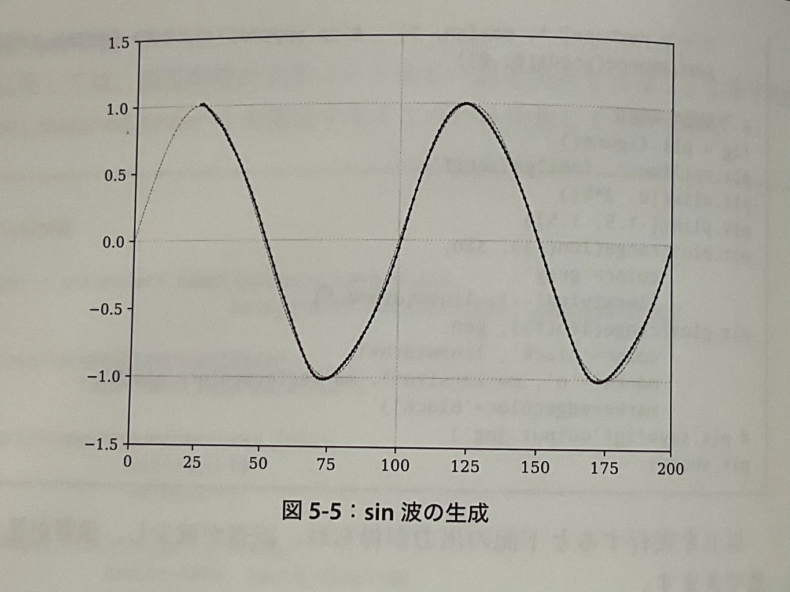
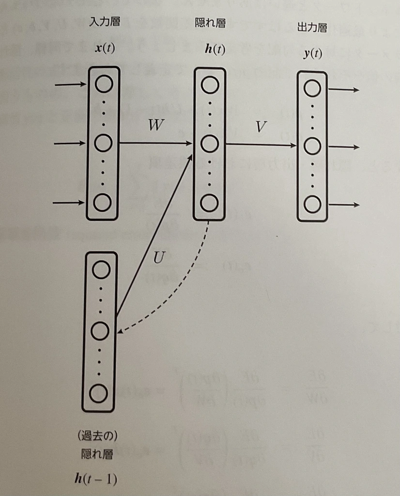
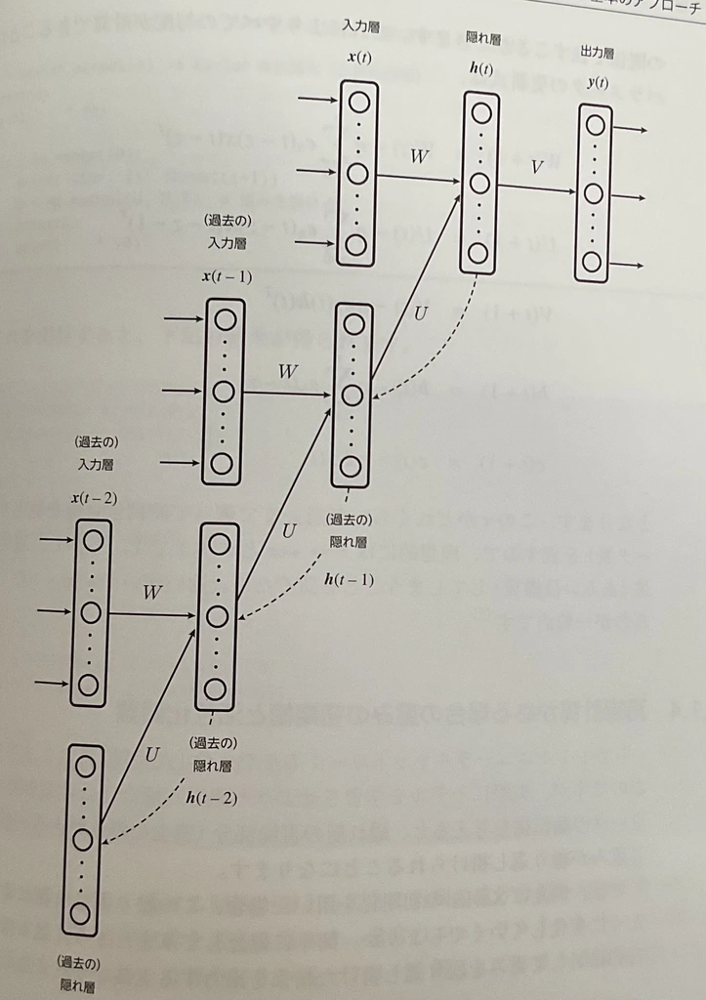
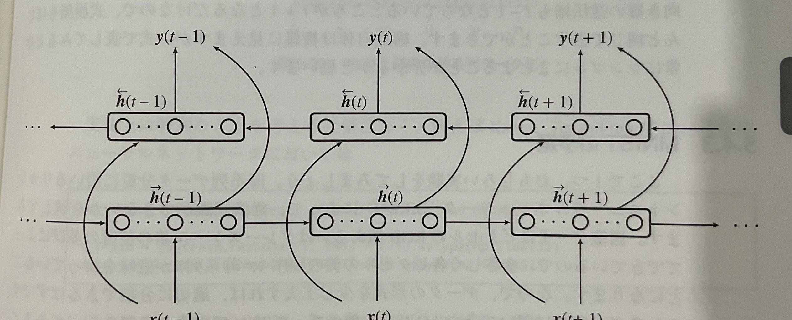

**詳解ディープラーニング**
# 第5章: リカレントニューラルネットワーク

島内研究室 2025年5月1日 輪読会

発表者: 多田 瑛貴
公立はこだて未来大学 複雑系知能学科 複雑系コース

*写真: 兵庫県宝塚市*

---

## RNN (Recurrent Neural Network)

時系列データを扱うためのNN

---

隠れ層${h}$は

$$ {h}_t = f(W {x} + {U} {h}(t-1) + {b}) $$

*あくまでt-1の隠れ層を参照するが、結果的には過去の全ての状態を再帰的に参照するから"リカレント"*

出力層${y}$は

$$ {y}_t = g({V} {h} + {c}) $$

*ただし$f$,$g$は活性化関数、${W}$,${U}_h$,${V}$は重み行列*
*${b}$,${c}$はバイアス*

---

ここで、

$$
\begin{align}
{p}(t) &:= Wx(t) + Uh(t-1) + b \\
{q}(t) &:= Vh(t) + c
\end{align}
$$

を考えると、隠れ層と出力層に対する誤差項は以下のようになる

$$
\begin{align}
e_h(t) &:= \frac{\partial E}{\partial p(t)} \\
e_o(t) &:= \frac{\partial E}{\partial q(t)} 

\end{align}
$$

---

すると、

$$
\begin{align}
\frac{\partial E}{\partial W} 
&= \frac{\partial E}{\partial p(t)} \left( \frac{\partial p(t)}{\partial W} \right)^{\!\!T}
= e_h(t) x(t)^T  \\
\frac{\partial E}{\partial V} 
&= \frac{\partial E}{\partial q(t)} \left( \frac{\partial q(t)}{\partial V} \right)^{\!\!T}
= e_o(t) h(t)^T \\
\frac{\partial E}{\partial U} 
&= \frac{\partial E}{\partial p(t)} \left( \frac{\partial p(t)}{\partial U} \right)^{\!\!T}
= e_h(t) h(t-1)^T \\
\frac{\partial E}{\partial b} 
&= \frac{\partial E}{\partial p(t)} \circ \frac{\partial p(t)}{\partial b} 
= e_h(t) \\
\frac{\partial E}{\partial c} 
&= \frac{\partial E}{\partial q(t)} \circ \frac{\partial q(t)}{\partial c} 
= e_o(t) \\
\end{align}
$$

となることから、$p$と$q$の誤差項のみを考えればよく
既存の最適化のアプローチが適用可能

---

## BPTT (Back Propagation Through Time)

時間を遡ってNNを展開し
誤差逆伝播を適用する

---

各パラメータの更新式は次のようになる
*詳細は省略。この式に至る前提として$e_h(t-1)$を$e_h(t)$で表現する必要が生じる*

$$
\begin{align*}
W(t+1) &= W(t) - \eta \sum_{z=0}^{\tau} e_h(t-z) x(t-z)^{\top} \\
U(t+1) &= U(t) - \eta \sum_{z=0}^{\tau} e_h(t-z) h(t-z-1)^{\top} \\
V(t+1) &= V(t) - \eta e_o(t) h(t)^{\top} \\
b(t+1) &= b(t) - \eta \sum_{z=0}^{\tau} e_h(t-z) \\
c(t+1) &= c(t) - \eta e_o(t)
\end{align*}
$$

$\tau$はどれくらい遡り時間依存性を考慮するかを決める
理想的には無限大だが、勾配の消失・爆発が起こるため
$\tau = 10$から$100$が現実的

---

### 参考: 再帰計算がある場合の重みの初期値と活性化関数

隠れ層の再帰部分では同じ重み$W$が繰り返し使われるため
順伝播時、値の成分が指数関数的に大きくなる場合がある
*教科書ではXavierの初期化にて発生することを示している*

そこで、直交行列を用いた初期化が有効
*${W}{W}^T = {I}$となる正方行列*

また、ReLU活性化関数も最大値が無限大であることからオーバーフローの懸念がある
シグモイド関数やtanh関数といった出力値が一定に収まる活性化関数が一般的

---

## LSTM (Long Short Term Memory) / GRU (Gated Recurrent Unit)

従来のRNNでは時間が深まるほど勾配が消失するため
長期の時間依存性が学習できない → **LSTM**を用いる

隠れ層のニューロンを、過去の情報を保持し適切に伝播・忘却する役割を持つ
**LSTMブロック**に置き換える

LSTMの代替となり得るよりシンプルな構造の**GRU**も提案されている
*パラメータ数が少ないため学習が早く済む*

*どちらも全体構造は従来のRNNと同じで、一つ前の隠れ層の出力を再度隠れ層に伝播する*

*長期依存性の学習を評価するトイ・プロブレムも存在
教科書では**Adding Problem**が用いられ、LSTMの有用性を示している*

---

**参考: LSTMブロック**

- CECゲート・入力ゲート・出力ゲート
*CEC: Constant Error Carousel*
*過去の情報を残し、依存性のありそうな情報のみを活性化する*
- 忘却ゲート *CECの状態を操作し、必要のない過去の情報を忘却する*
- 覗き穴結合 *CECの状態を各ゲートに伝播する*

*この三つはそれぞれ提案された文献が異なる*

---

## BiRNN (Bidirectional Recurrent Neural Network)

すでに手元に時系列データがある場合は未来の情報を参照しても良い
→ **BiRNN**を用いる

---

- ${\overrightarrow{h}}(t)$: 前向き層 (過去から未来へ伝播) 
- ${\overleftarrow{h}}(t)$: 後ろ向き層 (未来から過去へ伝播)

の2つの隠れ状態を結合した${h}(t)$を用いて
$$ {y}(t) = g({V}{h}(t) + {c}) $$

*${h}(t)$ は単にベクトルを並べて作ることが多いが、${h}(t) = {h}_f(t) + {h}_(t)$とすることもある*

---

## 文章データの扱いについて

文章データ数値データでないため直接は扱えない
そこで、単語ごとにIDを機械的に付与する方向性が考えられる
*各単語をone-hotベクトルとすることで、入力として与えることができるようになる*

加えて、いくつかの工夫が必要
- 登場回数上位N個の単語は同じIDを付与
- まだ登場していない単語(未知語)用のIDを用意
- パディング: ミニバッチの長さを揃えるために、短い文章を0で埋める

例えば、予約語として以下のような割り当てができる
- 0: パディング
- 1: 文章開始記号
- 2: 未知語

---

### 参考: 埋め込み層

one-hotベクトルは次元数が大きく疎である
**埋め込み層**の導入により、次元を圧縮し効率よく処理することができる場合がある

*この章では単に次元圧縮の手法として埋め込み層を紹介している*
*word2vecなど、ベクトル間の距離と単語の意味的な距離関係と対応させた実装もある*
*学習パラメータとして埋め込み層 (埋め込み行列) を用いることもある*

---

例えば、${0, 2, 1, 3}$というIDの文章があるとする
また、この4つしか単語が登場しないとする

one-hotベクトルは次のようになる

$$
\begin{align*}
x(1) &= \begin{pmatrix} 1 \\ 0 \\ 0 \\ 0 \end{pmatrix}, &
x(2) &= \begin{pmatrix} 0 \\ 0 \\ 1 \\ 0 \end{pmatrix}, &
x(3) &= \begin{pmatrix} 0 \\ 1 \\ 0 \\ 0 \end{pmatrix}, &
x(4) &= \begin{pmatrix} 0 \\ 0 \\ 0 \\ 1 \end{pmatrix}
\end{align*}
$$

---

埋め込み行列$W$を次のように定義すると (3x4行列)
$$
W = 
\begin{pmatrix}
0 & 1 & 2 & 3 \\
4 & 5 & 6 & 7 \\
8 & 9 & 10 & 11
\end{pmatrix}
$$

各単語を3次元ベクトルに変換することができる

$$
\begin{align*}
h(1) &= \begin{pmatrix} 0 \\ 4 \\ 8 \end{pmatrix}, &
h(2) &= \begin{pmatrix} 2 \\ 6 \\ 10 \end{pmatrix}, \\
h(3) &= \begin{pmatrix} 1 \\ 5 \\ 9 \end{pmatrix}, &
h(4) &= \begin{pmatrix} 3 \\ 7 \\ 11 \end{pmatrix}
\end{align*}

$$
