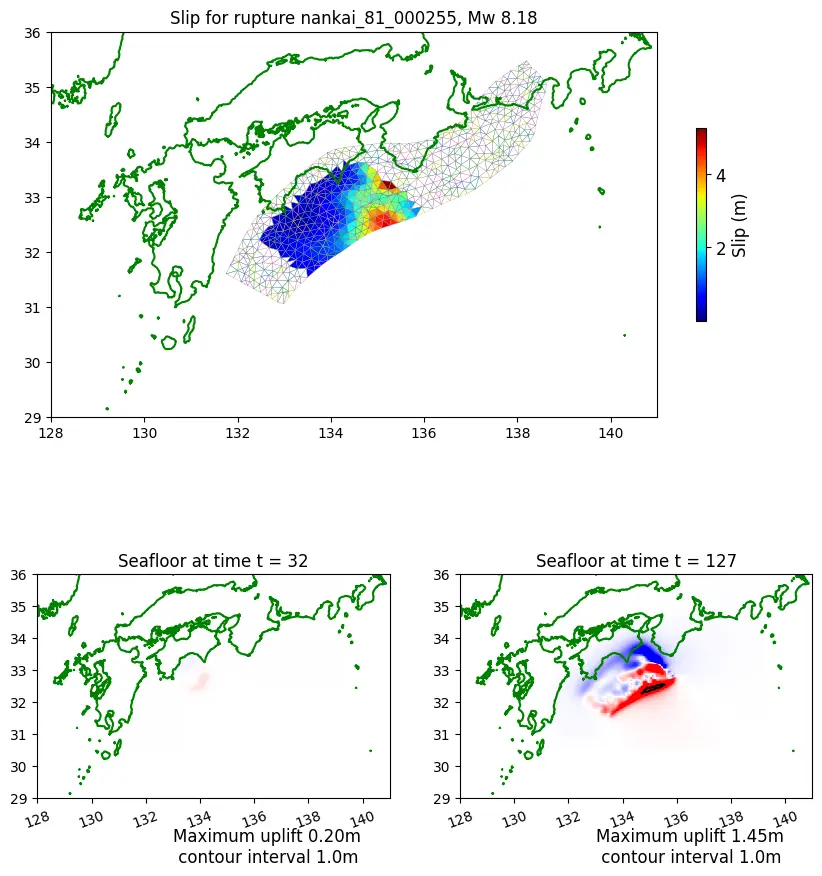

# 論文紹介: Scenario Superposition Method for Real-Time Tsunami Prediction Using a Bayesian Approach

発表者: 多田 瑛貴
(公立はこだて未来大学 複雑系知能学科 複雑系コース)

2025年4月15日 島内研究室

*写真: 北海道留萌市*

---

## 書誌情報

**Scenario Superposition Method for Real-TimeTsunami Prediction Using a Bayesian Approach** *Saneiki Fujita et al., 2024*

- 2024年12月1日
- DOI: 10.1029/2024JC021565
- 著者: Saneiki Fujita, Reika Nomura, Shuji Moriguchi, Yu Otake, Randall J. LeVeque, Kenjiro Terada
  - 全員が東北大学関連機関に所属
- 掲載誌: Journal of Geophysical Research: Oceans
  - アメリカ地球物理学連合 (AGU) が発行する査読つき学術雑誌
  Journal of Geophysical Research (JGR) のセッションの一つ

---

提案手法の実験にあたり、南海トラフ沖地震を想定した
津波シミュレーションのデータセットが作成され、全て公開されている
*詳細は後述。提案手法自体によるシミュレーション結果ではないことに注意*

**Pythonコード** DOI: 10.5281/zenodo.14029637.
**シミュレーションデータ** DOI: 10.5281/zenodo.12696848.

---

## 背景

津波の早期警報システムは、災害時の被害を軽減する重要な役割を果たす
津波の流体現象の高速な再現が必要

---

## 既存手法: 即時シミュレーション

津波の流体現象を支配方程式を用いて計算
- Oishi et al. (2015): K-computer/13498コア/5mメッシュ/約1.5分
- Musa et al. (2018): SX-ACE/512コア/10m(等)メッシュ/4分以内
*ドメイン領域やシミュレーション上での経過時間など実験設定が異なるため*
*ここで単純比較はできないことに注意。以降の手法も同様*

**課題:** 初期入力値による不確実性の考慮、計算コストと精度の兼ね合い

観測データを用いてその結果を修正していく手法 (Assimilation) も存在
ただし、計算コストと精度の兼ね合いの課題は残る

- Wang et al. (2018): 14分で信頼性の高い到達予測を実現
*各Assimilationの計算時間は10秒以内でほぼ無視可能*

---

## 既存手法: データベース検索

津波のシミュレーション結果を事前に計算し、データベースとして保存
津波発生時には観測データに最も近いものを予測結果として参照

- Fauzi and Mizutani (2020): CNN+MLPによるシナリオ検索、1秒以内
*Open AccessではないためAbstractのみ参照。おそらく画像分類に近いアプローチ？*
- Nomura et al. (2022): ベイズ推定によるシナリオ検索

**課題:** 取り得るパターンを網羅する大量のシミュレーション結果が必要

---

## 既存手法: 機械学習

観測データからシミュレーション結果を学習

- Mulia et al. (2022): MLP
- Makinoshima et al. (2021), Rim et al. (2022): CNN

時系列予測

- Alan et al. (2023): LSTM

シミュレーションに比べ高速な予測が可能

**課題**
- ブラックボックスで物理的な裏付けが乏しい
- 学習にかかる計算コスト

---

## 既存手法: 確率的な津波予測

- Blaser et al. (2011), Blaser et al. (2012), Tatsumi et al. (2014)

不確実性を定量的に調べることができる

**課題**
- シミュレーション時のパラメータの正確な設定
- 津波地震 (地震の規模に対して大きな津波を引き起こす地震) や
沿岸での複雑な振る舞いなど
説明の難しい不確実性に対しての対応

---

## 提案手法の概要

**シミュレーション結果の重ね合わせによる即時予測**

- 複数のシナリオによる
津波のシミュレーション結果を事前に用意
 *シナリオごとに想定する地震のパターンが異なる*
 *図は、あるシナリオでのシミュレーション結果の例*
 *図上: 断層すべり量の分布, 図下: 波高の分布*

 - 生成済みのシミュレーション結果を
複数重ね合わせ (線型結合し)
未知の地震パターンに対する津波の
シミュレーション結果を生成

---

重ね合わせに用いるシミュレーション結果への重みを
ベイズ推定により確率分布の形式で導出
信頼区間を用いて、不確実性を考慮した予測を行う
*このアプローチ自体は、Nomura et al. (2022)で同様に行われている*
*ただし、こちらはあくまでデータベース検索のアプローチに基づく*

*提案手法のアプローチ自体はデータベース検索に近いが、結果の不確実性を推定できる他*
*既存のシミュレーション結果を補間するようなデータを出力の候補として考慮できる*

---

# Methodology

---

**参考: 観測装置 (gauges)**

災害に関わる自然現象の観測網が日本各地に存在

- 海底に設置/地震計や水圧計など搭載/
地震・津波を対象
  - S-net: 太平洋沖
  - DONET (1,2): 南海トラフ沖
 - 沖合に設置/波高計など搭載/波浪を対象
   - NOWPHAS

*右図: S-netによる海底観測網*
*https://www.seafloor.bosai.go.jp/S-net/*

以降、説明に用いる「観測点」は
このような観測装置が存在する地点に対応

---

## シナリオ重ね合わせ (Scenario Superposition)

シナリオ $j$ における観測点 ($N_g$個) ・時間 ($N_t$ステップ) ごとの
波高データを次のように表す ($\boldsymbol{x}$ は$N_g$次元のベクトル):

$$
X_j = \left[ \boldsymbol{x}^j_{t_1}, \boldsymbol{x}^j_{t_2}, \cdots, \boldsymbol{x}^j_{t_{N_t}} \right] \in \mathbb{R}^{N_g \times N_t}
$$

同様に、観測器による観測データを次のように表す ($\boldsymbol{y}$ は$N_g$次元のベクトル):
$$
Y = \left[ \boldsymbol{y}_{t_1}, \boldsymbol{y}_{t_2}, \cdots, \boldsymbol{y}_{t_{N_t}} \right] \in \mathbb{R}^{N_g \times N_t}
$$

観測データを、事前に作成した$N_s$シナリオ分のシミュレーション結果を用いて
次のような線形結合で近似する → **目標: 各シナリオへの重み $\boldsymbol{w}\in \mathbb{R}^{N_s}$の導出**

$$Y = \sum_{j=1}^{N_s} w_j X_j$$

---

## 大まかな流れ

- Offline Phase: $X$を低ランク近似により次元圧縮/事前に処理
- Online Phase: 重み$\boldsymbol{w}$の確率分布を定める/観測データに合わせ実行
---

## Offline Phase

特異値分解 (SVD) により、データの次元を$r$まで落とした$X$の低ランク近似$X_r$を導出:

$$X_r =  \Phi_r D_r V_r^{\mathrm{T}}$$

ここで、時間に依存しない行列 $\Phi_r$ が取れる
*以上の操作は動的モード分解 (DMD) と呼ばれる操作と思われるが、その詳細は追いきれなかった*
時間$t$での$X_r$の各要素について、$D_r v_t^{j\mathrm{T}} = a_t^j$ とまとめ:

$$\boldsymbol{x}_t^j \approx \Phi_r D_r v_t^{j\mathrm{T}} = \Phi_r a_t^j$$

以上より、$\boldsymbol{y}_t$と$\boldsymbol{x}_t$ (=$\Phi_r a_t^j$)の関係は次のように表せる:

$$\boldsymbol{y}_t \approx \sum_{j=1}^{N_s} \Phi_r a^j_t w_j$$

---

**参考: 特異値分解**

データを以下のように分解 ($D$は対角行列で、一意に定まる):

$$X = U D V^{\mathrm{T}}$$

各成分を、$D$が次のようになるよう並べ替える: *主成分は大きな特異値$\sigma$をとる*

$$
D = 
\begin{bmatrix}
\sigma_1 & 0 & \cdots & 0 \\
0 & \sigma_2 & \ddots & \vdots \\
\vdots & \ddots & \ddots & 0 \\
0 & \cdots & 0 & \sigma_{N}
\end{bmatrix},
\quad \text{where } \sigma_1 > \sigma_2 > \cdots > \sigma_{N}.
$$

$\sigma_{1:r}$以外の特異値を0とした$D_r$を用いて、$X$を近似する階数$r$の$X_r$を得る:
*$X_r$は (フロベニウスノルムに基づくと) 元のデータを最もよく近似することが知られている*

$$X_r =  U_r D_r V_r^{\mathrm{T}}$$

---

<!-- _class: smartblockquote -->

## Online Phase

> 目標とする$\boldsymbol{y}_t$と$\boldsymbol{x}_t$ (=$\Phi_r a_t^j$)の関係: $\boldsymbol{y}_t \approx \sum_{j=1}^{N_s} \Phi_r a^j_t w_j$

誤差$\varepsilon_t$を考慮し、次のように表す:
*$\varepsilon_t$は観測誤差や次元圧縮による情報欠落、シミュレーション自体の予測誤差など様々な要因を内包*

$$\boldsymbol{y}_t  \approx \sum_{j=1}^{N_s} \Phi_r a^j_t w_j + \varepsilon_t$$

---

${\varepsilon }_{t}\sim \mathcal{N}\left(\mathbf{0},\,{\boldsymbol{\Sigma }}_{\varepsilon }\right)$と仮定し、行列形式で以下のように表す:

$$\boldsymbol{y}_t = \Phi_r \mathbf{A}_t \boldsymbol{w} + \varepsilon_t$$

ただし
$${\boldsymbol{A}}_{t}=\left[\begin{array}{@{}cccc@{}}\hfill {a}_{t}^{j=1}\hfill & \hfill {a}_{t}^{j=2}\hfill & \hfill {\cdots}\hfill & \hfill {a}_{t}^{j={N}_{s}}\hfill \end{array}\right]\in {\mathbb{R}}^{r\times {N}_{s}}$$

$$\boldsymbol{w}={\left\{\begin{array}{@{}cccc@{}}\hfill {w}^{j=1}\hfill & \hfill {w}^{j=2}\hfill & \hfill {\cdots}\hfill & \hfill {w}^{j={N}_{s}}\hfill \end{array}\right\}}^{\mathrm{T}}\in {\mathbb{R}}^{{N}_{s}}$$

これはベイズ線形回帰の標準的な形となっている

---

ベイズの公式より

$$p(\boldsymbol{w} \mid \boldsymbol{y}_t) = \frac{p(\boldsymbol{y}_t \mid \boldsymbol{w}) p(\boldsymbol{w})}{p(\boldsymbol{y}_t)}$$

重みの事前分布$p(\boldsymbol{w})$から、観測データ$\boldsymbol{y}_t$を用いて事後分布$p(\boldsymbol{w} \mid \boldsymbol{y}_t)$を定めていく

ここで${\varepsilon }_{t}\sim \mathcal{N}\left(\mathbf{0},\,{\boldsymbol{\Sigma }}_{\varepsilon }\right)$より以下が定まる *詳細は省略*
ただし、${\boldsymbol{\mu }}_{w}, {\boldsymbol{\Sigma }}_{w}$ は事前分布を定めるハイパーパラメータ

$$p\left({\boldsymbol{y}}_{t}\vert \boldsymbol{w}\right)=\mathcal{N}\left({\boldsymbol{y}}_{t}\vert {\boldsymbol{\Phi }}_{r}{\boldsymbol{A}}_{t}\boldsymbol{w},\,{\boldsymbol{\Sigma }}_{\varepsilon }\right)$$

$$p\left(\boldsymbol{w}\right)=\mathcal{N}\left(\boldsymbol{w}\vert {\boldsymbol{\mu }}_{w},\,{\boldsymbol{\Sigma }}_{w}\right).$$

$$p\left({\boldsymbol{y}}_{t}\right)=\mathcal{N}\left({\boldsymbol{y}}_{t}\vert {\boldsymbol{\Phi }}_{r}{\boldsymbol{A}}_{t}{\boldsymbol{\mu }}_{w},\,{\boldsymbol{\Sigma }}_{\varepsilon }+{\boldsymbol{\Phi }}_{r}{\boldsymbol{A}}_{t}{\boldsymbol{\Sigma }}_{w}{\left({\boldsymbol{\Phi }}_{r}{\boldsymbol{A}}_{t}\right)}^{\mathrm{T}}\right).$$

---

これをベイズの公式に当てはめることで
最終的にある時間の観測データ${\boldsymbol{y}}_{t}$を考慮した
事後分布を次のように解析的に表せる:

$$p\left(\boldsymbol{w}\vert {\boldsymbol{y}}_{t}\right)=\mathcal{N}\left(\boldsymbol{w}\vert {\widehat{\boldsymbol{w}}}_{t},\,{\boldsymbol{P}}_{t}\right)$$

ただし

$${\widehat{\boldsymbol{w}}}_{t}={\boldsymbol{\mu }}_{w}+{\boldsymbol{P}}_{t}{\left({\boldsymbol{\Phi }}_{r}{\boldsymbol{A}}_{t}\right)}^{\mathrm{T}}{\boldsymbol{\Sigma }}_{\varepsilon }^{-1}\left({\boldsymbol{y}}_{t}-{\boldsymbol{\Phi }}_{r}{\boldsymbol{A}}_{t}{\boldsymbol{\mu }}_{w}\right)$$

$${\boldsymbol{P}}_{t}={\left({{\boldsymbol{\Sigma }}_{w}}^{-1}+{\left({\boldsymbol{\Phi }}_{r}{\boldsymbol{A}}_{t}\right)}^{\mathrm{T}}{\boldsymbol{\Sigma }}_{\varepsilon }^{-1}{\boldsymbol{\Phi }}_{r}{\boldsymbol{A}}_{t}\right)}^{-1}$$

*論文でもこの導出は割愛されており、他の文献の参照が必要*

次の時間の観測データ${\boldsymbol{y}}_{t+1}$が得られた場合には
上記で得られた$p\left(\boldsymbol{w}\vert {\boldsymbol{y}}_{t}\right)$を事前分布とし、同様の手順で事後分布を導出
これを観測データの存在する時間範囲で繰り返し適用

---

## 逐次更新のアルゴリズム

Required: $\boldsymbol{\Phi }_{r}$, $\boldsymbol{A}_{t}$ (Offline Phaseで事前に計算), $\boldsymbol{y}_{t}$ (観測データ)

誤差項の共分散を次のように設定:

$$
{\boldsymbol{\Sigma }}_{\varepsilon }=\boldsymbol{I}
$$

事前分布の平均・共分散を次のように初期化:

$${\boldsymbol{\mu }}_{w}=\mathbf{0}, \quad{\boldsymbol{\Sigma }}_{w}=\alpha \boldsymbol{I}$$

---

<!-- _class: smartblockquote -->

$t=1,\ldots,T \ll {N}_{t}$ の範囲で、以下のように${\boldsymbol{\mu }}_{w}$と${\boldsymbol{\Sigma}}_{w}$を更新していく:

> $\text{for}\;t=1,\ldots,T$:
> $$
> \begin{aligned}
> {\boldsymbol{P}}_{t}&={\left({\boldsymbol{\Sigma }}_{w}^{-1}+{\left ({\boldsymbol{\Phi }}_{r}{\boldsymbol{A}}_{t}\right)}^{\mathrm{T}}{\boldsymbol{\Sigma }}_{\varepsilon }^{-1}{\boldsymbol{\Phi }}_{r}{\boldsymbol{A}}_{t}\right)}^{-1} \\
> {\widehat{\boldsymbol{w}}}_{t}&={\boldsymbol{\mu }}_{w}+{\boldsymbol{P}}_{t}{\left({\boldsymbol{\Phi }}_{r}{\boldsymbol{A}}_{t}\right)}^{\mathrm{T}}{\boldsymbol{\Sigma }}_{\varepsilon }^{-1}\left({\boldsymbol{y}}_{t}-{\boldsymbol{\Phi }}_{r}{\boldsymbol{A}}_{t}{\boldsymbol{\mu }}_{w}\right) \\
> {\boldsymbol{\Sigma }}_{w}&{\leftarrow}{\boldsymbol{P}}_{t} \\
> {\boldsymbol{\mu }}_{w}&{\leftarrow}{\widehat{\boldsymbol{w}}}_{t}
> \end{aligned}
> $$

*$T$は$t$の上限。観測データの取得可能な範囲に限られ、基本的に$N_t$より少なくなる*

---

最終的に得られた${\widehat{\boldsymbol{w}}}_{T}, {\boldsymbol{P}}_{T}$を用いて
予測される津波の波高 $\widehat{\boldsymbol{y}}_{t}$ は次のように表される:

$${\widehat{\boldsymbol{y}}}_{t}={\boldsymbol{\Phi }}_{r}{\boldsymbol{A}}_{t}{\widehat{\boldsymbol{w}}}_{T}$$

同様に、予測誤差の共分散行列は次のように表される:

$${\boldsymbol{R}}_{t}={\boldsymbol{\Phi }}_{r}{\boldsymbol{A}}_{t}{\boldsymbol{P}}_{T}{\left({\boldsymbol{\Phi }}_{r}{\boldsymbol{A}}_{t}\right)}^{\mathrm{T}}$$

*以上は$t = 1, \ldots, N_t$まで適用可能*

---

**参考: T=150, T=600 (単位:秒) での実験結果**

*Tが大きくなるほど信頼区間が絞られていることがわかる*

---

# 南海トラフ沖の地震を想定した実験

---

## 津波シナリオの作成

南海トラフを震源とする
津波シミュレーションのデータセットを作成

- 断層面を1119個のメッシュに分割
- 断層すべり量を**Mudpy**を用いて計算
*Karhunen-Loève展開に基づく*
- **GeoClaw**を用いて
非線形浅水方程式による
3時間の津波の伝播を計算

$N_s=2342$のシナリオを用意
地震の規模はMw 8.1から9.1まで0.2刻み

うち、586個のシナリオをテスト用
残りの1756個のシナリオを訓練用に使用

---

**参考: 断層すべり量**

地震によってプレート境界にある岩石が破壊しずれ動いた量
東日本大震災では最大65m

*https://www.jamstec.go.jp/j/pr/topics/quest-20170310/*

---

## 観測点の用意

- DONET, NOWPHAS による$N_g=62$の観測機器の位置を観測点とする

*実験では、特にGauge Aでの結果を観察*

---

## Offline Phaseのハイパーパラメータ

各成分のcontribution rateを計算し、大きいものを抽出
*contribution rateは、特異値の2乗を全特異値の2乗で割ったもの*

ある成分までのcontribution rateの合計は図のよう推移する
$r=23$で99%に達することから、実験でもこの値を用いる

---

<!-- _class: smartblockquote -->

## Online Phase

> $${\boldsymbol{\mu }}_{w}=\mathbf{0}, \quad{\boldsymbol{\Sigma }}_{w}=\alpha \boldsymbol{I}$$

各シナリオに対する重みは
最初すべて同じであり
図のようになる

*縦横軸は、$N_s=2342$個の重みから
無作為に選んだもの*

---

Online Phaseを経て、図のように推移

---

$T=600$ (単位:秒) における各シナリオへの重みの分布
*負の数になる重みも存在*

---

## 予測値結果の観察と比較

**比較対象: Nomura et al. (2022)** (N.2022)
 Sequential Bayesian Update to Detect the Most Likely Tsunami Scenario Using Observational Wave Sequences

- データセット検索によるアプローチ
*出力結果はあるシナリオでのシミュレーション結果と同じとなること*
- ベイズ推定に基づく

---

$T=150, T=600$ (単位:秒) におけるGauge Aの波高の予測値とシミュレーション値
*(a)と(b)はそれぞれMw 8.1, Mw 9.1*
*赤い網がけ部分は信頼区間 (±1σ) を示す*

---

<!-- _class: smartblockquote -->

どちらも、シミュレーション値が信頼区間 (±1σ) に収まっている
*予測値だけでなく信頼区間も提示することで、予測の過小評価を防ぐことが期待できる*

ただし、比較的小さな津波での予測は未だ課題がある
- $T=150$ では、信頼区間は最大波高の約3倍
- 事前分布を見直す必要を示唆
*本実験では、誤差の分布はガウス分布で、すべてのシナリオで均一となっている*
*不確実性の要因をより正確に表現するために、これらを見直す必要があるとしている*

> 誤差の分布: ${\varepsilon }_{t}\sim \mathcal{N}\left(\mathbf{0},\,{\boldsymbol{\Sigma }}_{\varepsilon }\right)\quad$実験では${\boldsymbol{\Sigma }}_{\varepsilon }=\boldsymbol{I}$

---

テイラー図を用いて、シミュレーション結果と予測値の近さを視覚的に表現
*原点との距離は標準偏差、角度は相関係数に対応*
*黒い点がシミュレーション結果で、黒い点からの距離が二乗平均平方根誤差の大きさに対応*

- N.2022と比較し、Tの長さに応じて結果が継続的に改善されている
- 実際の事象に類似したシナリオが存在しない場合に利点を有することを示唆

---

テストケースで、予測結果の最大波高とシミュレーション結果の最大波高を比較
*縦軸: 予測, 横軸: シミュレーション値*

大きな地震での予測が過小・過大評価されるN.2022と比べ改善が見られる

---

## 回帰問題による解の不安定さについて

実験結果から、従来手法となるN.2022に比べ結果が改善していると主張

一方で、逆問題の解が不安定な場合、予測の信頼性が失われることを示唆
- 2つ以上のシナリオがすべての観測点でほぼ同じデータを持つ場合
*基底関数がほぼ同一となるため解が不定となり、非常に大きな分散が現れる*
- シナリオが少なすぎる場合

---

## 付録: 特異値分解による結果への影響

シナリオごとにノイズ付きのテストデータを1000個適用
各シナリオに対する重みの分布を可視化
*特異値分解を用いない場合(右)と用いる場合(左)で比較*

差がわずかしか見られないことがわかる
*ガウス事前分布によるベイズ線形回帰は、L2正則化を用いた線形回帰と同等であることが知られている*
*特異値分解を用いた方がより高い堅牢性を持つことを示唆*

---

特異値分解の有無による予測結果の比較

---

# まとめ

**Scenario Superposition Method for Real-TimeTsunami Prediction Using a Bayesian Approach** *Saneiki Fujita et al., 2024*

- 事前計算されたシミュレーション結果の線形結合による
即時かつ幅広い事象に対応する津波予測の手法を提案
- 特異値分解による低ランク近似を用いる
- 重みの決定をベイズ線形回帰問題に帰着
- 信頼区間の提示により過小評価を防ぐ

**課題**

- 事前分布の見直し *小さな津波での大きな不確実性に対処*
- 他の確率回帰モデルの導入
- 様々な種類の不確実性をより明示的に定義

