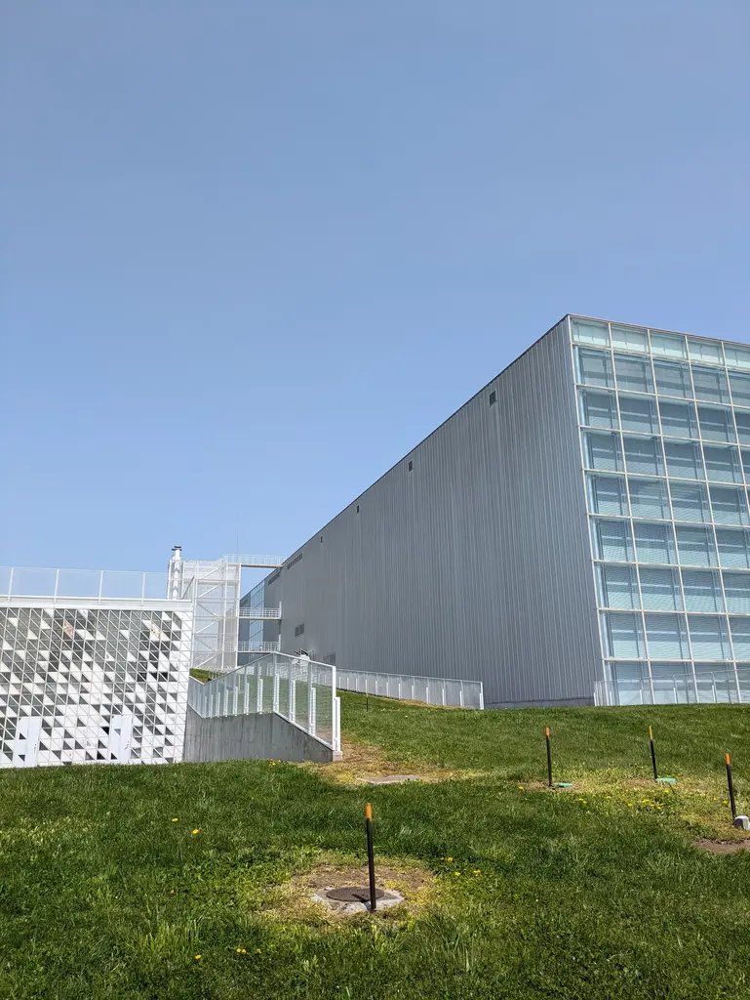
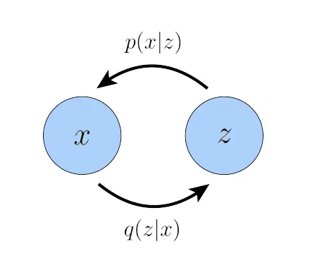
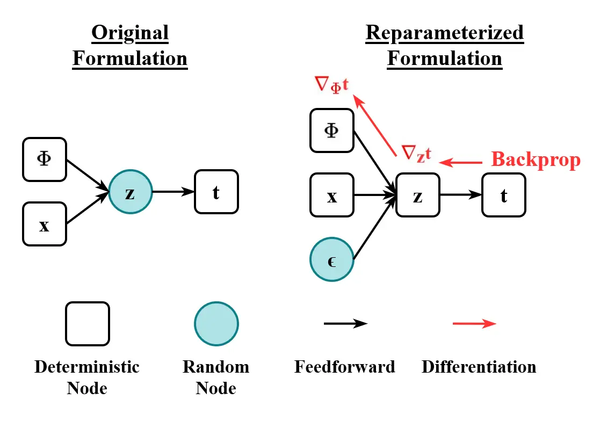
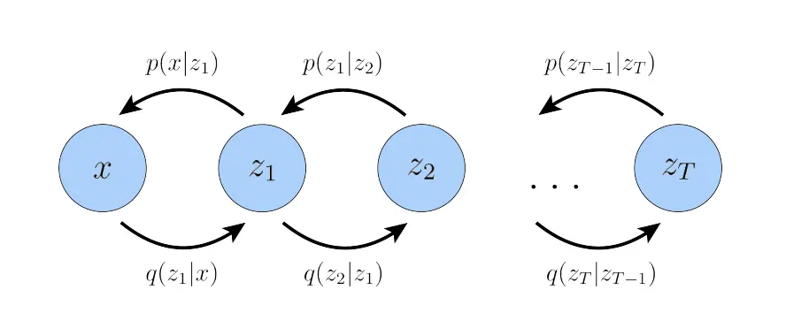
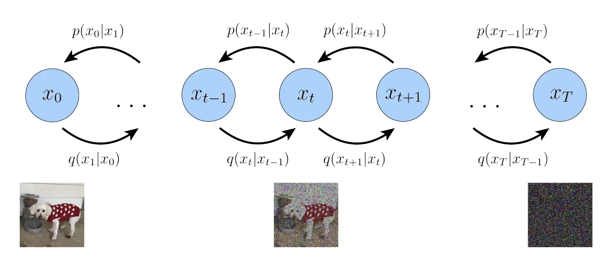
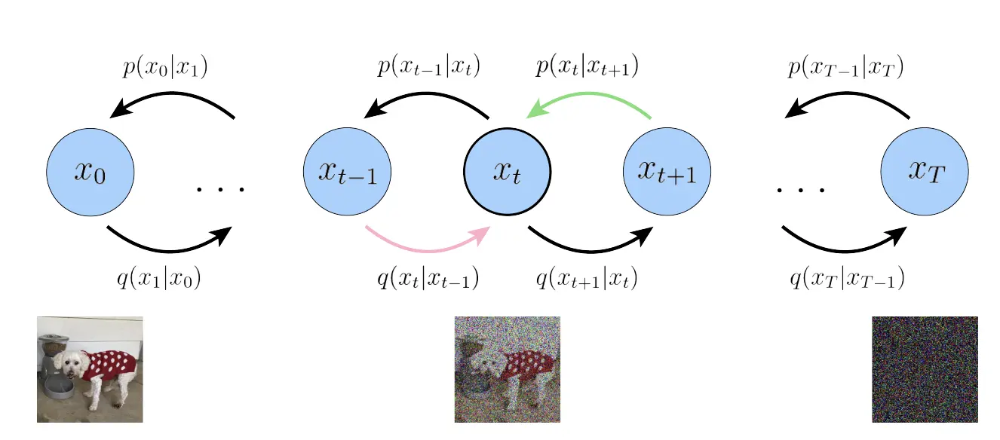
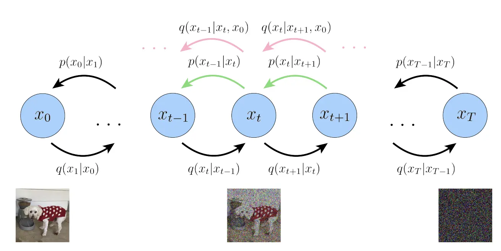

**論文紹介**

# Understanding Diffusion Models: A Unified Perspective

発表者: 多田 瑛貴
*公立はこだて未来大学 システム情報科学部*
*複雑系知能学科 複雑系コース*

2025年5月13日 島内研究室

---

## 書誌情報

**Understanding Diffusion Models: A Unified Perspective**
DOI: 10.48550/arXiv.2208.11970 (arXiv) 

著者: Calvin Luo

---

## 内容の方向性

- 拡散モデルを2つの視点で捉える
  - 尤度最大化のモデルとして
  - スコア関数の学習に基づく生成モデルとして
- 拡散モデルを具体的にどのように実装するかは述べていない
  - あくまで解くべき問題、およびその導出と理論的な解釈を示す

---

## 今回発表すること/しないこと

- 変分拡散モデルの問題設定と
背景にあるELBO, VAE, HVAEの考え方と繋がりを説明
- 以下は今回発表しません *多分次回？*
  - スコア関数の学習に基づく生成モデルとしての解釈
  - エンコーダーのパラメータを学習する方法
  - 条件付き拡散モデルの実装

---

## Introduction: Generative Models

生成モデルの目標: 観測データ$\boldsymbol{x}$の背後にある確率分布$p(\boldsymbol{x})$を学習すること
*一度学習すれば、$p$からサンプリングすることで新しいデータを得られる*

- GAN *Generative Adversarial Networks*
  - 敵対的な学習手法により、サンプリングの手続きをモデルにする
- likelihood-based models *VAEなど*
  - 観測データ$\boldsymbol{x}$の尤度を最大化するモデルを学習する
- Energy-based models (EBM) / Score-based models
  - エネルギー関数 / エネルギー関数のスコアを学習

---

# Background: ELBO, VAE, and Hierarchical VAE

---

観測データ$\boldsymbol{x}$を、それに紐づく潜在変数 $\boldsymbol{z}$で表現する仮定
*この関係は、この論文では後述するAllegory of the Caveで形容されている*

ランダムな$\boldsymbol{z}$から$\boldsymbol{x}$を生成するモデルを学習することを考える
*ほとんどの場合、$\boldsymbol{z}$は$\boldsymbol{x}$より低次元*
*$\boldsymbol{z}$の導入により、よりコンパクトかつ本質を捉えた表現ができる可能性がある*

---

**参考: Allegory of the Cave**

 

*写真 by 4edges (https://commons.wikimedia.org/wiki/File:An_Illustration_of_The_Allegory_of_the_Cave,_from_Plato%E2%80%99s_Republic.jpg), オリジナル画像からリサイズを適用*

---

## Evidence Lower Bound (ELBO)

likelihood-based modelsについて
- 目標: 尤度$p(\boldsymbol{x})$を観測データ$\boldsymbol{x}$に対して最大化するよう学習すること
- 先ほどの前提から潜在変数との同時分布 $p(\boldsymbol{x},\boldsymbol{z})$ が想像できる

...しかし、$p(\boldsymbol{x})$を直接最大化することは難しい
- $\boldsymbol{z}$による周辺化 → $\boldsymbol{z}$ 全体を網羅する必要があり、複雑なモデルでは計算が困難
$$p(\boldsymbol{x})=\int p(\boldsymbol{x},\boldsymbol{z}) d\boldsymbol{z}$$
$$$$
- 条件付き確率分布の連鎖律 → 未知の$p(\boldsymbol{z}|\boldsymbol{x})$が必要
$$p(\boldsymbol{x})=\frac{p(\boldsymbol{x},\boldsymbol{z})}{p(\boldsymbol{z}|\boldsymbol{x})}$$
<!--TODO-->

---

<!-- _class: smartblockquote -->

そこで、目的関数として**Evidence Lower Bound (ELBO)** を導入
- **Evidence**: ここでは、観測データ$\boldsymbol{x}$に対する対数尤度$\log p(\boldsymbol{x})$
- Evidenceの下限 (lower bound): ELBO として$p(\boldsymbol{x})$の代わりに最大化する

> **ELBOの定義** ただし、 $q_{\phi}(\boldsymbol{z}|\boldsymbol{x})$ は$p(\boldsymbol{z}|\boldsymbol{x})$を近似する関数 *$\phi$はパラメータ*
> $$\mathbb{E}_{q_{\phi}(\boldsymbol{z}|\boldsymbol{x})}\left[\log \frac{p(\boldsymbol{x},\boldsymbol{z})}{q_{\phi}(\boldsymbol{z}|\boldsymbol{x})}\right]$$

- ELBOがEvidence($\log p(\boldsymbol{x})$)の下限となることは
イェンセンの不等式によって示される *導出は省略*
- ELBOとEvidenceの差は$D_{\mathrm{KL}}(q_\phi(z|x) \parallel p(z|x))$である *導出は省略* ため
ELBOを最大化することは、$q_\phi(z|x)$と$p(z|x)$の距離を最小化することに等しい
*パラメータ$\phi$が完全に最適に調整された場合はこの2つは同じになる*

---

### 参考: ELBOの性質の導出

$$
\begin{align*}
\log p(x) &= \log \int p(x, z) \, dz \\
&= \log \int \frac{p(x, z) q_\phi(z|x)}{q_\phi(z|x)} \, dz \\
&= \log \mathbb{E}_{q_\phi(z|x)} \left[ \frac{p(x, z)}{q_\phi(z|x)} \right] \\
&\geq \mathbb{E}_{q_\phi(z|x)} \left[ \log \frac{p(x, z)}{q_\phi(z|x)} \right]
\end{align*}
$$

---

$$
\begin{align*}
\log p(x) 
&= \log p(x) \int q_\phi(z|x) \, dz   \\
&= \int q_\phi(z|x) \log p(x) \, dz   \\
&= \mathbb{E}_{q_\phi(z|x)} [\log p(x)]   \\
&= \mathbb{E}_{q_\phi(z|x)} \left[ \log \frac{p(x, z)}{p(z|x)} \right]   \\
&= \mathbb{E}_{q_\phi(z|x)} \left[ \log \frac{p(x, z) q_\phi(z|x)}{p(z|x) q_\phi(z|x)} \right]   \\
&= \mathbb{E}_{q_\phi(z|x)} \left[ \log \frac{p(x, z)}{q_\phi(z|x)} \right]
+ \mathbb{E}_{q_\phi(z|x)} \left[ \log \frac{q_\phi(z|x)}{p(z|x)} \right]   \\
&= \mathbb{E}_{q_\phi(z|x)} \left[ \log \frac{p(x, z)}{q_\phi(z|x)} \right]
+ D_{\mathrm{KL}}(q_\phi(z|x) \parallel p(z|x))   \\
&\geq \mathbb{E}_{q_\phi(z|x)} \left[ \log \frac{p(x, z)}{q_\phi(z|x)} \right]  
\end{align*}
$$

---

## Variational Autoencoder (VAE)

ELBOを直接最大化する手法として
**Variational Autoencoder** がある

この時、条件付き確率分布として
- $q_\phi(\boldsymbol{z}|\boldsymbol{x})$: $x$から$z$を生成 → **エンコーダ**
- $p_\theta(\boldsymbol{x}|\boldsymbol{z})$: $z$から$x$を生成 → **デコーダ**

これらの関係は図のように表現できる

*データを内部で低次元の表現に落とし込む
→ オートエンコーダと同じ考え方*

---

ELBOは$p_\theta(x|z)$を新たに用いて次のように表現できる:

$$
\begin{align*}
\mathbb{E}_{q_{\phi}(\boldsymbol{z}|\boldsymbol{x})}\left[\log \frac{p(\boldsymbol{x},\boldsymbol{z})}{q_{\phi}(\boldsymbol{z}|\boldsymbol{x})}\right]
&=
\mathbb{E}_{q_\phi(z|x)} \left[ \log \frac{p_\theta(x|z) p(z)}{q_\phi(z|x)} \right] \\
&= \mathbb{E}_{q_\phi(z|x)} [\log p_\theta(x|z)] 
+ \mathbb{E}_{q_\phi(z|x)} \left[ \log \frac{p(z)}{q_\phi(z|x)} \right] \\
&= \mathbb{E}_{q_\phi(z|x)} [\log p_\theta(x|z)]
- D_{\mathrm{KL}}(q_\phi(z|x) \,\|\, p(z))
\end{align*}
$$

VAEでは、ELBOを最大化するために

- $\mathbb{E}_{q_\phi(z|x)} [\log p_\theta(x|z)]$は **reconstruction term** → 最大化する
*観測データが潜在変数から正しく再構成できることを測る*
- $D_{\mathrm{KL}}(q_\phi(z|x) \,\|\, p(z))$は **prior matching term** → 最小化する
*$q_\phi(z|x)$と$p(z)$の近さを測り、エンコーダの出力が$z$の分布となるよう学習させる*
*(ディラックのデルタ関数のような歪な形になることを防ぐため)*

---
ここでは、エンコーダは多変量正規分布を仮定
平均$\mu_\phi(x)$と分散$\sigma^2_\phi(x)$を出力するとする

$$
\begin{align*}
q_\phi(z|x) &= \mathcal{N}(z; \mu_\phi(x), \sigma^2_\phi(x) I) \\
p(z) &= \mathcal{N}(z; 0, I)
\end{align*}
$$

最適化の対象となるのは、$\phi$と$\theta$の2つのパラメータ
この時、モンテカルロ法により$q_\phi(z|x)$から${L}$個のサンプル$z^{(l)}$を得ることで
目的関数は次のように表せる:

$$
\begin{align*}
\arg\max_{\phi, \theta} \; 
&\mathbb{E}_{q_\phi(z|x)} [\log p_\theta(x|z)] - D_{\mathrm{KL}}(q_\phi(z|x) \,\|\, p(z)) \\
&\approx \arg\max_{\phi, \theta} 
\sum_{l=1}^{L} \log p_\theta(x | z^{(l)}) - D_{\mathrm{KL}}(q_\phi(z|x) \,\|\, p(z))
\end{align*}
$$

しかし、これには問題がある

---

<!-- _class: smartblockquote -->

> $$
\arg\max_{\phi, \theta} 
\sum_{l=1}^{L} \log p_\theta(x | z^{(l)}) - D_{\mathrm{KL}}(q_\phi(z|x) \,\|\, p(z))
$$

"モンテカルロ法により$q_\phi(z|x)$から${L}$個のサンプル$z^{(l)}$を得る"
という計算で損失を計算する場合、微分ができない

---

### reparameterization trick
$z$を、$\mathcal{N}(z; \mu_\phi(x), \sigma^2_\phi(x) I)$の代わりに

$\mathcal{N}(0, I)$を$\sigma^2_\phi(x)$と$\mu_\phi(x)$を用いて
移動・スケールしたものとして表現する

$$
\begin{align*}
z &= \mu_\phi(x) + \sigma_\phi(x) \odot \varepsilon, \quad \varepsilon \sim \mathcal{N}(0, I)
\end{align*}
$$

→ パラメータに対する微分が可能に

*写真 by EugenioTL (https://commons.wikimedia.org/wiki/File:Reparameterization_Trick.png)
オリジナル画像からリサイズ*

---

## Hierarchical VAE (HVAE)

VAEを階層的に適用したもの

$T$層の潜在変数$z_{1:T}$を持つとして
デコーダ、エンコーダは
次のようになる:
$$
\begin{align*}
p(x, z_{1:T}) &= p(z_T) \, p_\theta(x | z_1) \prod_{t=2}^{T} p_\theta(z_{t-1} | z_t) \\
q_\phi(z_{1:T} | x) &= q_\phi(z_1 | x) \prod_{t=2}^{T} q_\phi(z_t | z_{t-1})
\end{align*}
$$

---

ELBOはHVAEにおいても同様に定義できる。イェンセンの不等式から:

$$
\begin{align*}
\log p(x) 
&= \log \int p(x, z_{1:T}) \, dz_{1:T} \\
&= \log \int \frac{p(x, z_{1:T}) q_\phi(z_{1:T} | x)}{q_\phi(z_{1:T} | x)} \, dz_{1:T} \\
&= \log \mathbb{E}_{q_\phi(z_{1:T} | x)} \left[ \frac{p(x, z_{1:T})}{q_\phi(z_{1:T} | x)} \right] \\
&\geq \mathbb{E}_{q_\phi(z_{1:T} | x)} \left[ \log \frac{p(x, z_{1:T})}{q_\phi(z_{1:T} | x)} \right]
\end{align*}
$$

であるから、HVAEのELBOは:
$$
\mathbb{E}_{q_\phi(z_{1:T} | x)} \left[ \log \frac{p(x, z_{1:T})}{q_\phi(z_{1:T} | x)} \right] = 
\mathbb{E}_{q_\phi(z_{1:T} | x)} \left[ 
\log \frac{
    p(z_T) \, p_\theta(x | z_1) \prod_{t=2}^{T} p_\theta(z_{t-1} | z_t)
}{
    q_\phi(z_1 | x) \prod_{t=2}^{T} q_\phi(z_t | z_{t-1})
}
\right]

$$

---

# Variational Diffusion Models

---

**Variational Diffusion Models (変分拡散モデル)**
HVAEに対して、以下3つの制約を課したもの: *これから順を追って説明します*
1. データの次元と潜在変数の次元は同じ
2. エンコーダは線形ガウスモデルとして、どの階層でも不変の構造
3. エンコーダのパラメータは階層ごとに異なる値を取り
最後の潜在変数の分布が純粋なガウスノイズとなるよう定まる

---

<!-- _class: smartblockquote -->

> 1. データの次元と潜在変数の次元は同じ

HVAEでは、エンコーダは次のように表現されていた:

$$q_\phi(z_{1:T} | x) = q_\phi(z_1 | x) \prod_{t=2}^{T} q_\phi(z_t | z_{t-1})$$

VDMでは全ての階層で次元が同じであるから、$x$と$z_{1:T}$の代わりに$x_{0:T}$として表現し
$$
q(x_{1:T} | x_0) = \prod_{t=1}^{T} q(x_t | x_{t-1}) \\
$$

---

<!-- _class: smartblockquote -->

> 2. エンコーダは線形ガウスモデルとして、どの階層でも不変の構造

エンコーダは次のように表現される:

$$
q(x_t | x_{t-1}) = \mathcal{N}(x_t; \sqrt{\alpha_t} x_{t-1}, (1 - \alpha_t) I)
$$

直感的には、$x_t$は$x_{t-1}$に対してガウス分布に基づくノイズを与えたもの
- $\alpha_t$は固定しても良いし、学習対象のパラメータとしても良い
*学習する場合の手法も論文では説明されているが、今回は割愛*
- $(1-\alpha_t)$は、ノイズの強さに相当する
- 分散は一定となる
- $q(x_t | x_{t-1})$自体は**学習されない**ため、$\phi$は用いられない

---

<!-- _class: smartblockquote -->

> 3. エンコーダのパラメータは階層ごとに異なる値を取り
最後の潜在変数の分布が純粋なガウスノイズとなるよう定まる

つまり、$x_T$は純粋なノイズとなる

---
これに基づいて、デコーダは次のように表現される:
$$
p(x_{0:T}) = p(x_T) \prod_{t=1}^{T} p_\theta(x_{t-1} | x_t) \\
\,\, \,  \text{where},\, \, \,  p(x_T) = \mathcal{N}(x_T; 0, I)
$$

VDMでの学習の関心は各層のデコーダ$p_\theta(x_{t-1} | x_t)$にある

エンコーダではノイズが与えられるのに対し
デコーダではそのノイズを取り除くような変換を行い
新規の$x_0$を生成することを目指す

---

### VDMのELBO
VDMのELBOは次のように表現できる: *導出は省略。文献を参照してください*

$$
\begin{align*}
\log p(x_0)
&\geq \mathbb{E}_{q(x_1 | x_0)} [\log p_\theta(x_0 | x_1)] \\
&\quad - \mathbb{E}_{q(x_{T-1} | x_0)} \left[ D_{\mathrm{KL}}(q(x_T | x_{T-1}) \| p(x_T)) \right] \\
&\quad - \sum_{t=1}^{T-1} \mathbb{E}_{q(x_{t-1}, x_{t+1} | x_0)} \left[ D_{\mathrm{KL}}(q(x_t | x_{t-1}) \| p_\theta(x_t | x_{t+1})) \right]
\end{align*}
$$

- $\mathbb{E}_{q(x_1 | x_0)} [\log p_\theta(x_0 | x_1)]$は**reconstruction term**
*$x_0$が$x_1$から正しく再構成できることを測る。VAE同様*
- $D_{\mathrm{KL}}(q(x_T | x_{T-1}) \| p(x_T))$は**prior matching term**
*$q_\phi(x_T | x_{T-1})$と$p(x_T)$の近さを測り、エンコーダの出力が$x_Tの$分布
ここでは純粋なガウスノイズとなるようにする。ただし、VDMではこの項は**学習が行われない***
- $\sum_{t=1}^{T-1} \mathbb{E}_{q(x_{t-1}, x_{t+1} | x_0)} \left[ D_{\mathrm{KL}}(q(x_t | x_{t-1}) \| p_\theta(x_t | x_{t+1})) \right]$は**consistency term**

---

<!-- _class: smartblockquote -->

> **consistency term**: $\sum_{t=1}^{T-1} \mathbb{E}_{q(x_{t-1}, x_{t+1} | x_0)} \left[ D_{\mathrm{KL}}(q(x_t | x_{t-1}) \| p_\theta(x_t | x_{t+1})) \right]$

$x_t$は$x_{t-1}$および$x_{t+1}$どちらからも同じ分布が得られるようにしたい
*ノイズの付与と除去の過程で、同じ分布が得られるようにする*

---

<!-- _class: smartblockquote -->

> **consistency term**: $\sum_{t=1}^{T-1} \mathbb{E}_{q(x_{t-1}, x_{t+1} | x_0)} \left[ D_{\mathrm{KL}}(q(x_t | x_{t-1}) \| p_\theta(x_t | x_{t+1})) \right]$

しかし、この状態では学習が不安定になる可能性がある

毎ステップでランダムな$x_{t-1}$と$x_{t+1}$の2つをサンプリングする必要がある
*双方は分布が異なる*
→ 分散が大きくなり、項の推定値が揺れやすくなる

これを、$x_t$のみをサンプリングすれば良いように変形したい

---

$q(x_t | x_{t-1})$は$q(x_t | x_{t-1}, x_0)$としても不変である
*エンコーダ$q$はマルコフ性により、直前の状態からしか影響を受けない*

ベイズの定理を用いて$q(x_t | x_{t-1}, x_0)$は次のように表現できる:

$$
q(x_t | x_{t-1}, x_0) = \frac{q(x_{t-1} | x_t, x_0) q(x_t | x_0)}{q(x_{t-1} | x_0)}
$$

この時$q(x_{t-1} | x_t, x_0)$が現れる *方向が逆*
最終的にはこれが$p_\theta$に近似するよう学習を進めることになる

---

これを元にELBOを改めて導出すると: *導出は省略。文献を参照してください*

$$
\begin{align*}
\log p(x_0)
&\geq 
 \mathbb{E}_{q(x_1 | x_0)} \left[ \log p_\theta(x_0 | x_1) \right] \\
&\quad - D_{\mathrm{KL}}(q(x_T | x_0) \| p(x_T)) \\
&\quad - \sum_{t=2}^T \mathbb{E}_{q(x_t | x_0)} \left[
D_{\mathrm{KL}}(q(x_{t-1} | x_t, x_0) \| p_\theta(x_{t-1} | x_t))
\right]
\end{align*}
$$

- $\mathbb{E}_{q(x_1 | x_0)} [\log p_\theta(x_0 | x_1)]$は**reconstruction term**
- $D_{\mathrm{KL}}(q(x_T | x_0) \| p(x_T))$は**prior matching term** *ここでは$x_{T-1}$が$x_0$となっている*
- $\sum_{t=2}^T \mathbb{E}_{q(x_t | x_0)} \left[
D_{\mathrm{KL}}(q(x_{t-1} | x_t, x_0) \| p_\theta(x_{t-1} | x_t))
\right]$は**denoising matching term**

---

<!-- _class: smartblockquote -->
> **denoising matching term**: $\sum_{t=2}^T \mathbb{E}_{q(x_t | x_0)} \left[
D_{\mathrm{KL}}(q(x_{t-1} | x_t, x_0) \| p_\theta(x_{t-1} | x_t))
\right]$

$q(x_{t-1} | x_t, x_0)$は、$x_{t-1}$が$x_0$に近づくようにどうノイズが除去されるべきかの
真の答えを示すものとして捉えることができる
この$q(x_{t-1} | x_t, x_0)$とデコーダ$p_\theta(x_{t-1} | x_t)$が近づくよう学習する
*サンプリングすべきは$x_t$のみに！*

---

### ここまでの性質とVAE/HVAEとの繋がり

- サンプリングの対象を$x_t$のみに落とし込むこの方針は
マルコフ構造を持つあらゆる階層VAEに適用可能
  - 必要となる前提はマルコフ性のみであるため
- $T=1$ (一層のみ) の場合、このモデルは通常のVAEに等しくなる

---

### 最終的な最適化問題

ということで、$q(x_{t-1} | x_t, x_0)$を定めたい

ここで、ベイズの定理より:

$$q(x_{t-1} | x_t, x_0) = \frac{q(x_t | x_{t-1}, x_0) q(x_{t-1} | x_0)}{q(x_t | x_0)}$$

- エンコーダーの定義から
$q(x_t | x_{t-1}, x_0) = q(x_t | x_{t-1}) = \mathcal{N}(x_t; \sqrt{\alpha_t} x_{t-1}, (1 - \alpha_t) I)$
- $q(x_t | x_0)$, $q(x_{t-1} | x_0)$ は未定義

どのように割り出すか？

---

ここで、**reparametrization trick**を再度導入

$$
\begin{align*}
x_t &= \sqrt{\alpha_t} x_{t-1} + \sqrt{1 - \alpha_t} \, \varepsilon_t, 
\quad \varepsilon_t \sim \mathcal{N}(0, I) \\

x_{t-1} &= \sqrt{\alpha_{t-1}} x_{t-2} + \sqrt{1 - \alpha_{t-1}} \, \varepsilon_{t-1} 
\end{align*}
$$

これを繰り返し適用し続けると... *導出は省略。文献を参照してください*
$$
\begin{align*}
x_t &= \sqrt{\alpha_t} \left( \sqrt{\alpha_{t-1}} x_{t-2} + \sqrt{1 - \alpha_{t-1}} \, \varepsilon_{t-1} \right)
+ \sqrt{1 - \alpha_t} \, \varepsilon_t \\

&= \sqrt{\alpha_t \alpha_{t-1}} x_{t-2} 
+ \sqrt{\alpha_t (1 - \alpha_{t-1})} \, \varepsilon_{t-1} 
+ \sqrt{1 - \alpha_t} \, \varepsilon_t \\

&\vdots \\

x_t &= \sqrt{\bar{\alpha}_t} x_0 
+ \sqrt{1 - \bar{\alpha}_t} \, \varepsilon, \quad \varepsilon \sim \mathcal{N}(0, I)
\end{align*}
$$

ただし、$
\bar{\alpha}_t := \prod_{s=1}^t \alpha_s
$

---

<!-- _class: smartblockquote -->

> $x_t = \sqrt{\bar{\alpha}_t} x_0 + \sqrt{1 - \bar{\alpha}_t} \, \varepsilon, \quad \varepsilon \sim \mathcal{N}(0, I)$

このことから、
$$
q(x_t | x_0) = \mathcal{N}(x_t; \sqrt{\bar{\alpha}_t} x_0, (1 - \bar{\alpha}_t) I)
$$

---

ここから、$q(x_{t-1} | x_t, x_0)$は次のように表現できる: *導出は省略。文献を参照してください*

$$
\begin{align*}
q(x_{t-1} | x_t, x_0)
&= \mathcal{N}\left(x_{t-1}; \mu_q(x_t, x_0), \Sigma_q(t) \right)
\end{align*}
$$
ただし
$$
\begin{align*}

\mu_q(x_t, x_0)
&= \frac{
\sqrt{\alpha_t} (1 - \bar{\alpha}_{t-1}) x_t + \sqrt{\bar{\alpha}_{t-1}} (1 - \alpha_t) x_0
}{
1 - \bar{\alpha}_t
} \\[1em]

\Sigma_q(t)
&= \frac{(1 - \alpha_t)(1 - \bar{\alpha}_{t-1})}{1 - \bar{\alpha}_t} I
\end{align*}
$$

ここで、$\Sigma_q(t)$は分散を表す行列であり、$\Sigma_q(t) = \sigma_q^2(t) I$と表すと

$$
\sigma_q^2(t) = \frac{(1 - \alpha_t)(1 - \bar{\alpha}_{t-1})}{1 - \bar{\alpha}_t}
$$

---

KLダイバージェンスの定義より、ガウス分布間では:

$$
D_{KL}(\mathcal{N}(x; \mu_x, \Sigma_x) \,\|\, \mathcal{N}(y; \mu_y, \Sigma_y)) 
= \frac{1}{2} \left[ \log \frac{|\Sigma_y|}{|\Sigma_x|} - d + \mathrm{tr}(\Sigma_y^{-1} \Sigma_x) + (\mu_y - \mu_x)^T \Sigma_y^{-1} (\mu_y - \mu_x) \right] 
$$

ここから、最小化したい$D_{KL}(q(x_{t-1} | x_t, x_0) \,\|\, p_\theta(x_{t-1} | x_t))$を求めると:
$$
\begin{align*}
D_{KL}(q(x_{t-1} | x_t, x_0) \,\|\, p_\theta(x_{t-1} | x_t))
&= D_{KL}(\mathcal{N}(x_{t-1}; \mu_q, \Sigma_q(t)) \,\|\, \mathcal{N}(x_{t-1}; \mu_\theta, \Sigma_q(t))) \\
&= \frac{1}{2} \left[ \log 1 - d + d + (\mu_\theta - \mu_q)^T \Sigma_q(t)^{-1} (\mu_\theta - \mu_q) \right] \\
&= \frac{1}{2} (\mu_\theta - \mu_q)^T \Sigma_q(t)^{-1} (\mu_\theta - \mu_q) \\
&= \frac{1}{2 \sigma_q^2(t)} \left\| \mu_\theta - \mu_q \right\|_2^2
\end{align*}
$$

---

前の導出から、

$$
\mu_q(x_t, x_0) = \frac{\sqrt{\alpha_t(1 - \bar{\alpha}_{t-1})} \, x_t + \sqrt{\bar{\alpha}_{t-1}(1 - \alpha_t)} \, x_0}{1 - \bar{\alpha}_t} \\
$$

この$x_0$を、ニューラルネットワークにより近似される$\hat{x}_\theta(x_t, t)$で置き換える
*ノイズのかかった$x_t$から$x_0$を復元するもの*
$$
\mu_\theta(x_t, t) = \frac{\sqrt{\alpha_t(1 - \bar{\alpha}_{t-1})} \, x_t + \sqrt{\bar{\alpha}_{t-1}(1 - \alpha_t)} \, \hat{x}_\theta(x_t, t)}{1 - \bar{\alpha}_t}
$$

---

これにより、最小化するKLダイバージェンスは:

$$
\begin{align*}
D_{KL}(q(x_{t-1} \mid x_t, x_0) \,\|\, p_\theta(x_{t-1} \mid x_t)) 
&= \frac{1}{2 \sigma_q^2(t)} \left\|
\frac{\sqrt{\alpha_t(1 - \bar{\alpha}_{t-1})} \, x_t + \sqrt{\bar{\alpha}_{t-1}(1 - \alpha_t)} \, \hat{x}_\theta(x_t, t)}{1 - \bar{\alpha}_t} \right. \\
&\qquad \left. - \frac{\sqrt{\alpha_t(1 - \bar{\alpha}_{t-1})} \, x_t + \sqrt{\bar{\alpha}_{t-1}(1 - \alpha_t)} \, x_0}{1 - \bar{\alpha}_t} \right\|_2^2 \\
&= \frac{1}{2 \sigma_q^2(t)} \left\|
\frac{\sqrt{\bar{\alpha}_{t-1}(1 - \alpha_t)}}{1 - \bar{\alpha}_t} \left( \hat{x}_\theta(x_t, t) - x_0 \right) \right\|_2^2 \\
&= \frac{1}{2 \sigma_q^2(t)} \cdot \frac{\bar{\alpha}_{t-1}(1 - \alpha_t)^2}{(1 - \bar{\alpha}_t)^2} \cdot \left\| \hat{x}_\theta(x_t, t) - x_0 \right\|_2^2
\end{align*}
$$

よってVDMの最適化は、各ステップにてノイズの与えられた$x_t$から
$x_0$を復元するような$\hat{x}_\theta(x_t, t)$を学習することに帰着される！

---

最終的には、これを全てのステップに対して最適化する必要があるため
最適化問題の最終形は:

$$
\begin{align*}
\text{argmin}_{\theta} \;
\mathbb{E}_{t \sim \mathcal{U}\{2, T\}} \left[
\mathbb{E}_{q(x_t \mid x_0)} \left[
D_{KL}(q(x_{t-1} \mid x_t, x_0) \,\|\, p_\theta(x_{t-1} \mid x_t))
\right]
\right]
\end{align*}
$$

---

# まとめ

- VDMは、Markovian Hierarchical VAEの特別な場合
  1. データの次元と潜在変数の次元は同じ
  2. エンコーダは線形ガウスモデルとして
  どの階層でも不変の構造
  3. エンコーダのパラメータは階層ごとに異なる値を取り
  最後の潜在変数の分布が
  純粋なガウスノイズとなるよう定まる 
- ここまででは、各$x_t$から$x_0$を復元する
モデル($\hat{x}_\theta(x_t, t)$)の学習に帰着される

---

# ここまでの感想

- VAE/HVAE/VDMはどれもELBOの最大化を目指しているが
式を分解し解釈をすると、それぞれ異なる意味や役割を持つ項が
得られることが興味深い点と感じた
*reconstruction termやconsistency termなど*

