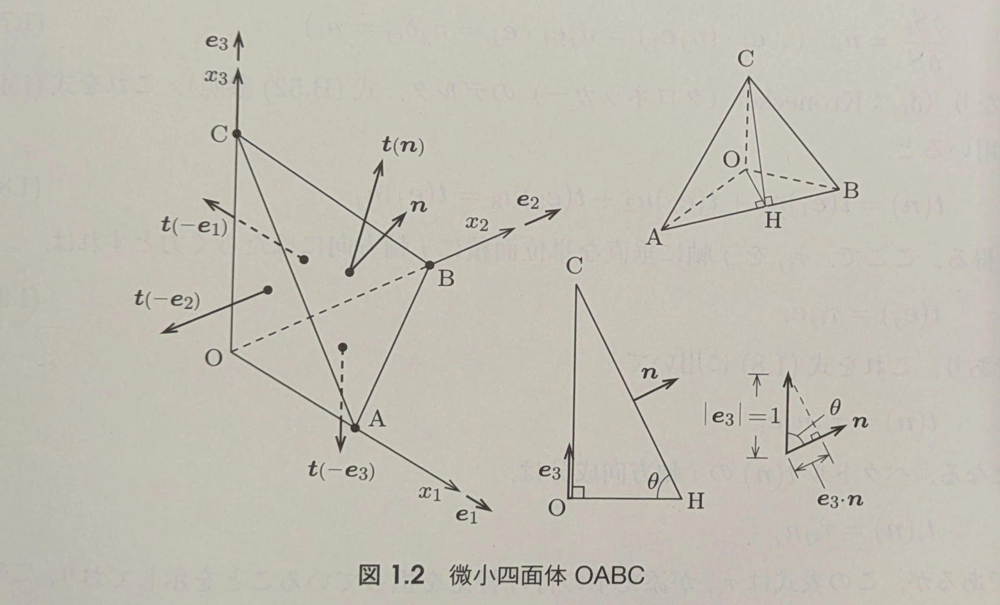
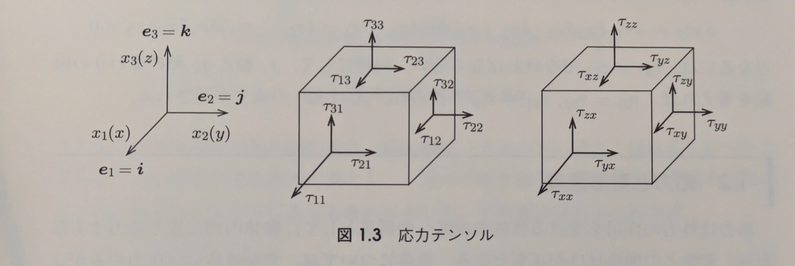
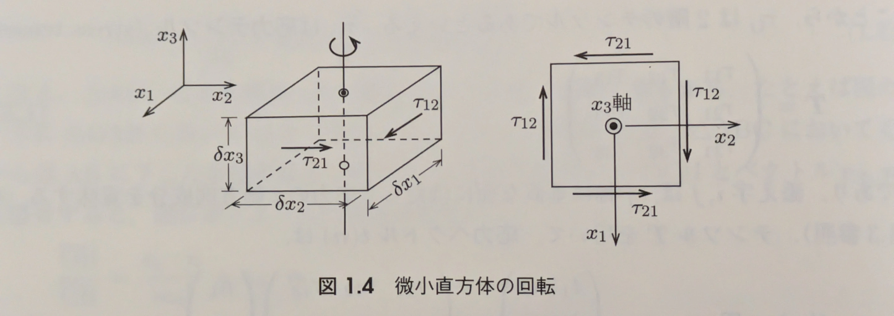
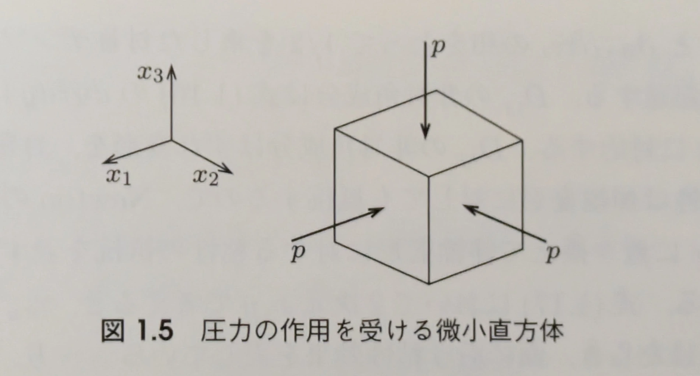
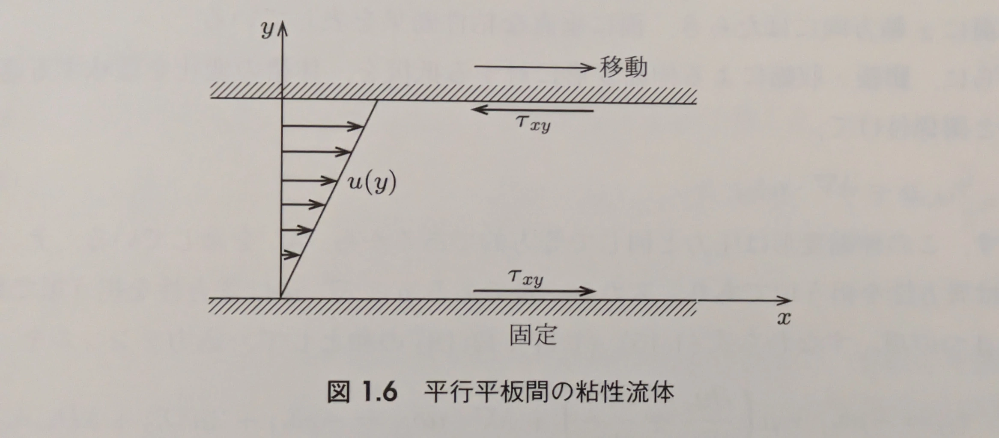

**流れの方程式**
# 第1部 粘性流体と乱流の方程式 1.1(続)-1.2

多田 瑛貴
公立はこだて未来大学 システム情報科学部
複雑系知能学科 複雑系コース 3年

*写真: 北海道稚内市*

---

## A.7 流体に働く力

---

流体に働く力は、**体積力**と**面積力**に分類される

### 体積力
 物体(流体)の内部に浸透する力。重力など

流体の単位質量あたりにかかる力を$K$とすると
密度$\rho$の流体に働く体積力は$\rho K$、全体では $\int_V \rho K dV$

---

### 面積力
物体(流体)の表面に働く力

流体の単位面積あたりにかかる力を$T$とすると
表面の向き$n$ *(法線ベクトル、一般的に外向き)*・位置$r$・時刻$t$に依存し、$T(n, r, t)$と書ける

面積力 $\delta F^S$ は、物体表面の微小面積 $\delta S$ に比例すると考えると

$$\delta F^S = T(n, r, t) \delta S$$

ここから面積あたりの力を求めると、$\delta S \to 0$ として
極限値が得られ、これが**応力ベクトル** $T(n, r, t)$ である

$$\lim_{\delta S \to 0} \frac{\delta F^S}{\delta S} = T(n, r, t)$$

---

## 前回のまとめ

---

- 流れの運動の2つの表現: Lagrangeの方法 *質点の力学* / Eulerの方法 *場の力学*
- 物体表面の応力を示す応力ベクトル $T(n, r, t)$ は表面の向き $n$ に依存
- ここから、面の向きに依存しない**応力テンソル $\mathbf{T}$** を導入
$$T(n) = \mathbf{T} \cdot n$$

前回は、この関係を微小四面体を用いて導いた

---

**復習: 応力ベクトル $T(n)$ と 応力テンソル $\mathbf{T}$ の関係**
- $\tau_{ij}$ は $i$ 方向の応力成分を $j$ 方向の法線成分で表したもの
- 方向余弦より、$n$を成分ごとに分解 $n$ = $n_j e_j$
*添字は各軸に対応*

$$T(n) = \mathbf{T} \cdot n$$
これは以下と同じ
$$
\begin{pmatrix}
    t_1(n) \\
    t_2(n) \\
    t_3(n)
\end{pmatrix}
=
\begin{pmatrix}
    \tau_{11} & \tau_{12} & \tau_{13} \\
    \tau_{21} & \tau_{22} & \tau_{23} \\
    \tau_{31} & \tau_{32} & \tau_{33}
\end{pmatrix}
\begin{pmatrix}
    n_1 \\
    n_2 \\
    n_3
\end{pmatrix}
$$

---

## 1.1 応力テンソル (続き)

---

### 成分の呼称

$$
\begin{pmatrix}
    t_1(n) \\
    t_2(n) \\
    t_3(n)
\end{pmatrix}
=
\begin{pmatrix}
    \tau_{11} & \tau_{12} & \tau_{13} \\
    \tau_{21} & \tau_{22} & \tau_{23} \\
    \tau_{31} & \tau_{32} & \tau_{33}
\end{pmatrix}
\begin{pmatrix}
    n_1 \\
    n_2 \\
    n_3
\end{pmatrix}
$$

対角成分 $\tau_{11}, \tau_{22}, \tau_{33}$ は**垂直応力**
非対角成分 $\tau_{12}, \tau_{13}, \tau_{23}$ は**せん断応力**と呼ばれる

連続体力学では、この応力テンソルをCauchy応力テンソルと呼び
上の式は Cauchy の式と呼ばれる

---

### 応力テンソルの対称性

$\tau_{ij} = \tau_{ji}$ すなわち $T = T^T$ を示したい *注: $T^T$ は転置行列*

もう少し具体的には、せん断応力によって角運動量保存の法則が破られない
(直感的には、物体が自発的に回転することはない) ということを示したい

そこで、各軸 $x_i$ と平行な長さ $\delta x_i$ の辺をもつ微小直方体を考え
$x_3$ 軸まわりの回転の運動方程式を考える

---

慣性モーメントを$I$、角速度を$\omega$、
直方体に働く体積モーメントを$\delta M_V$、面積モーメントを $\delta M_S$ としたとき
$$ I \omega = \delta M_V + \delta M_S $$

と表せる。長さスケールを$l$とすると、
体積モーメントは$O(l^4)$、面積モーメントは$O(l^3)$、慣性モーメントは$O(l^5)$

微小直方体を扱う上では面積モーメントのみが残り、ほかは0となる

角運動量が保存するためには、面積モーメントについても0となる、つまり
$\delta M_S = 0$ であることを示したい

---

$\tau_{12} = \tau_{21}$ であることを示すために、軸$x_3$まわりの回転に限って考える

$\tau_{13}, \tau_{23}$は軸$x_3$上にありモーメントはゼロ
考えるのは接線応力 $\tau_{12}, \tau_{21}$ による偶力モーメントのみでよい

$\tau_{12}$により面積$\delta x_1 \delta x_3$ に働く力は $\tau_{12} \delta x_1 \delta x_3$ であり、偶力の腕の長さは $\delta x_2$ であるから、偶力モーメントは $\tau_{12} \delta x_1 \delta x_3 \delta x_2$
同様に、$\tau_{21}$による偶力モーメントは $\tau_{21} \delta x_2 \delta x_3 \delta x_1$

---

よって、面積モーメントについて以下の関係が得られる

$$\delta M_S = \tau_{12} \delta x_1 \delta x_3 \delta x_2 - \tau_{21} \delta x_2 \delta x_3 \delta x_1 = (\tau_{12} - \tau_{21}) \delta x_1 \delta x_2 \delta x_3$$

$\delta M_S = 0$となる条件は $\tau_{12} = \tau_{21}$ であり
これを他の軸まわりについても同様に考えることで$\tau_{23} =\tau_{32}$、 $\tau_{13} = \tau_{31}$が示される

---

## 1.2 応力と変形速度

---

応力は外力の作用を受ける物体への変形の抵抗である
ここでは、変形速度について考えたい

*変形... 例えば、伸縮変形・ずれ変形 (前々回資料を参考)*

そこで、流体にはたらく応力$\tau_{ij}$を
- 圧力に起因する部分 $\tau_{ij\_p}$
- 変形に起因する部分 $\tau_{ij\_d}$

に分けて、その和として次のように表す

$$\tau_{ij} = \tau_{ij\_p} + \tau_{ij\_d}$$

---

### 圧力

圧力は等方的な *(方向に依存しない)* 垂直応力で
流体運動には直接関係しないので

$$\tau_{ij\_p} = -p \delta_{ij}$$

と書くと、$\tau_{11\_p} = \tau_{22\_p} = \tau_{33\_p} = -p$ となり
図も踏まえて、圧力を表す式として妥当となる
*注: $\delta_{ij}$ はクロネッカーのデルタ*

---

### 変形に起因する部分 (Newtonの粘性法則)

流体の変形に起因する部分を考える

図のような平行平板の間の流れを考える
(Couette流と呼ばれる)
一方を固定、もう一方を$x$軸方向に速度$u$で動かすと
平板にかかる応力は

$$\tau_{xy} = \mu \frac{\partial u}{\partial y}$$

ここで、$\mu$ は粘性係数で、流体の粘性 (流れにくさ) を表す

---

<!-- _class: smartblockquote -->

> 変形速度とずれ応力の関係 (Newton流体) $\tau_{xy} = \mu \frac{\partial u}{\partial y}$

このように、変形速度とずれ応力が比例する流体は **Newton流体** と呼ばれ
水や空気がこれに該当するとされる

*非Newton流体もあるが、その関係式は第8章にて*

---

# まとめ

- 流体に働く力は体積力と面積力に分類され、応力テンソルは面積力を表す
- 応力テンソルは対称行列である (角運動量保存の法則から)
- 応力テンソルは、圧力と変形に起因する部分に分けることができる
- Newton流体は変形速度とずれ応力が比例する流体である